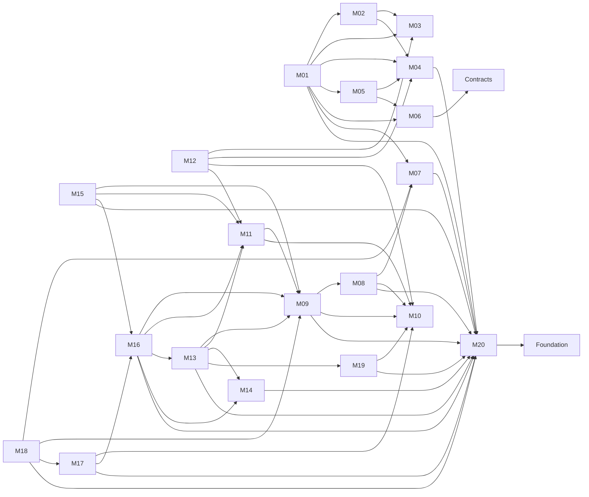

# Fraud Graph Arena

## High-Level Technical Architecture, Module Interaction, and Test Strategy

**Document version:** 1.0  
**Architecture pair ID:** `FGA-MODULAR-ARCHITECTURE-1.0-20260726`  
**Specification pack:** `FGA-MODULAR-SPEC-PACK-1.0-20260726`  
**Parent normative pair:** `FGA-NORMATIVE-PAIR-9.0-20260726`  
**Status:** Normative modular decomposition companion  
**Date:** 26 July 2026

---

## 1. Architectural style

Fraud Graph Arena is implemented as a **multi-module modular monolith** with a polyglot workspace for React/TypeScript and FastAPI/Python components. The system uses **20 logical modules, four long-running/release runtime roles, one signed image lineage, and external durable state**.

The design optimizes for:

- strict business-capability boundaries;
- independent compilation and automated tests;
- contract-first integration;
- atomic cross-module invariants without direct table access;
- private evaluator isolation;
- deterministic ranked retrieval and evaluation;
- independent replacement of adapters without changing domain contracts;
- complete pairwise, cluster, runtime, and end-to-end qualification.

## 2. Proposed repository/workspace layout

```text
fraud-graph-arena/
  apps/
    web-ui/                 # React composition root
    web-api/                # public FastAPI WEB role
    maintenance/            # continuous private executor
    evaluator/              # private truth/evaluation role
    migrate/                # release-only migration/publication role
  modules/
    01-application-shell-navigation/
    ...
    20-publication-workflow-runtime-control/
  contracts/
    core/                   # IDs, problem details, exact time/number primitives
    openapi/
    events/
    json-schema/
    compatibility-fixtures/
  foundation/
    python/                 # transaction, clock, IDs, observability abstractions
    typescript/             # safe common primitives; no business rules
  testkits/
    browser/
    database/
    provider-fakes/
    security/
    accessibility/
    chaos/
  cases/
  assets/
  migrations/
  docs/
  reports/
```

`foundation` and `contracts/core` contain no business aggregates, repositories, or feature rules. They are not dumping grounds. A new shared abstraction requires multiple real consumers and architecture approval.

## 3. Module packaging standard

Every module publishes:

1. a **contracts package** containing only public DTOs, schemas, events, ports, and compatibility fixtures;
2. an **implementation package** containing domain/application/adapters;
3. a **test-kit package** containing builders, fakes, clocks, IDs, contract verifiers, and fault injection;
4. isolated migrations or browser-storage schema where applicable;
5. module documentation and generated requirement/test traceability.

Frontend packages use workspace package boundaries. Backend packages use separately declared Python distributions/workspace members. No module relies on source-path reach-through into another module.

## 4. Compile-time dependency graph

Arrows point from a module implementation to an allowed public contract dependency. Events may flow in the opposite business direction without an implementation import.



Architecture tests enforce:

- implementation packages may import only their own internals, foundation, and declared public contract packages;
- no module imports another module's domain/application/adapters/migrations;
- no frontend module imports backend implementation code;
- no public web package imports evaluator truth adapters or keys;
- no circular implementation dependency;
- no cross-module repository or table reference.

## 5. Runtime composition

| Runtime role | Composed modules | Network exposure | Privileges |
|---|---|---|---|
| `WEB` | M01–M16, M18 safe surfaces, M19 free planner/capability query, M20 safe ports | Public HTTPS | Player-safe DB and service credentials only |
| `MAINTENANCE` | M08–M20 workflow handlers as required | Nonpublic | Outbox/jobs, provider calls, export/deletion, safe finalization; no generic truth read |
| `EVALUATOR` | M17 plus minimum M10/M16/M20 contracts/adapters | Private only | Protected truth read and verdict signing; no public ingress |
| `MIGRATE` | M10/M20 publication and migrations plus owned module migrations | Release-only | Migration/publication privileges; never public |

One image lineage may contain all code, but each role has a distinct entry point, identity, secret set, network policy, database grants, readiness check, and runtime hardening profile.

## 6. Data ownership and database design

Each backend module owns a database schema or clearly prefixed table set. Ownership is enforced through repository boundaries, architecture tests, migration ownership, and—where practical—database grants/RLS.

Examples:

- `identity.*` — M07
- `career.*` — M08
- `rounds.*` — M09
- `cases.*` safe registry projection — M10
- `investigation.*` — M11
- `commands.*` — M13
- `economy.*` — M14
- `saves.*` — M15
- `casefile.*` and `submissions.*` — M16
- `evaluation_safe.*` and private evaluator schema — M17 with separate roles
- `leaderboard.*` — M18
- `retrieval.*` and provider cost/conversation state — M19
- `platform.*` — M20

A consumer cannot query a producer's table directly. It uses a public query/application port or an immutable projection explicitly published for that purpose.

## 7. Cross-module transaction model

### 7.1 Shared unit of work, separate ownership

For atomic constitutional workflows, M20 provides a transaction context. The orchestrating application service calls participant ports; each participant changes only its own tables.

Required atomic collaborations:

1. **Command acceptance:** M13 idempotency/command/outbox + M14 debit.
2. **Command settlement:** M13 terminal status + M14 charge/refund + M11 visibility grant.
3. **Submission:** M16 immutable submission + M09 lifecycle transition, after M13/M14 snapshot validation.
4. **Verdict finalization:** M17 safe verdict projection + M09 closure + M08 progression, orchestrated outside the truth-reading step.
5. **Publication activation:** M20 trust/freshness/verifier checks + active pointer.

No participant exposes generic database callbacks to another module. Lock order, isolation, bounded retry, and fencing are specified and integration-tested.

### 7.2 Durable asynchronous work

External provider calls, export generation, deletion, notification, reindex, retention, and amendments use durable work records. The maintenance executor claims with leases and fencing, records correlation before external I/O, and commits local settlement in a new transaction.

## 8. Public contract conventions

- JSON Schema 2020-12-compatible schemas for JSON contracts.
- OpenAPI for public HTTP operations.
- Versioned event envelopes with event ID, aggregate revision/version, producer, occurred time, contract version, correlation/causation IDs, and safe payload digest.
- RFC 9457-style problem details with project-owned stable codes.
- Project-owned idempotency contract: principal + operation + key + canonical request hash + retention + exact replay semantics.
- Opaque identifiers and explicit immutable binding/version fields.
- Exact numeric/time representations and deterministic canonicalization.
- N-1/N compatibility fixtures and retirement dates.

## 9. Independent module testing

Every module supports this command conceptually:

```text
build <module>
test:unit <module>
test:property <module>
test:contract <module>
test:component <module>
test:architecture <module>
test:security <module>
```

A module component test boots only:

- its real domain and application layers;
- its real owned persistence adapter when persistence is part of the contract;
- fake outbound collaborators from the module or producer test kits;
- deterministic clock, IDs, randomness, and failure injection.

It never requires the complete web application, all migrations, a live provider, or another module implementation.

## 10. Contract testing

### 10.1 Provider verification

The provider module runs every public-contract fixture and proves it accepts valid messages, rejects invalid/unsupported versions, returns only documented statuses, and preserves idempotency/canonicalization.

### 10.2 Consumer verification

Each consumer runs against the producer test kit and proves its assumptions are limited to the public contract. Consumer fixtures are published back to the producer pipeline.

### 10.3 Compatibility

A contract change cannot merge until:

- schema diff classifies it;
- N-1/N fixtures pass;
- all known consumers pass;
- event replay and stored historical payload tests pass;
- retirement/migration behavior is documented.

## 11. Pairwise and cluster integration testing

### 11.1 Pairwise tests

Every interaction edge in the high-level functional document has a real producer/consumer suite. Unrelated modules are replaced with fakes. Critical edges also inject timeout, duplicate, stale revision, malformed payload, crash-after-commit, and dependency-unavailable failures.

### 11.2 Cluster tests

The eight mandatory clusters use a real PostgreSQL-compatible database, real module migrations, real in-process ports/events, and deterministic provider/browser fakes. They validate cross-module invariants rather than internal implementation details.

### 11.3 Architecture fitness tests

Static and runtime fitness functions verify:

- allowed package dependency graph;
- owned migration/table access;
- no truth imports/credentials in WEB;
- no network I/O in transaction scopes;
- no authenticated response in service-worker cache;
- all requirements map to tests;
- diagrams/contracts/migrations/runtimes use the current pair and module IDs.

## 12. Whole-solution testing

The complete test stack is:

1. **Static:** format, lint, type checking, dependency graph, secret and truth scans.
2. **Module:** unit, property/model, contract, component, architecture, security.
3. **Pairwise:** real producer and consumer.
4. **Cluster:** business capability groups with real database/browser harness.
5. **Role integration:** WEB, MAINTENANCE, EVALUATOR, MIGRATE with exact identities and grants.
6. **End-to-end:** real browser against exact production image and deterministic external fakes.
7. **Accessibility:** keyboard, focus, accessibility tree, screen-reader-oriented, reflow, zoom, contrast, reduced motion.
8. **Security/privacy:** IDOR, CSRF, XSS, prompt/data injection, cache leakage, erasure, export, truth noninterference.
9. **Concurrency/resilience:** duplicate clicks, two tabs, crash points, database wake/failover, provider/evaluator/key outage, stale client.
10. **Performance/capacity:** bounded API, graph, database, queue, resolver, evaluator, and frontend budgets.
11. **Chaos/game day:** executor loss, split roles, stale lease, partial deployment, rollback, restore, publication/key incidents.
12. **Release evidence:** signatures, SBOM/provenance, migration/restore/rollback, requirement traceability, digest and image inspection.

## 13. Canonical end-to-end test journeys

At minimum:

- account registration, policy receipt, recovery codes, logout/login, passkey and recovery-limited flow;
- multiple careers, every catalogue availability reason, fixed progression and revisit/practice isolation;
- all four action families, valid no-result, duplicate click, timeout, reconciliation, zero credits;
- list/graph/document/semantic parity with Unicode, bidi, missing assets, dense graph, and accessibility modes;
- autosave, checkpoints, two tabs, restart, stale client, service-worker isolation;
- immutable submission, all score components, six endings, amendment and leaderboard reindex;
- deterministic ranked retrieval parity across players and provider interpretation variance;
- provider outage/capacity/budget/deletion, evaluator/key outage, maintenance loss, database restore, mixed-version deployment;
- export integrity, expiry, deletion, backup-safe cryptographic erasure, leaderboard withdrawal;
- publication signature, freshness, revocation, quarantine, rollback, and anti-downgrade.

## 14. CI/CD test matrix

| Pipeline | Scope | Required evidence | Isolation |
|---|---|---|---|
| PR fast lane | Changed modules | lint, type/static analysis, unit, property smoke, contract, architecture tests | No unrelated runtime required |
| Module lane | Each module independently | full unit/property/component/security/performance smoke | Uses module test kit and isolated persistence |
| Contract lane | All public contracts | producer + consumer compatibility, schema canonicalization, N-1/N | Runs on every contract change |
| Pairwise lane | Affected dependency edges | real producer + consumer, fault injection | Selected from dependency graph |
| Cluster lane | Eight capability clusters | real DB/browser/provider fakes and runtime composition | Required before merge to integration |
| System lane | All modules and roles | E2E, accessibility, security, performance, restart | Exact production image |
| Release lane | Frozen artifact | backup/restore, rollback, chaos, signature, SBOM, leakage | Produces signed evidence bundle |

Changed-module selection is an optimization only. The integration and release lanes always include mandatory cross-cutting regressions for identity, credits/commands, truth isolation, submission/evaluation, publication trust, accessibility, and migrations.

## 15. Test data and deterministic fixtures

- Each module owns small local fixtures and builders.
- Shared Core Contract fixtures are immutable and versioned.
- Academy T1–T12 are public engine conformance fixtures.
- Kennel Lab T13–T15 are protected stress/concurrency fixtures.
- Production cases provide golden clean, partial, wrong, overbroad, inefficient, unresolved, no-result, and innocent-protection playthroughs.
- Provider tests use recorded-schema deterministic fakes; live benchmarks are separate qualification evidence and never ordinary CI dependencies.
- Clocks, randomness, UUIDs, locales, tzdb behavior, provider status, and database failure points are injectable.

## 16. Observability and diagnostics

Every module emits safe structured operations with module ID, operation, contract version, outcome, latency, and opaque correlation identifiers. Cross-module traces use correlation/causation IDs. Diagnostics exclude secrets, recovery codes, private prose, raw evidence, protected truth, SQL/reasoning, and provider raw responses.

Test suites verify redaction and cardinality. A player-consented diagnostic bundle is a separate previewed workflow.

## 17. Deployment and migration

- One reproducible signed image lineage; separate role commands and permissions.
- Expand/contract migrations owned by modules and coordinated by M20.
- Deployment epoch binds image, roles, schema, policy, evaluator, provider capability, and ranking compatibility.
- Readiness blocks incompatible mixed versions.
- Maintenance and evaluator roles drain accepted work before incompatible replacement.
- Rollback restores only compatible image and publication pointers; historical immutable data is not rewritten.

## 18. Technical definition of done

1. All twenty modules build and test independently.
2. The architecture dependency graph is machine-enforced and cycle-free at implementation level.
3. Every owned table/migration has exactly one module owner and no unauthorized repository access.
4. All contracts have provider, consumer, canonicalization, and N-1/N tests.
5. Every declared edge passes pairwise integration tests.
6. All eight capability clusters pass real-database integration tests.
7. All four runtime roles pass identity/secret/network and mixed-version tests.
8. Complete E2E, accessibility, security, resilience, performance, chaos, migration, backup/restore, rollback, and release evidence gates pass.
9. The exact frozen artifact is the artifact deployed.
10. The conformance graph links every requirement, interface, schema, migration, test, module, runtime role, and release artifact to the current IDs.
