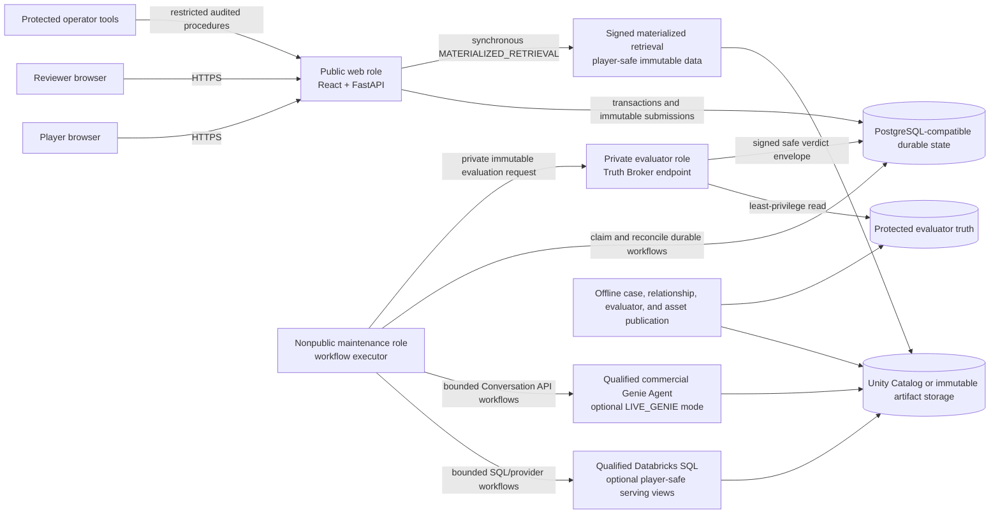
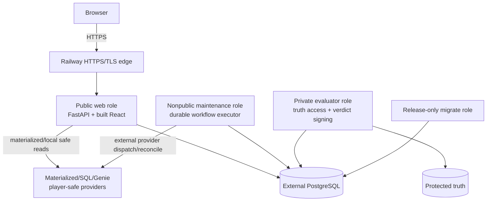
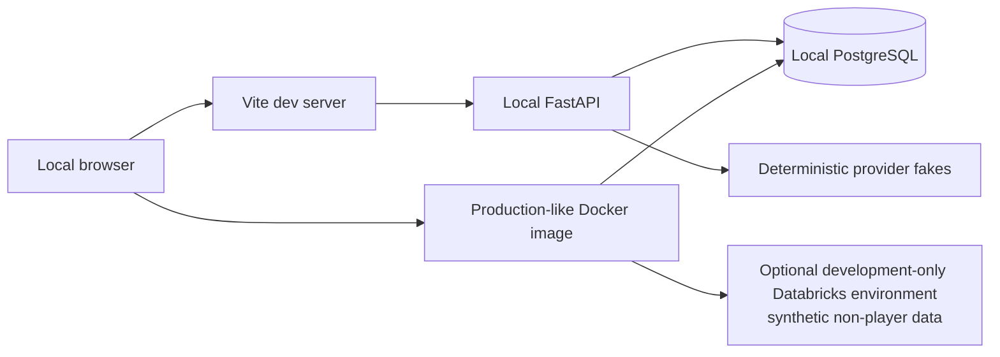
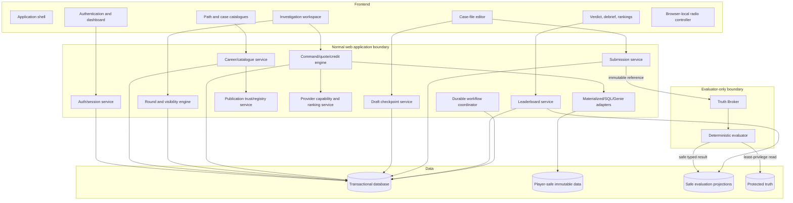
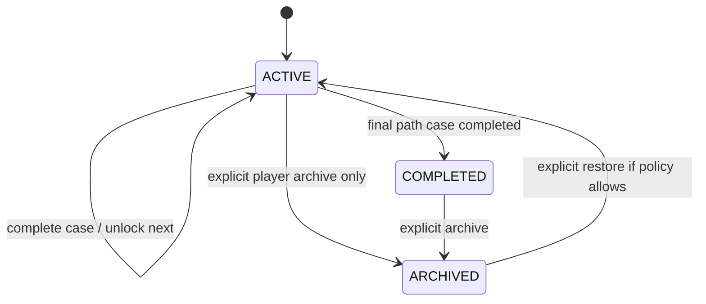
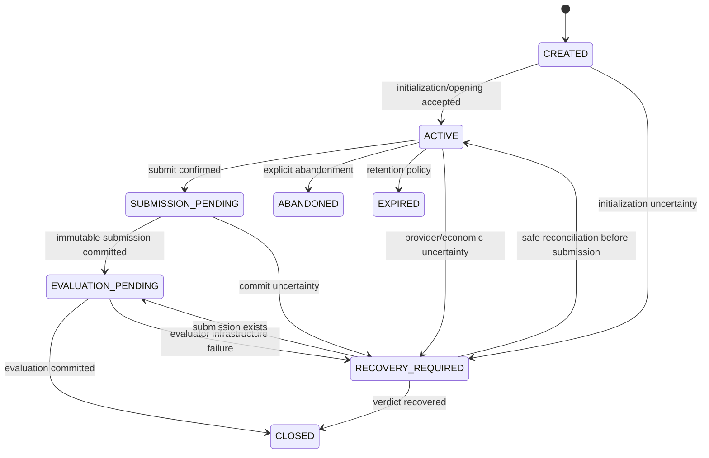
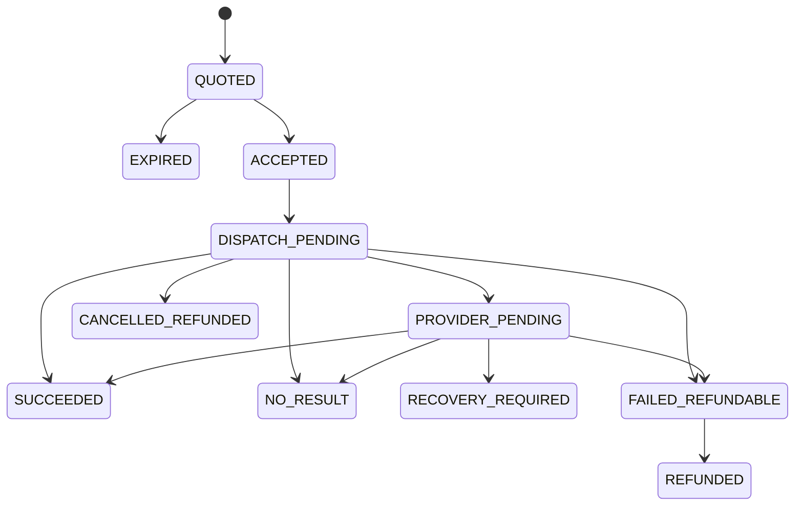
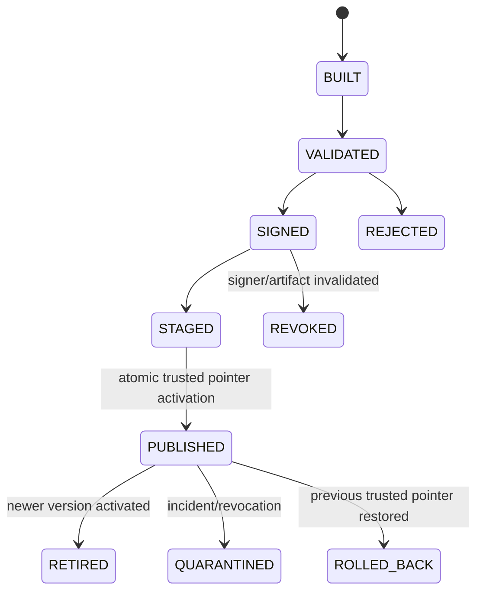
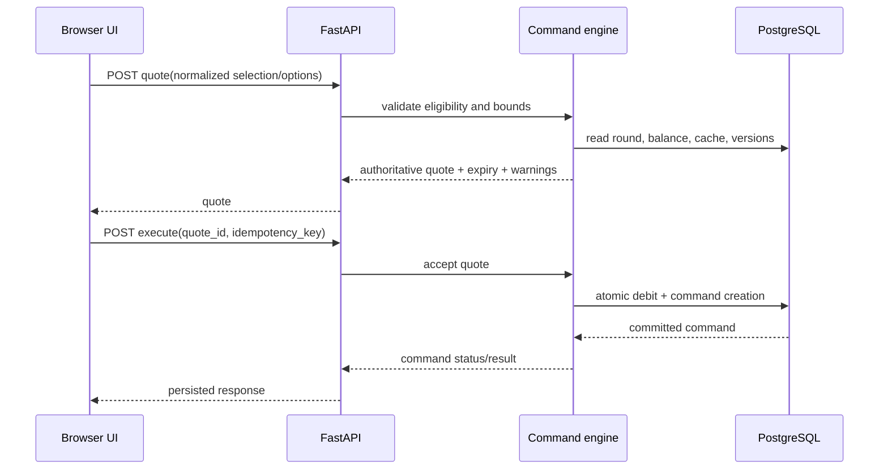
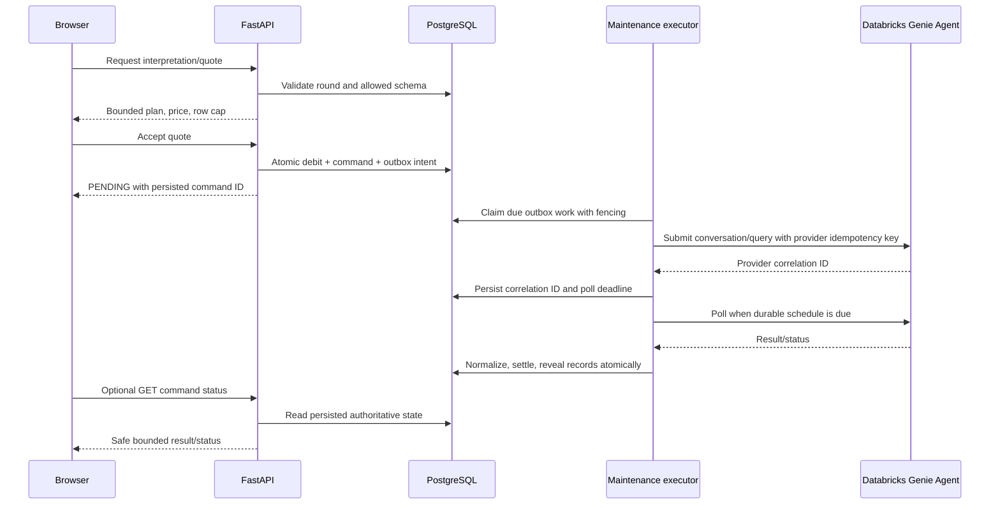

# Fraud Graph Arena

## Complete Technical Architecture and Design Specification

**Document version:** 10.0  
**Normative pair ID:** `FGA-NORMATIVE-PAIR-10.0-20260726`  
**Project baseline:** Version 9.0 consolidated architecture plus Iteration 20 provider-fact/credential, cryptographic-lifecycle, audit-integrity, active-content, regional-recovery, automation-fairness, privacy-measurement, contract/time-evolution, vulnerability, source, and 26 July 2026 research/platform audit; Definitive Game Specification v5.3; Master Development Plan v8.3; Image Asset Production Bible v3.3; and signed shared-core contracts through Iteration 11  
**Language:** English  
**Status:** Normative consolidated architecture and engineering specification — Iteration 20 credential, audit, content-safety, recovery, and contract-evolution convergence  
**Audience:** Software architects, backend and frontend engineers, data engineers, fraud analytics engineers, QA, security, accessibility, privacy, legal/licensing, DevOps, SRE, release engineering, and technical reviewers  
**Research and platform verification date:** 26 July 2026  

---

## 0. Iteration 20 / version 10.0 architecture correction register

Version 10.0 supersedes the paired version 9.0 specifications and is joined to the version 10.0 functional specification by `FGA-NORMATIVE-PAIR-10.0-20260726`. It preserves the signed multi-role image, private evaluator and Truth Broker, deterministic evaluator and ranked resolver, exact ledgers, monotonic ranked state, provider-conversation isolation, pre-reveal noninterference, policy receipts, runtime hardening, deployment epochs, work-class fairness, and release provenance. Iteration 20 closes the remaining seams around provider-fact reconciliation, workload identity and credential rotation, cryptographic lifecycle, tamper-evident audit, active-content handling, fenced regional recovery, automation fairness, privacy-preserving measurement, and deterministic API/time evolution.

Historical sections labelled inherited version 5.0 through 9.0 are informative provenance only. The current-layer contract graph MUST reject implementation predicates derived solely from historical text or containing stale normative-pair, release-gate, or deployment-iteration references.

| Correction | Version 10.0 architectural decision |
|---|---|
| Provider-fact reconciliation | Introduce `provider_fact_assertions`, supersession/conflict records, observations, effective intervals, and a qualification projection. Contradictory or expired facts fail affected admission closed; they are never resolved by hard-coded source order [S177]–[S181] |
| Workload identity | Provider/warehouse integrations use dedicated service principals and OAuth M2M or qualified workload federation. Access tokens are short-lived; secret overlap, expiry, rotation, and revocation are durable workflows. PATs require an expiring exception [S177][S182] |
| Entitlement migration | Capture explicit provider entitlements and test the July/September 2026 Databricks behavior change. Readiness compares actual grants with the signed least-privilege template before and after migration [S178] |
| Cryptographic lifecycle | Add purpose-separated key classes, inventory, algorithm identifiers, state machine, rotation/compromise/destruction, threshold approval where appropriate, restore behavior, and crypto-agility/PQC planning [S183][S184] |
| Break-glass | Add a separately authenticated, time-limited, scoped emergency-access workflow with approval, just-in-time grants, session recording at safe metadata level, automatic revocation, and post-use review |
| Audit integrity | Canonicalize and chain security/audit events into immutable segments with sequence numbers, source identity, previous-root commitment, external anchoring/WORM where available, verification, and missing-source alarms. Databricks system tables are supplementary Preview/regional inputs, not the project ledger [S180][S181][S185][S186] |
| Incident evidence | Add incident state machine, evidence holds, affected-object graph, player-notice projection, release/round validity decision, recovery criteria, and lessons-to-control linkage [S185] |
| Content safety | Add isolated authoring/import and export pipelines with format allowlists, content sniffing, archive limits, sandboxed renderers, active-content stripping, malware/CDR adapters, CSV formula neutralization, safe filenames, and final-byte integrity manifests [S187][S188] |
| Regional recovery | Add primary-writer lease and fencing, `RECOVERY_EPOCH`, restore barriers, immutable/cross-failure-domain backup evidence, key/publication/policy restoration checks, provider reconciliation, stale-writer rejection, and failover/failback game days [S196] |
| Abuse architecture | Add privacy-minimized rate/risk buckets, durable distributed limits, accessible challenge alternatives, false-positive review, and hard separation from score/rank/evidence. No CAPTCHA-only path is permitted [S193][S194] |
| Measurement privacy | Add event-schema compiler, purpose binding, contribution limits, cohort suppression, delayed aggregation, experiment assignment, privacy-budget ledger, and outbound release checks [S176] |
| API and temporal evolution | Add signed deprecation/compatibility records, principal/query/snapshot-bound cursor tokens, schema-evolution gates, idempotency fingerprint versions, pinned tzdb/ICU/collation, Unicode language/direction metadata, and clock-source qualification [S195][S196] |
| Database ownership isolation | Make composite owner/object constraints and forced row-level security the `PUBLIC_RANKED` baseline for private player tables; normal roles cannot use `BYPASSRLS`, disable policies, or rely on unsafe security-definer search paths |
| Vulnerability triage | Enrich SBOM/VEX with CISA KEV, EPSS, CVSS v4, reachability, privilege, exploit path, and asset criticality; release exceptions are expiring and signed [S189]–[S191] |
| Source and research refresh | Add FDIC/FCA/IOSCO/Companies House source cards and SQaLe/SynQuE/FRAUDGUESS/FiFAR research fixtures under nonproduction and fictionalization controls [S197]–[S204] |
| Structural correction | Replace the stale “version 8.0 product rules” sentence, update delivery/deployment language through Iteration 20, extend manifests/tables/APIs/invariants, and add current-layer lint rules |

### 0.1 Nonnegotiable version 10.0 boundaries

- A provider documentation correction, promotion, entitlement migration, or observed invoice discrepancy cannot silently change ranked admission or economics.
- Production integrations do not share one broad human credential, nonexpiring token, or default-users entitlement.
- Signing, encryption, TLS, backup, database, and provider credentials are not interchangeable and do not share one lifecycle merely for convenience.
- A compromised or stale signer/key/provider credential cannot remain trusted because an old artifact or backup still references it.
- Break-glass access cannot disable audit, export protected truth, bypass two-person review where required, or survive its approved window.
- Ordinary logs, provider audit tables, or one database table are not sufficient proof of audit completeness.
- A correct digest does not make a malicious spreadsheet, archive, PDF, SVG, or Office file safe to open.
- A promoted recovery site cannot accept writes until it owns the current recovery epoch and all stale writers are fenced.
- Bot/risk signals never become gameplay evidence, score inputs, guilt labels, or accessibility penalties.
- An experiment or telemetry flag cannot change a ranked round's evidence, price, resolver, evaluator, or progression contract.
- Host locale, timezone database, collation, or Unicode library upgrades cannot silently alter historical ordering, canonicalization, or chronology.
- A vulnerability marked exploited and reachable cannot be waived solely because its base severity is below a numeric threshold.
- Normal application roles cannot bypass or disable owner isolation on private player tables.

### 0.2 Canonical vocabulary additions

| Term | Meaning |
|---|---|
| `PROVIDER_FACT_ASSERTION` | One sourced, scoped, dated statement about a provider capability, limit, maturity, price, correction, region, or entitlement |
| `PROVIDER_FACT_LEDGER` | Append-only assertion/conflict/supersession/observation ledger whose projection drives qualification |
| `CREDENTIAL_LIFECYCLE_PROFILE` | Signed service-identity, privilege, token, secret, rotation, revocation, and alerting contract |
| `CRYPTOGRAPHIC_ASSET_INVENTORY` | Authoritative registry of cryptographic keys, certificates, secrets, algorithms, purposes, owners, states, and dependencies |
| `AUDIT_SEGMENT_ROOT` | Digest root committing to one ordered immutable segment of canonical audit events |
| `AUDIT_INTEGRITY_CHAIN` | Ordered sequence of segment roots, prior-root links, anchors, and verification results |
| `BREAK_GLASS_RECORD` | Signed record of emergency justification, approvals, grant, bounded actions, expiry, revocation, and review |
| `CONTENT_SAFETY_PROFILE` | Machine-readable import/render/export policy for file formats and active content |
| `RECOVERY_EPOCH` | Monotonic fencing generation for authoritative disaster-recovery writes |
| `AUTOMATION_ABUSE_POLICY` | Signed privacy-minimized abuse, rate, challenge, accessibility, review, and retention contract |
| `PRIVACY_BUDGET_LEDGER` | Append-only accounting of formal privacy-loss budget where differential privacy is claimed |
| `CONTRACT_COMPATIBILITY_WINDOW` | Signed N-1/N-style client/API/schema/fingerprint compatibility matrix and retirement dates |
| `TIME_SEMANTICS_PROFILE` | Versioned tzdb, ICU/collation, Unicode normalization, language/direction, and clock-source contract |


## 0A. Inherited Iteration 19 / version 9.0 architecture correction register

Version 9.0 supersedes the paired version 8.0 specifications and is joined to the version 9.0 functional specification by `FGA-NORMATIVE-PAIR-9.0-20260726`. It preserves the multi-role signed image, continuous private executor, private Truth Broker, deterministic evaluator, monotonic ranked state, exact ledgers, isolated provider conversations, signed browser policy, canonical evidence roots, hermetic publications, and executable chaos qualification. It makes ranked retrieval evidence deterministic, formalizes protocol noninterference and policy consent, and closes the remaining runtime/deployment/supply-chain implementation gaps.

Historical sections labelled inherited version 5.0, 6.0, 7.0, or 8.0 are informative provenance only. The generated current-layer contract graph MUST reject any implementation predicate derived only from historical delta text.

| Correction | Version 9.0 architectural decision |
|---|---|
| Ranked retrieval authority | Split provider interpretation from authoritative data execution. In `PUBLIC_RANKED`, a `DETERMINISTIC_RESULT_RESOLVER` executes the canonical plan over immutable player-safe data and signs/binds the answer-set digest. Provider-selected rows are diagnostic or unranked only [S154][S155][S167] |
| Answer-set parity | Add a signed parity manifest for every supported canonical intent, profile, snapshot, semantic configuration, row cap, ordering rule, and valid no-result. Qualification verifies cross-language canonicalization and cross-player equality |
| Protocol noninterference | Introduce a pre-reveal information-flow boundary for quote, acknowledgement, queue/status, retry, error, cancellation, and timing buckets. Hidden cardinality and protected truth cannot influence distinguishable behavior |
| Clarification policy | Add deterministic ambiguity classes, bounded options, maximum turn count, accessibility semantics, and regret/abstention benchmarks [S165] |
| Policy lifecycle | Add `policy_bundles`, `policy_receipts`, `policy_change_assessments`, feature-specific consent state, withdrawal, and a migration coordinator. Policy digests bind affected new rounds and provider actions |
| GPC and optional analytics | Parse and preserve applicable GPC signals; disable optional third-party sharing/telemetry paths without changing core functionality [S157] |
| Idempotency semantics | Treat the IETF Idempotency-Key draft as informative. Define a project-owned contract with principal+operation+key scope, canonical request hash, retention, in-progress result, exact replay, and authorization checks [S158] |
| HTTP representation integrity | Use RFC 9530 `Content-Digest` for generated downloads and optionally RFC 9421 HTTP Message Signatures for controlled server-to-server/high-assurance flows; application evidence signatures remain authoritative [S159][S160] |
| Export artifact security | Build exports in an isolated workflow with canonical manifest, per-file digest, encryption where configured, one-time capability, expiry, no-store delivery, anti-enumeration, and verified deletion |
| Container/runtime hardening | Add role-specific rootless UID/GID, read-only root filesystem, dropped Linux capabilities, no privilege escalation, bounded tmpfs, no core dumps, minimal shell/tooling, dependency/runtime inventory, and safe termination evidence [S169] |
| Mixed-version deployment | Add deployment epochs, `N-1/N` compatibility matrix, schema barriers, role rollout order, evaluator/policy lineage consistency, drain, canary, rollback, and forward-fix rules |
| Work QoS | Replace prose-only fairness with a signed `WORK_CLASS_POLICY`, deficit/weighted fairness or equivalent, per-principal limits, aging, deadline admission, safe cancellation boundaries, and starvation tests [S161] |
| Supply-chain baseline | Emit CycloneDX 1.7 or SPDX 3.0-compatible SBOMs with declared profile; map OSPS Baseline v2026.02.19 and SSDF/SSDF-AI practices; maintain VEX/applicability and dependency-health evidence [S156][S168][S172]–[S175] |
| Open-data portfolio | Add OFAC SLS, EBA payment/e-money register, and UK Register of Overseas Entities under adverse-data, effective-date, snapshot, fictionalization, and no-guilt controls [S162]–[S164] |
| Research refresh | Add RegretBench-style clarification evaluation, LakeQuest noisy-lake grounding, TSAI-MetaFraud/SAGA temporal multimodal fixtures, and provenance-constrained evidence research as nonproduction inputs [S165]–[S171] |
| Structural correction | Update stale Iteration 16 decision gates, patch the primary retrieval flow, add Iteration 19 to delivery, and require semantic-diff checks for direct-provider ranked evidence authority |

### 0.1 Nonnegotiable version 9.0 boundaries

- The final ranked answer set is determined by immutable FGA data and rules, not by one stochastic provider response.
- Provider interpretation cannot widen the canonical plan beyond the player-confirmed quote.
- Before reveal, observable protocol behavior cannot disclose whether hidden matches exist or how many exist.
- A material policy change cannot be hidden inside a generic login, route visit, or continued use.
- Idempotency lookup is scoped to the authenticated principal and operation; a key cannot reveal or replay another principal's result.
- A downloadable export is not trusted by filename or TLS alone; its representation digest and manifest are verifiable.
- Production roles do not require a writable root filesystem, root user, ambient Linux capabilities, core dumps, or interactive shell.
- A deployment never mixes incompatible evaluator bundle, policy bundle, schema, or ranking contract for one accepted workflow.
- Queue priority cannot be purchased with investigation credits, inferred from accessibility behavior, or starve another player indefinitely.
- SBOM generation without schema validation, component identity, provenance, and vulnerability applicability is insufficient release evidence.
- Open adverse-status registers are authoring inputs only and never direct playable accusation lists.
- Experimental research can add fixtures and tests; it cannot silently add a model, provider tool, or scoring dependency.

### 0.2 Canonical vocabulary additions

| Term | Meaning |
|---|---|
| `RANKED_RETRIEVAL_PARITY_MANIFEST` | Signed deterministic answer-set contract for canonical intents in one ranking segment |
| `DETERMINISTIC_RESULT_RESOLVER` | Trusted player-safe component that executes canonical plans against immutable data and produces stable ordered results |
| `PRE_REVEAL_NONINTERFERENCE_PROFILE` | Executable policy constraining observable protocol behavior before evidence is granted |
| `POLICY_BUNDLE` | Immutable content-addressed policy/notice set with jurisdiction and feature applicability |
| `POLICY_RECEIPT` | Append-only evidence of a player's informed choice for a specific policy bundle |
| `IDEMPOTENCY_CONTRACT` | Project protocol defining key scope, request fingerprint, replay, retention, concurrency, and error behavior |
| `EXPORT_INTEGRITY_MANIFEST` | Content-addressed index of every export object and delivery constraint |
| `RUNTIME_HARDENING_PROFILE` | Role-specific container/process/filesystem/capability hardening contract |
| `DEPLOYMENT_EPOCH` | Orchestration epoch binding compatible image, role, schema, config, policy, and evaluator versions |
| `WORK_CLASS_POLICY` | Signed scheduling/admission/cancellation rules for durable workflow classes |

## 0B. Inherited Iteration 18 / version 8.0 architecture correction register

Version 8.0 supersedes the paired version 7.0 specifications and is joined to the version 8.0 functional specification by `FGA-NORMATIVE-PAIR-8.0-20260726`. It preserves the complete game constitution, private evaluator, immutable publications, deterministic scoring, provider-independent solvability, monotonic ranked state, signed policy, cryptographic erasure, accessibility equivalence, and version 7.0 assurance controls. It closes the remaining production-operability gaps found by cross-document review and the 26 July 2026 platform/research revalidation.

Sections explicitly labelled as inherited version 5.0, 6.0, or 7.0 change history were **informative traceability records** in version 8.0. In this document they remain historical provenance and cannot override the version 9.0 authority, constitutional boundaries, acceptance criteria, or signed machine-readable contract graph.

| Correction | Version 8.0 architectural decision |
|---|---|
| Railway executor semantics | `PUBLIC_RANKED` uses an always-on, nonpublic `maintenance` service for bounded command/evaluation/workflow progress. Railway cron jobs are start-run-exit tasks and are limited to coarse sweeps, retention, verification, and backstop reconciliation; they are not the sole interactive liveness mechanism [S137]–[S139] |
| Provider conversation lifecycle | One accepted ranked natural-language command starts one isolated provider conversation. Ranked follow-ups and cross-command context reuse are disabled. Conversation IDs, deletion state, retention deadline, capacity headroom, and provider correlation are durable [S05][S125][S147] |
| Provider object capacity | Admission accounts for current table/view, instruction, conversation, message, rate, and workspace ceilings plus deletion lag. Capacity values remain dated capabilities, never source constants [S125] |
| Product-specific pricing | Genie Code, Genie One, and Genie Agents pricing facts are stored under distinct product/SKU identities. A pricing notice for one product cannot qualify another. Promotional usage remains nonrepresentative of paid production cost [S126] |
| Real provider-cost accounting | Add a provider-cost ledger, price catalogue with effective windows, budget reservations, actual-usage reconciliation, and anomaly controls. Fictional investigation credits remain completely separate from real infrastructure cost |
| Provider history and reasoning | Generated SQL, reasoning traces, visualizations, comments, feedback, and provider-wide conversation history are denied by the baseline player adapter. Unexpected rich fields are stripped and security-audited rather than logged or rendered [S05] |
| Identity assurance | Adopt the final NIST SP 800-63-4 suite as the identity-management reference. Player recovery remains low-data and does not claim formal identity proofing; operators and release signers require phishing-resistant MFA. Operator reset creates a restricted recovery state rather than immediate full access [S140] |
| LLM security verification | Add an OWASP LLMSVS 2.0 control mapping for the live retrieval path, covering prompt/data injection, tool and data authorization, model/provider lifecycle, output handling, logging, privacy, and incident response [S141] |
| Browser isolation profile | Extend CSP/Trusted Types with a signed HTTP security-header profile: HSTS, Referrer-Policy, Permissions-Policy, Fetch Metadata checks, frame isolation, COOP/CORP, an explicit COEP decision, safe `postMessage`, and violation-report minimization [S142][S143] |
| Transaction isolation | Define lock order, isolation level, retry rules, fencing, invariant checks, and no-network-I/O boundaries for credits, commands, submissions, progression, publication pointers, and amendments |
| Evidence integrity | Canonicalize signed JSON using RFC 8785-compatible rules, hash every immutable evidence object, publish Merkle roots for snapshots/bundles, and bind submission/verdict lineage to those roots [S152] |
| Reproducible publication | Case/data/evaluator/asset builds are hermetic where practical: pinned toolchains, locale/timezone, seeds, source-date epoch, ordered serialization, input/output digests, and a declared nondeterminism inventory |
| AI Act applicability nuance | Record provider/deployer role, system placement date, content type, human editorial control, interaction disclosure, marking obligation, and any legally applicable transitional/grace rule. The official July 2026 guidance is applied without treating every asset as identically covered [S144] |
| Chaos and game-day evidence | Add scheduled fault-injection for executor loss, provider timeout, conversation-capacity exhaustion, database failover, key unavailability, stale client, partial deployment, split brain, and restoration before public-ranked release |
| Open-data portfolio | Add ESMA's MiCA register and FinCEN SAR statistics/trend analyses as governed defensive authoring inputs for crypto-provider, payment, reporting, and chronology schemas only [S145][S146] |
| Research refresh | Add multi-turn text-to-SQL memory contamination, long-context enterprise grounding, value-linking mismatch, flexible exploration/cost risk, synthetic-data membership inference, and 2026 accessibility prevalence evidence to benchmark design [S102][S103][S147]–[S150] |
| Structural cleanup | Correct stale “Version 6.0 project rule” labelling, make inherited delta sections explicitly informative, add Iteration 18 to the plan, and require the generated contract graph to identify the current normative layer |

### 0.1 Nonnegotiable version 8.0 boundaries

- A periodic cron invocation is not sufficient liveness for an accepted ranked command with an interactive deadline.
- An accepted ranked natural-language command cannot inherit hidden context from another command, player, round, case, or provider conversation.
- Provider conversation cleanup may lag, but admission closes before documented capacity or privacy limits can be exceeded.
- Fictional credits never represent, expose, or settle real provider currency; the two ledgers cannot share a balance or transaction table.
- Provider reasoning traces, generated SQL, comments, and visualizations are not player evidence and are not persisted in ordinary logs.
- A recovery code proves possession of a secret, not the civil identity of the person presenting it.
- Privileged operator and release-signing actions require phishing-resistant authentication and cannot be performed from a normal player session.
- Browser security headers are generated, tested, and versioned as one policy; no route silently weakens them for convenience.
- Critical economic and progression transitions have a documented lock order and bounded retry policy; external I/O never occurs inside their database transaction.
- Every immutable evidence package and verdict lineage is digest-bound; a label, filename, database key, or provider correlation ID is never sufficient identity.
- Article 50 applicability and any grace period are decided by a signed legal record, not by a generic “AI-generated” flag.
- Chaos tests may demonstrate safe failure, pause, or recovery; they may not waive duplicate-charge, truth-isolation, accessibility, or historical-integrity invariants.

### 0.2 Canonical vocabulary additions

| Term | Meaning |
|---|---|
| `CONTINUOUS_MAINTENANCE_EXECUTOR` | Always-on nonpublic runtime responsible for bounded, deadline-aware progress of accepted workflows; distinct from coarse cron/backstop jobs |
| `PROVIDER_CONVERSATION_RECORD` | Durable mapping among FGA command, provider agent/space, conversation/message IDs, status, retention deadline, deletion receipt, and capability snapshot |
| `PROVIDER_CAPACITY_HEADROOM` | Reserved difference between observed/declared provider use and the signed admission ceiling, including cleanup lag and incident reserve |
| `PROVIDER_COST_LEDGER` | Append-only real infrastructure usage/cost ledger, separate from investigation credits and player-visible economy |
| `RECOVERY_LIMITED` | Temporary account state after exceptional reset in which sensitive operations, exports, deletion, alias publication, and session expansion are restricted pending step-up/cooldown |
| `SECURITY_HEADER_PROFILE` | Signed route-aware set of CSP, HSTS, framing, cross-origin, permissions, referrer, MIME, Fetch Metadata, and reporting rules |
| `EVIDENCE_MERKLE_ROOT` | Canonical digest root committing to an ordered set of immutable evidence objects and their content/provenance digests |
| `HERMETIC_PUBLICATION_RECORD` | Toolchain, environment, seed, locale, time, input, output, and nondeterminism evidence required to reproduce or explain a publication |
| `CHAOS_QUALIFICATION_REPORT` | Signed report of injected failure, expected invariant-preserving behavior, observations, recovery, residual risk, and owner approval |

## 0C. Inherited Iteration 17 / version 7.0 architecture correction register

Version 7.0 supersedes the version 6.0 technical specification and is paired with the version 7.0 functional specification through one `NORMATIVE_PAIR_ID`. It preserves the multi-role image, scheduler-backed liveness, private evaluator, immutable publications, exact numerics, signed verifier policy, provider-safe retrieval, and cryptographic erasure model. It adds deployability and assurance controls that were missing or only implicit in version 6.0.

| Correction | Version 7.0 architectural decision |
|---|---|
| Authority and generated consistency | Build a machine-readable requirement/invariant export from both specifications, OpenAPI, JSON Schemas, Mermaid diagrams, migrations, and deployment manifests; duplicate IDs, stale version references, state mismatches, or contradictory predicates fail CI |
| Provider limits and pricing | Capability discovery records exact table/view, instruction, conversation, row, API-rate, region, maturity, pricing-unit, currency, and effective-window data. Current Genie limits and promotional pricing are never constants [S125][S126] |
| EU AI transparency | Add `ai_disclosure_profiles`, applicability records, UI disclosure tests, and media-marking evidence before 2 August 2026 EU release [S88][S104] |
| Media provenance | Add signed `asset_creation_records`; optionally emit/verify C2PA 2.4 credentials with `c2pa.ai-disclosure`. Internal digests/signatures remain authoritative because provenance metadata can be stripped, conflict, or be semantically misleading [S129]–[S131] |
| Frontend injection defense | Add CSP Level 3 policy generation, Trusted Types report-only/enforcement testing, sink inventory, no-`eval`/no-`javascript:`/no-unsanitized-HTML gates, and browser compatibility fallback [S127][S128] |
| Privacy engineering | Add privacy data-flow diagrams, LINDDUN-style threat enumeration, NIST Privacy Framework mapping, DPIA trigger records, processor/transfer evidence, and privacy regression tests [S134] |
| Dynamic accessibility | Add executable journey traces containing DOM/accessibility-tree snapshots, focus order, keyboard events, live-region output, timing, and screenshots; human review remains decisive [S132] |
| Benchmark statistics | Add repeat-count, randomization, provider-temperature/control settings where observable, exact scorer, confidence interval, drift, flaky-test quarantine, and cost-distribution schemas |
| Ranked feature flags | Move ranked-affecting flags into signed policy/configuration artifacts; existing rounds bind the policy digest. Emergency switches may disable admission or a provider feature but never broaden data access or change price/score in-place |
| Dependency identity | Pin package registries/namespaces/hashes and verify provenance to prevent dependency confusion, typosquatting, mutable tags, or alternate-registry substitution |
| Schema-topology reasoning | Add data-warehouse schema graph and lineage reasoning fixtures informed by DW-Bench, alongside existing identifiability and relational-fidelity gates [S133] |
| Source portfolio | Add FATF stablecoin/unhosted-wallet and EBA/ECB payment-fraud source cards as defensive schema/typology inputs only [S135][S136] |
| Structural defects | Repair the stale functional-to-v5 authority reference, Appendix B invariant renumbering, source-date mismatch, and duplicate release-delta ambiguity |

### 0A.1 Nonnegotiable inherited version 7.0 boundaries

- A mutable dashboard toggle or provider-side default cannot alter ranked semantics without a new signed policy digest and compatibility decision.
- Provider qualification performed before an applicable pricing/terms effective date is provisional.
- C2PA or another content credential is never sufficient to authorize, publish, or trust an asset; the signed FGA asset manifest and creation record are authoritative.
- Trusted Types is treated as a defense-in-depth control with compatibility evidence, not a substitute for safe React/DOM coding.
- Privacy release evidence covers harms to people, linkability, inference, exclusion, and support—not only confidentiality.
- Automated accessibility agents/scanners cannot issue the final conformance decision.
- Repeated provider benchmarks cannot silently discard failed runs, timeouts, or cost outliers.
- Emergency controls may fail closed, pause admission, quarantine publications, or disable an external provider; they cannot rewrite a round, refund policy, score, evidence set, or ranking key without the amendment/incident process.

## 0D. Inherited version 6.0 architecture correction register

Version 6.0 supersedes version 5.0 while preserving the backend-authoritative domain, immutable bindings, deterministic evaluation, monotonic ranked state, durable command settlement, exact numerics, publication freshness, cryptographic erasure, and provider-neutral PostgreSQL model. The principal corrections are deployment-role convergence, scheduler-backed liveness, exact Genie capability maturity, agentic cost containment, evaluator noninterference, verifier policy, transparency evidence, JDBC security, query identifiability, and relational/temporal synthetic-data quality.

| Correction | Version 6.0 architectural decision |
|---|---|
| Deployment topology | One signed OCI image is executed as isolated `web`, `maintenance`, `evaluator`, and release-only `migrate` roles. Production requires separate runtime identities and network/secret policies; only `web` is public |
| Liveness/admission | A guaranteed maintenance executor or scheduler is mandatory. Executor heartbeat, queue age, evaluator backlog, key availability, and provider budget determine admission; web requests never provide the liveness guarantee |
| Genie maturity | Conversation API is GA; Agent mode product is GA as of 2 July 2026; Agent mode APIs and some visualization/benchmark surfaces remain Beta. Capability records bind the exact operation and maturity [S110][S111] |
| Agentic execution | The baseline `LIVE_GENIE` adapter uses the bounded Conversation API. Agent mode is deny-by-default for ranked play because it can issue multiple iterative queries. Enabling it requires enforceable query/DBU/time/tool/result budgets and a separate ranking segment [S110][S111] |
| Provider data boundary | File uploads, arbitrary volume attachments, conversation sharing, thinking traces, generated SQL, visualization payloads, external embedding, and long-lived provider history are disabled or rejected by the FGA adapter unless explicitly allowlisted |
| Evaluator noninterference | Add safe-output information-flow tests, adaptive oracle tests, fixed reason vocabularies, coaching templates, minimum aggregation, and signed declassification manifests |
| Artifact verification | Add verifier policies that constrain signer identity/issuer, source repository/ref, build workflow, artifact type, digest, SLSA/in-toto attestations, transparency proof, freshness, and revocation [S113]–[S115] |
| Transparency logs | Sigstore/Rekor-style bundles are optional implementation technology but transparency inclusion and offline verification are first-class evidence. Log endpoints are discovered through rotated trust metadata, never hard-coded [S113][S114] |
| JDBC security | JVM publication jobs pin pgJDBC 42.7.12+ and test `channelBinding=require` behavior after CVE-2026-54291 [S112] |
| Query identifiability | Provider-safe semantic interfaces include machine-readable identifiability evidence for every required benchmark intent [S123] |
| Synthetic relational quality | Add schema-graph, foreign-key topology, trajectory, aligned-time, and time-varying relationship fidelity gates [S120][S122] |
| Benchmark methodology | Add frozen sandbox fixtures, deterministic structured scoring, repeated temporal execution, schema-grounding taxonomy, multilingual cases, and explicit cost budgets [S121][S124] |
| Open data | Add FATF 2026 cyber-enabled-fraud typology, PSR APP-scam data, FCA FS Register, and FCA NSM under source-registry controls [S116]–[S119] |
| Internal consistency | Replace stale single-container diagrams, optional-scheduler language, and duplicate decision framing; semantic-diff tests now compare functional, technical, schemas, and diagrams |

### 0B.1 Nonnegotiable inherited boundaries

- Browser, public API, public web runtime, normal repositories, providers, logs, telemetry, exports, release assets, and support bundles never receive protected truth.
- The `web` runtime has no evaluator database credential, evaluator signing key, migration privilege, or generic truth-reading path.
- Only the private `evaluator` runtime can read protected truth and emit a signed safe verdict envelope.
- The `maintenance` runtime or guaranteed scheduler is mandatory for every accepted noninteractive workflow in `PUBLIC_RANKED`.
- One image does not mean one process, one service, one role, one secret set, or one trust zone.
- Agent mode is not enabled merely because the product surface is GA; exact Beta APIs remain preview capabilities.
- A paid provider command cannot exceed its persisted cost envelope or silently broaden tools/data access.
- Provider-side file upload, sharing, active content, and unbounded history are outside the baseline player contract.
- A safe verdict cannot become an adaptive oracle for protected truth.
- Required retrieval questions are answerable from the exposed safe interface by construction, not optimism.
- Signature verification applies a signed verifier policy and checks transparency/freshness/revocation where configured.
- JVM publication tooling is included in dependency and security patch qualification.
- Designated private text is envelope-encrypted and cryptographically erasable in `PUBLIC_RANKED`.
- Historical verdicts and publications are never overwritten; corrections are linked and signed.
- Correctness never depends on browser polling, player traffic, process memory, local disk, database session state, or one executor instance.

## 1. Purpose, scope, and normative authority

This document defines the target architecture and detailed engineering design of **Fraud Graph Arena**. It translates the version 10.0 functional requirements into components, trust boundaries, data contracts, state machines, APIs, persistence, provider adapters, tests, release evidence, and operational controls.

The terms **MUST**, **MUST NOT**, **SHOULD**, **SHOULD NOT**, and **MAY** are normative. Bracketed references point to Appendix E. Platform facts are dated and revalidated at freeze.

Implementation precedence is:

1. Version 10.0 Complete Functional Specification for product behavior.
2. This Version 10.0 Technical Architecture and Design Specification.
3. Signed Core Contract schemas and signed case/publication manifests for exact versioned values, provided they conform to items 1 and 2.
4. Approved conformance tests and release evidence.
5. Earlier game, plan, asset, prototype, and comment artifacts where nonconflicting.

A code path, configuration flag, provider capability, or manifest cannot weaken hidden-truth isolation, ranked-state monotonicity, explicit registration, deterministic evaluation, provider-mode fairness, or publication integrity without a new normative version.

## 2. Architecture goals and quality attributes

### 2.1 Primary goals

The system MUST:

- deliver the complete browser game without a player Databricks login;
- preserve distinctions among records, possible identity, association, direct evidence, player hypotheses, roles, harm, and culpability;
- make every paid action quote-driven, idempotent, auditable, recoverable, and safe under uncertain external delivery;
- keep protected truth outside browser, public API, normal web repositories, player-safe SQL, providers, static assets, logs, and ordinary traces;
- route evaluation truth access through one narrow Truth Broker with separate credentials and safe outputs;
- support the ten-case anthology through signed registry-driven packages rather than case forks;
- bind each round to immutable case, snapshot, `as_of_time`, analytical, rules, scoring, provider-mode/capability, asset, and contract versions;
- keep ranked evidence, commands, economy, and submission monotonic across saves and browser caches;
- provide equivalent accessible list and semantic graph paths;
- run from one signed stateless application image under multiple isolated runtime roles against external durable state;
- qualify `DEVELOPMENT`, `DEMO`, and `PUBLIC_RANKED` profiles independently;
- keep public ranked play completable without reliance on a noncommercial/free/no-SLA provider environment;
- sign and verify build/publication provenance and prevent downgrade/replay of revoked artifacts.

### 2.2 Quality attribute priorities

1. **Correctness and truth isolation.** Wrong score, duplicate settlement, hidden-answer leak, forged provenance, or unsafe provider output outranks cosmetic defects.
2. **Reproducibility and integrity.** Historical rounds and results remain explainable from immutable signed inputs.
3. **Security, privacy, and ownership.** Server-side authorization, data minimization, safe retention, and least privilege are mandatory.
4. **Competitive fairness.** Provider mode, capability, evidence, cost, and ranking segment cannot drift inside a pool.
5. **Recoverability.** Refresh, lost responses, tab races, deployment replacement, database wake, and provider interruption do not corrupt state.
6. **Accessibility.** Every important task has keyboard and noncanvas semantics; wall-clock speed is irrelevant to rank.
7. **Extensibility.** New cases and types are package changes, not core-engine forks.
8. **Operability.** External calls are bounded, observable, reconcilable, and optional for application availability.
9. **Performance.** Bounded evidence sets and dense Senior cases remain responsive.
10. **Visual fidelity.** Noir presentation never outranks correctness or access.

### 2.3 Explicit non-goals

The target release does not require live Zingg/GraphFrames execution, arbitrary SQL or graph algorithms, real-person investigation, compliance decisions, real-time collaboration, countdown pressure, a separate message-broker/Redis product, a separately built worker codebase, local durable volumes, a Databricks App runtime, permanent source-record merging, offline-ranked mutation, or authoritative generative-model scoring. Nonpublic maintenance and evaluator roles from the same signed image are required by the public-ranked assurance profile.

## 3. System context



### 3.1 External actors

- **Player:** creates an account, creates or resumes a career, investigates cases, spends credits, saves, submits, and reviews results.
- **Reviewer:** uses the same player-safe runtime; reviewer status cannot grant hidden truth.
- **Operator:** uses protected procedures for account reset, publication activation, rollback, diagnostics, and incident response.
- **Case author/data engineer:** generates synthetic datasets, relationships, truth, semantic views, assets, and validation evidence outside the player path.
- **Release engineer:** builds, qualifies, signs, deploys, verifies, and rolls back immutable artifacts.

### 3.2 External systems

- **PostgreSQL or Lakebase-compatible PostgreSQL:** durable transactional state.
- **Signed materialized retrieval:** default deterministic player-safe retrieval implementation.
- **Databricks SQL:** optional bounded, governed retrieval from immutable player-safe tables/views in a qualified environment.
- **Databricks Genie Agent:** optional commercial `LIVE_GENIE` implementation over allowlisted case/profile views.
- **Unity Catalog or equivalent immutable storage:** versioned records, relationships, manifests, evaluator bundles, and assets.
- **Private evaluator / Truth Broker:** evaluator-only least-privilege runtime and protocol that consumes immutable requests and writes signed safe verdict projections.
- **Railway or another qualified host:** one public web ingress plus nonpublic maintenance/evaluator executions from the same signed release image, or an equivalent isolated topology.

---

## 4. Container and deployment architecture

### 4.1 Production topology



The signed `PUBLIC_RANKED` release image MUST include:

- Python runtime and the FastAPI application;
- the compiled React application;
- approved optimized comic and decorative assets;
- approved radio MP3 files and immutable radio manifest;
- database migration metadata required for safe startup checks;
- build metadata, version manifest, and health endpoints.

The production container MUST NOT include:

- Node.js or frontend source code unless explicitly required and approved;
- source maps that expose implementation or protected labels;
- test dependencies, notebooks, reports, raw case-authoring data, protected truth, raw image/audio projects, unapproved media, `.env` files, or credentials;
- a writable assumption that local filesystem state is durable.

### 4.1.1 Nonpublic executions

The public deployment exposes only the `web` role. The same signed image digest is eligible for private `maintenance`, `evaluator`, and `migrate` invocations with different entrypoints, identities, network policy, and secrets. These roles are not routed through the public edge. Release evidence records the exact scheduler/job/process topology and proves that the web role cannot assume evaluator or migration privileges.

### 4.2 Local development topology

Two supported local modes exist:

1. **Fast feedback:** Vite development server proxies `/api` to local FastAPI; local PostgreSQL is used for transactional state; provider fakes or immutable local snapshots are preferred.
2. **Production-equivalent integration:** the exact multi-stage Docker image serves React and FastAPI together and connects to an external local PostgreSQL container plus optional Databricks services.



No Railway resource is required during ordinary development or core qualification. Development and demo profiles are visibly labeled and cannot emit public-ranked eligibility.

### 4.3 Runtime process model

The frozen image is stateless and horizontally replaceable, but it runs under explicit least-privilege roles. The public `web` role serves React and FastAPI and performs no correctness-critical in-memory background work. The nonpublic `maintenance` role or guaranteed scheduler advances durable workflows; the private `evaluator` role evaluates immutable submissions; the `migrate` role is release-only. All authoritative state is external.

Every role:

- starts after role-specific configuration, secret, network, schema, and compatibility validation;
- maintains bounded connection pools appropriate to its privileges;
- uses durable leases and fencing for work ownership;
- handles SIGTERM by stopping new claims/requests and preserving durable state;
- exposes only role-appropriate health metadata.

The web role may opportunistically accelerate reconciliation, but public-ranked liveness never depends on player traffic or browser polling.

---

## 5. Technology choices

### 5.1 Frontend

- **React + TypeScript** for component composition, typed contracts, and testability.
- **Vite** for development and production build tooling.
- **Cytoscape.js** as the visual graph renderer because it supports typed nodes/edges, styling by data, pan/zoom, selection, and layouts [S17]. It is not treated as the accessible semantic interface. A synchronized HTML list and project-owned semantic graph navigator provide keyboard and assistive-technology access; the minimap is custom or actively maintained, never a release dependency on an abandoned plugin [S43].
- **Testing Library + Vitest** for component behavior.
- **Playwright** for browser, accessibility-path, restart, and production-container workflows.
- Native HTML semantics, ARIA, CSS media features, and live text are preferred over image-baked controls.

### 5.2 Backend

- **Python + FastAPI** for typed API contracts, dependency injection, security middleware, provider adapters, and integration with analytical Python tooling. The exact Python/FastAPI/Pydantic versions are pinned in lockfiles and the compatibility matrix, not inferred from “latest” documentation [S16].
- **Pydantic-style schemas** or equivalent strict validation for external inputs and outputs.
- A domain/service layer independent of HTTP and database implementation details.
- Repository and unit-of-work abstractions for transactional state.

### 5.3 Persistence

- **PostgreSQL** is the canonical relational model. Portable migrations and SQL target PostgreSQL 16 semantics because managed providers do not expose one uniform major version; PostgreSQL 17/18 and provider-specific capabilities are separately qualified [S10][S11].
- Local development uses a PostgreSQL container.
- `PUBLIC_RANKED` uses a durable PostgreSQL-compatible service with qualified point-in-time recovery. Lakebase Autoscaling or another provider is acceptable only after exact region/tier/version, history window, restore, HA, and failure semantics are qualified.
- SQL migrations are versioned, forward-tested, rollback-rehearsed where practical, and never generated ad hoc at request time.

### 5.4 Analytics and publication

- **Databricks SQL Statement Execution API** for governed bounded retrieval where used.
- **Databricks Genie Agent APIs** only in a qualified commercial `LIVE_GENIE` mode; deterministic `MATERIALIZED_RETRIEVAL` implements the same domain contract when live provider use is unavailable or undesired.
- Offline Spark, Zingg, and GraphFrames jobs MAY generate real analytical outputs, but player rounds consume only immutable published results.
- Early and public releases MAY use reviewed materialized/curated publications with truthful provenance. Databricks Free Edition is development-only and never processes public player prompts or ranked production data [S09][S44].

### 5.5 Packaging and hosting

- Multi-stage Docker build.
- One public web ingress service plus qualified nonpublic maintenance and evaluator executions from the same signed image, and a release-only migration job, or an equivalent isolated topology.
- Source-controlled configuration templates and release manifests.
- Dependency locks and an SBOM for the frozen release candidate.

---

## 6. Logical component model



### 6.1 Application shell

Owns:

- top-level routing and authenticated layout;
- persistent radio mount above route boundaries;
- global error boundary and safe retry UI;
- build/version metadata;
- route guards and session-expiry handling;
- loading, offline/degraded, and accessibility announcements.

### 6.2 Authentication and session service

Owns:

- explicit sign-in and registration semantics;
- username normalization and validation;
- Argon2id-first password hashing contract, NIST-aligned password policy, compromised-password screening, and hashed one-time recovery codes;
- session creation, rotation, expiry, revocation, and logout;
- rate limiting and generic authentication failures;
- protected operator reset without public recovery.

### 6.3 Career and catalogue service

Owns:

- immutable career entry tier;
- fixed career path and current unlocked position;
- case card state derivation (`OPEN`, `CLOSED`, `LOCKED`);
- publication and career eligibility checks;
- New Game confirmation and archive-not-delete behavior;
- family transitions and score-neutral revisit creation.

### 6.4 Round and visibility engine

Owns:

- round lifecycle and version bindings;
- revealed records, documents, direct relationships, and analytical relationships;
- list/graph common state;
- selection-safe object references;
- free manual hypotheses;
- case-file draft state and submission eligibility.

### 6.5 Command, quote, and credit engine

Owns:

- action validation;
- authoritative quotes and expiry;
- append-only credit ledger;
- idempotency and optimistic concurrency;
- command lifecycle;
- cached no-op or no-result behavior;
- debit, refund, cancellation, and reconciliation.

### 6.6 Provider adapters

Owns:

- reading precomputed Zingg candidates;
- reading precomputed exact shared-field links and their generator provenance;
- bounded Databricks SQL or local serving access;
- Genie conversation creation, polling, result normalization, and safe failure mapping;
- deterministic fakes with the same contracts.

### 6.7 Save and recovery service

Owns:

- bounded-debounce autosave;
- named manual save slots;
- version conflict detection;
- restart and database-wake recovery;
- read-only historical review;
- noncompetitive replay/revisit state.

### 6.8 Evaluator and result service

Owns:

- immutable submission snapshots;
- pending-evaluation lifecycle;
- access to protected truth through a separate adapter;
- deterministic score and ending calculation;
- safe coaching and debrief projection;
- historical evaluator-version binding.

### 6.9 Leaderboard service

Owns:

- eligibility rules;
- public alias opt-in;
- privacy-safe Hall of Fame and Hall of Shame entries;
- deterministic ranking and tie-breaking;
- moderation and withdrawal.

### 6.10 Publication service

Owns:

- case registry loading;
- schema and checksum verification;
- active publication pointers;
- atomic activation and rollback;
- compatibility checks against the Core Contract;
- historical version availability.

### 6.11 Command dispatch and reconciliation subsystem

Owns:

- transactional outbox rows written with accepted commands and debits;
- provider-submission leases and heartbeat/expiry;
- payload hashes and provider idempotency/correlation keys;
- request-driven and opportunistic reconciliation;
- safe classification of `NOT_SUBMITTED`, `SUBMITTED_UNKNOWN`, `POLLING`, terminal, refundable, and manual-review states;
- exactly-once local settlement under at-least-once process execution.

### 6.12 Source, license, and data-quality registry

Owns:

- open-data and dependency source records;
- license/terms/attribution/trademark approvals;
- source snapshots, checksums, staleness, and integrity incidents;
- public content cards and protected data cards;
- synthetic privacy, behavioral-fidelity, temporal-leakage, fairness, and entity-resolution evidence;
- publication blocking when any required approval or quality gate is incomplete.

### 6.13 Privacy and player-data service

Owns:

- telemetry preference and data-minimized event schemas;
- authenticated export assembly;
- account deletion/pseudonymization workflow;
- leaderboard withdrawal;
- private-text retention and encryption policy;
- recovery-code lifecycle.

### 6.14 Truth Broker

Owns the only runtime path from an immutable submission to protected evaluator truth. In `PUBLIC_RANKED` it runs under a separate nonpublic evaluator identity whose credentials and network path are absent from the public web runtime. It accepts canonical immutable evaluation requests, verifies digests/bindings/publication freshness, returns a signed safe verdict envelope, and emits an audit event. Normal API routes, provider adapters, catalogue/round services, observability, maintenance handlers unrelated to evaluation, and export code cannot import or instantiate a truth repository.

### 6.15 Provider capability and ranking-compatibility service

Owns environment profile, provider execution modes, startup capability discovery, qualified semantic configurations, benchmark/equivalence evidence, ranking-segment derivation, and prevention of mid-round mode drift.

### 6.16 Background workflow coordinator

Owns persisted resumable steps for provider reconciliation, evaluation delivery, exports, deletion, amendments, notices, retention, and maintenance. In `PUBLIC_RANKED`, due work is advanced by a nonpublic maintenance role or guaranteed scheduler using durable leases and fencing. Web requests may accelerate work, but neither safety nor liveness depends on an in-memory task, browser polling, or future player traffic.

### 6.17 Publication trust service

Owns signature verification, trusted signer/key rotation, checksum validation, revocation/quarantine, anti-downgrade floor, and activation authorization for images, manifests, case packages, assets, and evaluator bundles.

### 6.18 Evaluation amendment service

Owns:

- immutable original verdict lineage;
- reproduction of evaluator defects;
- `VALID`, `UNDER_REVIEW`, `INVALIDATED`, and `SUPERSEDED` states;
- linked amended evaluations;
- ranking reindex and player notification;
- operator audit records.


---

## 7. Repository and ownership design

Recommended repository structure:

```text
config/
  cases/
    registry.yaml
    families/
      puppy.yaml
      adult.yaml
      senior.yaml
    <case-id>/
      case.yaml
      investigation-profile.yaml
      commands.yaml
      scoring.yaml
      endings.yaml
  detectives/
  tutorial/
  leaderboards/
  schemas/
data/
  cases/<case-id>/
    source/
    normalized/
    relationships/
    player_safe/guided/
    player_safe/standard/
    player_safe/expert/
    genie/guided/
    genie/standard/
    genie/expert/
    truth/
    manifests/
assets/
  characters/spanish_water_dog/
    academy/
    puppy/
    adult_dog/
    senior_dog/
  cases/<case-id>/
  tutorial/
  leaderboards/
  music/radio/
frontend/src/
  app/
  auth/
  audio/radio/
  cases/
  investigation-profile/
  tutorial/
  saves/
  scoring/
  leaderboards/
  comics/
  game/
  genie/
  graph/
  list/
  relationships/
src/fraud_arena/
  api/
  auth/
  cases/
  contracts/
  domain/
  evaluator/
  leaderboards/
  persistence/
  providers/
  publication/
  security/
  serving/
  tutorial/
scripts/
  case-families/
  publication/
  release/
tests/
  unit/
  property/
  contract/
  auth/
  database/
  data/
  model/
  graph/
  integration/
  security/
  concurrency/
  performance/
  resilience/
  container/
  e2e/
  accessibility/
  fixtures/
reports/
  iteration-00/
  ...
  iteration-11/
  families/
    puppy/
    adult/
    senior/
  iteration-16/
  iteration-17/
```

### 7.1 Ownership classes

Every tracked path MUST be classified as one of:

- `CORE_SHARED`
- `PUPPY_FAMILY`
- `ADULT_FAMILY`
- `SENIOR_FAMILY`
- `GENERATED_LOCAL`

Family branches MUST fail qualification when they modify `CORE_SHARED` paths without an approved core-change record. Shared defects are fixed through a `core/fix-<topic>` branch and tested against Academy plus immutable fixtures from all families.

### 7.2 Case-specific code rule

Case-specific implementation SHOULD be limited to:

- content and assets;
- data generation and normalization configuration;
- relationship-generation configuration;
- semantic serving views;
- evaluator truth and scoring configuration;
- validation rules;
- optional presentation adapters registered through stable extension points.

A case MUST NOT require a private fork of authentication, credits, commands, persistence, submission, scoring infrastructure, or security middleware.

---

## 8. Versioning and immutable binding model

### 8.1 Version dimensions

A ranked round MUST bind at least:

- `core_contract_version`
- `case_id`
- `case_version`
- `snapshot_version`
- `investigation_profile` and protected cumulative `profile_rank`
- `relationship_publication_version`
- `direct_relationship_version`
- `provider_execution_mode`
- `provider_capability_snapshot_version`
- `semantic_intent_configuration_version`
- `genie_configuration_version` when applicable
- `rules_version`
- `economy_version`
- `scoring_version`
- `ending_version`
- `asset_package_version`
- `progression_rules_version`
- `environment_profile`
- `ranking_segment_id`
- `as_of_time` and narrative phase
- `publication_signature_set_id`
- `evaluator_bundle_digest`

The binding is immutable after round creation.

### 8.2 Core Contract

The Core Contract defines stable schemas and extension points for:

- case manifests;
- records, documents, events, and relationships;
- command requests and results;
- save and submission models;
- evaluator input/output;
- frontend semantic roles and asset manifests;
- publication activation and rollback;
- accessibility and automation hooks.

Iteration 10 produces a candidate. Iteration 11 validates it using Academy and Kennel Lab and freezes `core-contract-v1`. Production-family work begins only from the approved tag.

### 8.3 Historical reproducibility

The system MUST NOT silently recompute an old score with a new evaluator. Historical review uses the original stored verdict and version bindings. A migration that cannot preserve an old contract MUST mark the historical object as migrated and retain an explanation; it cannot rewrite history invisibly.

---

### 8.4 Canonical selector and case identifiers

The shared registry and APIs use the following stable selector IDs:

- `DETECTIVE_ACADEMY`
- `PUPPY`
- `ADULT_DOG`
- `SENIOR_DOG`

The production case registry preserves this immutable order and stable identity mapping:

| Order | Catalogue code | Stable case ID | Title | Family |
|---:|---|---|---|---|
| 1 | P1 | `MADDOG` | The Maddogg Investment Kennel | `PUPPY` |
| 2 | P2 | `CEO_BARKED_TWICE` | The CEO Who Barked Twice | `PUPPY` |
| 3 | P3 | `BISCUIT_RELIEF` | The Great Biscuit Relief Fund | `PUPPY` |
| 4 | A1 | `BONE_LEDGER` | The Bone Ledger | `ADULT_DOG` |
| 5 | A2 | `DOWNLINE` | Every Dog Gets a Downline | `ADULT_DOG` |
| 6 | A3 | `PHANTOM_VET` | The Phantom Veterinary Clinic | `ADULT_DOG` |
| 7 | A4 | `GOLDEN_HYDRANT` | The Golden Fire Hydrant Contract | `ADULT_DOG` |
| 8 | V1 | `V1` | Love, Leashes & Offshore Transfers | `SENIOR_DOG` |
| 9 | V2 | `V2` | The Long Con at Crypto Kennel | `SENIOR_DOG` |
| 10 | V3 | `V3` | The Panama Pawpers | `SENIOR_DOG` |

P1–A4 have accepted deterministic data baselines. V1–V3 remain package-generation and integration work until their publication gates pass. The core uses stable IDs and registry order rather than title strings for behavior.

---

## 9. Domain model

### 9.1 Core aggregates

- **Account:** authentication identity, consent/suitability state, and security status.
- **Recovery code set:** one-time protected account-recovery verifiers and lifecycle.
- **Public alias:** moderated optional presentation identity separate from login.
- **Session:** server-side session reference, expiry, rotation, and revocation.
- **Career:** fixed entry tier, fixed path, current unlocked position, completed case references, and progression version.
- **Case publication:** immutable package metadata and activation status.
- **Round:** one playable attempt bound to one career or explicit noncareer mode, provider execution mode, environment profile, and ranking segment.
- **Quote:** server-authored cost and normalized action plan with expiry.
- **Command:** one free or paid action request and its lifecycle.
- **Credit ledger entry:** append-only financial event in investigation credits.
- **Revealed-state item:** visibility grant for a record, document, or relationship.
- **Manual hypothesis:** player-owned relationship theory.
- **Case-file draft:** claims, classifications, evidence links, mechanism, tactics, and uncertainty.
- **Draft checkpoint:** named snapshot of reversible case-file/UI state; never an authoritative economy/visibility snapshot.
- **Practice fork:** new unranked round created from an allowed checkpoint/full-state template.
- **Submission:** immutable final case-file snapshot.
- **Evaluation:** deterministic score, gates, ending, and coaching.
- **Truth Broker request/result:** narrow audited evaluator boundary.
- **Provider capability snapshot:** qualified execution limits and semantic configuration.
- **Ranking segment:** immutable competitive compatibility key.
- **Publication signature/revocation:** trusted artifact state.
- **Workflow job:** persisted resumable export, deletion, reconciliation, or amendment work.
- **Leaderboard entry:** privacy-safe derived result.

### 9.2 Stable identifiers

Use opaque identifiers for user-owned objects. Public APIs MUST NOT depend on sequential database keys. Canonical entity IDs and protected truth identifiers never appear in player-facing responses unless explicitly transformed into safe record IDs.

### 9.3 Entity and record distinction

A source **record** is an observable row or document representation. A canonical **entity** may exist in protected authoring/truth data. The player reasons about possible identity equivalence but does not permanently merge records. Player-visible objects therefore retain record-level identifiers and source provenance.

### 9.4 Relationship families

Relationship types are distinct and noninterchangeable:

- `DIRECT_SOURCE`
- `MANUAL_HYPOTHESIS`
- `ZINGG_CANDIDATE_IDENTITY`
- `GRAPHFRAMES_EXACT_FIELD`
- `PLAYER_IDENTITY_CONCLUSION`
- `PLAYER_ROLE_OR_CULPABILITY_CLASSIFICATION`

A relationship response contains family, safe type, endpoints, direction where applicable, reveal provenance, publication version, and curated-versus-engine-generated status.

---

## 10. Persistence design

### 10.1 Recommended relational tables

The exact physical names MAY differ, but the following logical tables are required:

#### Identity and access

- `accounts`
- `password_credentials`
- `sessions`
- `auth_rate_limit_buckets`
- `account_security_events`
- `recovery_code_sets`
- `recovery_code_verifiers`
- `consent_receipts`
- `public_aliases`
- `webauthn_credentials`
- `authentication_challenges`
- `session_devices`
- `security_notifications`

#### Careers and catalogue

- `careers`
- `career_case_progress`
- `career_events`
- `case_publications`
- `active_publication_pointers`
- `publication_signatures`
- `publication_revocations`
- `trusted_signing_keys`
- `provider_capability_snapshots`
- `provider_preview_exceptions`
- `ai_transparency_records`
- `ranking_segments`
- `client_compatibility_policies`

#### Rounds and visibility

- `rounds`
- `round_version_bindings`
- `round_revealed_records`
- `round_revealed_documents`
- `round_revealed_relationships`
- `round_manual_hypotheses`
- `round_event_log`
- `round_draft_checkpoints`
- `practice_forks`

#### Economy and commands

- `quotes`
- `commands`
- `command_provider_state`
- `credit_ledger`
- `idempotency_records`
- `command_result_cache`

#### Case file, saves, and submissions

- `case_file_drafts`
- `case_file_claims`
- `case_file_classifications`
- `case_file_evidence_links`
- `save_slots`
- `submissions`
- `submission_payloads`
- `evaluations`
- `verdict_projections`
- `truth_broker_audit`
- `evaluation_amendments`

#### Rankings and operations

- `leaderboard_aliases`
- `leaderboard_entries`
- `moderation_events`
- `operator_audit_events`
- `privacy_preferences`
- `export_jobs`
- `deletion_jobs`
- `workflow_leases`
- `retention_tombstones`
- `legal_applicability_records`
- `processor_inventory`
- `accessibility_conformance_records`
- `content_platform_records`
- `player_incident_notices`
- `diagnostic_bundle_jobs`

### 10.2 Concurrency

Mutable aggregates use explicit revision numbers. Writes include `expected_revision`. A stale request receives a typed conflict response with the current revision and a safe recovery strategy.

The database transaction is the authority for:

- quote acceptance;
- debit and command creation;
- result settlement and visibility grants;
- refund;
- submission creation and round closure;
- evaluation completion and career progression.

### 10.3 Append-only ledgers and event histories

Credits MUST be represented by an append-only ledger. The balance is derived or transactionally materialized but never changed by overwriting prior entries. Important lifecycle transitions SHOULD also produce append-only domain events for audit and recovery.

### 10.4 Ranked-state monotonicity

`round_revealed_*`, command terminal history, ledger entries, round bindings, submission, and progression are append-only or forward-only for ranked rounds. Draft checkpoints store only reversible player-authored/UI projections. Database permissions and service interfaces do not expose a generic “restore whole round” operation. A full-state branch creates a new unranked round.

### 10.5 Soft deletion and retention

Careers and completed results are archived rather than destructively overwritten. Account deletion follows configured privacy policy and removes or severs private text and identity mappings while preserving only legally or operationally approved pseudonymous records.

---

## 11. State machines

### 11.1 Career state



Multiple `ACTIVE` careers may coexist. `default_resume_career_id` is an account preference, not a state transition and not a uniqueness rule over active careers.

### 11.2 Case card state derivation

A card is `CLOSED` with an immutable completed production submission, `OPEN` when next eligible/published or resumable, and `LOCKED` otherwise. Availability reasons remain independent. Publication acceptance, provider readiness, quarantine, and career state are separate dimensions.

### 11.3 Canonical round lifecycle



The round stores internal `phase_detail` and `recovery_reason`, but public contracts use the canonical state. Nonterminal/economically indeterminate commands block submission.

### 11.4 Quote and command lifecycle



Local debit, command, idempotency, and outbox intent commit atomically. Unknown provider outcome is reconciled before retry.

### 11.5 Provider execution mode

`provider_execution_mode` is immutable: `MATERIALIZED_RETRIEVAL`, `LIVE_GENIE`, or `DISABLED`. Capability/configuration changes affect only newly created rounds and normally create a new ranking segment. No state transition changes the mode.

### 11.6 Submission, evaluation, and amendment

A submission snapshot is immutable. One evaluator bundle produces one evaluation exactly once. A correction creates a linked amendment; original result rows remain. Ranking projections select the currently valid result without erasing history.

### 11.7 Publication trust lifecycle



Activation verifies signature, checksum, compatibility, signer trust, revocation, and anti-downgrade floor. Historical use after quarantine follows incident policy.

## 12. API design

### 12.1 Conventions

- Base path: `/api/v1`.
- JSON over HTTPS.
- Strict request and response schemas.
- Server-generated correlation ID on every request.
- `Idempotency-Key` plus request-body hash required for side-effecting registration, command, checkpoint, submission, export/deletion, and career-creation operations where duplicate retries are plausible.
- `If-Match` or explicit `expected_revision` for optimistic concurrency.
- No raw database identifiers or provider credentials in responses.
- Pagination is bounded and stable.
- Timestamps use ISO 8601 UTC plus explicit case timezone/valid-time semantics where required.
- Private/authenticated responses use `Cache-Control: no-store`; service workers cannot intercept or cache them.
- Every response exposing round data includes immutable binding and revision metadata sufficient for conflict/debugging without protected fields.

### 12.2 Problem Details

Errors use `application/problem+json` following RFC 9457 [S04]. Project extensions are namespaced and stable.

```json
{
  "type": "https://fraud-graph-arena.example/problems/revision-conflict",
  "title": "Investigation revision conflict",
  "status": 409,
  "detail": "This investigation changed in another tab.",
  "instance": "/api/v1/rounds/opaque-id/case-file",
  "code": "REVISION_CONFLICT",
  "correlation_id": "opaque-correlation-id",
  "retryable": true,
  "current_revision": 18,
  "recovery": "reload_and_reapply"
}
```

The production `type` URI is a stable documentation identifier and does not expose object existence. Messages are player-safe and generic where security requires it. Stack traces, generated SQL, provider payloads, hidden fields, internal hosts, and protected object locations are never returned.

### 12.3 Authentication endpoints

- `POST /auth/sign-in`
- `POST /auth/register`
- `POST /auth/logout`
- `GET /auth/session`
- `POST /auth/session/refresh` when used
- `POST /auth/recovery-codes/regenerate`
- `POST /auth/password-reset-with-recovery-code`

There is no email-based recovery endpoint. Registration and sign-in are distinct operations even if one UI screen presents them. Recovery and registration responses remain enumeration-resistant.

### 12.4 Dashboard and career endpoints

- `GET /dashboard`
- `GET /catalogue/sections`
- `GET /catalogue/{section}`
- `POST /careers`
- `GET /careers/{career_id}`
- `POST /careers/{career_id}/archive`
- `POST /careers/{career_id}/resume`

### 12.5 Round endpoints

- `POST /rounds`
- `GET /rounds/{round_id}`
- `POST /rounds/{round_id}/start`
- `POST /rounds/{round_id}/abandon`
- `GET /rounds/{round_id}/workspace`
- `GET /rounds/{round_id}/records`
- `GET /rounds/{round_id}/relationships`
- `GET /rounds/{round_id}/documents/{document_id}`

### 12.6 Manual hypothesis endpoints

- `POST /rounds/{round_id}/manual-hypotheses`
- `PATCH /rounds/{round_id}/manual-hypotheses/{hypothesis_id}`
- `DELETE /rounds/{round_id}/manual-hypotheses/{hypothesis_id}`

### 12.7 Paid action endpoints

A consistent two-step pattern is preferred:

- `POST /rounds/{round_id}/actions/{family}/quote`
- `POST /rounds/{round_id}/actions/{family}/execute`
- `GET /rounds/{round_id}/commands/{command_id}`
- `POST /rounds/{round_id}/commands/{command_id}/cancel` when supported

`family` is one of `zingg`, `exact-field`, or `genie`. API v1 may retain `graphframes` as a deprecated compatibility alias that normalizes to `exact-field`.

### 12.8 Save endpoints

- `POST /rounds/{round_id}/autosave`
- `GET /rounds/{round_id}/draft-checkpoints`
- `POST /rounds/{round_id}/draft-checkpoints`
- `PUT /rounds/{round_id}/draft-checkpoints/{checkpoint_id}`
- `POST /rounds/{round_id}/draft-checkpoints/{checkpoint_id}/restore`
- `POST /rounds/{round_id}/practice-forks`

### 12.9 Case file and submission endpoints

- `GET /rounds/{round_id}/case-file`
- `PUT /rounds/{round_id}/case-file`
- `POST /rounds/{round_id}/submission-review`
- `POST /rounds/{round_id}/submit`
- `GET /submissions/{submission_id}`
- `GET /submissions/{submission_id}/evaluation`

### 12.10 Results and rankings

- `GET /rounds/{round_id}/verdict`
- `GET /rounds/{round_id}/debrief`
- `POST /leaderboard/alias`
- `POST /leaderboard/entries/{entry_id}/publish`
- `DELETE /leaderboard/entries/{entry_id}/publish`
- `GET /leaderboards`
- `POST /leaderboard/entries/{entry_id}/dispute`

### 12.11 Privacy and account endpoints

- `GET /account/privacy`
- `PUT /account/privacy`
- `POST /account/exports`
- `GET /account/exports/{export_id}`
- `POST /account/deletion-request`
- `POST /account/deletion-request/{request_id}/confirm`

Exports and deletion are asynchronous domain workflows but do not depend on a continuously running worker; progress is persisted and resumable.

### 12.12 Draft history and reconciliation endpoints

- `GET /rounds/{round_id}/case-file/revisions`
- `POST /rounds/{round_id}/case-file/revisions/{revision_id}/restore`
- `POST /rounds/{round_id}/commands/{command_id}/reconcile`
- `GET /rounds/{round_id}/credit-ledger`

Public command reconciliation only asks the backend to run the same authorized state transition; it cannot override settlement.

### 12.13 Capability and release metadata

- `GET /capabilities` returns player-safe environment profile, provider mode, degradation, build digest, and public contract versions.
- `GET /rounds/{round_id}/bindings` returns the player-safe immutable binding set and ranking segment.
- Operator-only endpoints for publication/signature/revocation, reconciliation, and amendments are isolated from public routing and separately authorized.

### 12.14 Authorization rule

Every endpoint that contains an object ID performs an ownership or explicit-public-read check after authentication. Nested routes do not trust that a child belongs to the parent named in the URL; the database query enforces both.

---

## 13. Action processing design

### 13.1 Quote sequence



### 13.2 Zingg reveal

The request contains a bounded selection of compatible revealed records and a case-approved profile. The backend:

1. verifies ownership, round state, record visibility, compatibility, and selection cap;
2. normalizes a request fingerprint;
3. returns a quote with cost, result cap, and no-result warning;
4. on acceptance, debits once and reads immutable published candidate rows;
5. reveals only rows whose endpoints are permitted by the contract;
6. records provenance and classification prompts;
7. caches the deterministic result for identical round/version/fingerprint where policy allows.

### 13.3 Exact shared-field reveal

The request contains a bounded selection plus case-approved exact fields, match-any or match-all semantics, optional time window, and minimum match count. The backend never runs a graph algorithm during play. It reveals prepublished exact-field associations and includes ambiguity warnings for shared infrastructure.

### 13.4 Natural-language retrieval adapter



Before quote, a local/domain intent planner produces a safe normalized plan without data access or debit. In `PUBLIC_RANKED`, both `LIVE_GENIE` and `MATERIALIZED_RETRIEVAL` converge on the same deterministic publication-bound result resolver: Genie may assist interpretation or plan validation after acceptance, but it does not author the final ranked row set or order. A direct provider-row mode is unranked/experimental and uses a separate capability and result contract. The browser never calls Databricks directly. Provider prompts, generated SQL, and raw responses are filtered and bounded. Providers cannot access truth, scoring, internal profile fields, private notes, account identity, or unrevealed relationship tables. Free Edition is forbidden for public/player traffic [S09][S44].

### 13.5 Failure and refund semantics

Refund policy is versioned per failure class. The engine distinguishes:

- validation failure before acceptance: no debit;
- expired quote: no debit;
- duplicate idempotent retry: return prior result;
- provider unavailable before meaningful submission: refund;
- successful valid query with zero records: normally charged if quoted;
- malformed or unauthorized provider result: fail closed and refund or reconcile;
- lost client response after commit: retry returns persisted status without duplicate debit.

### 13.6 Deterministic repeat and cache policy

A normalized action fingerprint includes round ID, all immutable round bindings, action family, selected safe record IDs in canonical order, approved options, query-intent plan, and player-visible prerequisite revision. Once a deterministic command settles successfully or with a valid no-result, an identical request returns that persisted command/result at zero additional cost. Cache entries are owner-, round-, profile-, case-, snapshot-, and publication-scoped; cross-round or cross-profile reuse is forbidden unless a separately approved public immutable cache is designed.

### 13.7 External side-effect safety

The debit, command row, idempotency record, and outbox intent commit in one database transaction. Provider submission occurs only after an executor acquires a database lease. The executor records a stable payload hash and provider idempotency key before network I/O. A crash can therefore leave one of three recoverable facts: definitely not submitted, submitted with known correlation, or submission outcome unknown. Unknown outcomes are reconciled before any retry; they are never blindly resubmitted.

The same reconciliation function runs from the mandatory nonpublic maintenance executor/scheduler and may additionally run on process startup, command-status reads, round resume, or operator invocation. Work is claimed with `FOR UPDATE SKIP LOCKED` or equivalent leases so multiple web instances cannot settle one command twice.

### 13.8 Competitive provider equivalence

A provider-mode/configuration change requires a new `ranking_segment_id` unless a signed prepublication study demonstrates identical intent support, result rows/order, no-result behavior, caps, cost, and latency-independent gameplay outcomes for the complete benchmark suite. Equivalence cannot be asserted after players have competed in a mixed pool.

### 13.9 Ranked checkpoint safety

Checkpoint restore writes only the draft/UI projection under optimistic concurrency. It cannot call ledger, reveal, command, binding, provider, submission, or progression repositories. Database constraints and service boundaries enforce this separation.


---

## 14. Data architecture

### 14.1 Five data zones

1. **Authoring zone:** complete synthetic source, canonical entities, investigation-profile metadata, content roles, and generation annotations.
2. **Player-safe zone:** only fields and rows allowed for a specific case snapshot and profile.
3. **Provider-safe zone:** allowlisted semantic views or materialized retrieval data derived from player-safe data with bounded behavior.
4. **Protected truth zone:** evaluator truth, culpability, canonical identity, answer keys, red-herring purpose, solve gates, and scoring references.
5. **Evaluation projection zone:** signed safe, immutable private-evaluator outputs consumable by normal result/ranking services.

No direct path exists from browser, normal web repositories, providers, export code, or telemetry to the protected truth zone. Only the Truth Broker role can read it, and it returns a schema-limited safe evaluation projection.

### 14.2 Investigation-profile publication

Authoring rows use cumulative metadata such as:

```sql
WHERE minimum_profile_rank <= :selected_profile_rank
```

The `STANDARD` profile contains `GUIDED` evidence plus additional ambiguity and distractors. `EXPERT` contains prior profiles plus hard negatives, benign exact matches, missingness, migrations, reversals, and longer chronology. Player-safe and Genie-safe outputs MUST NOT expose `minimum_profile_rank`, content-purpose flags, or equivalent authoring hints.

### 14.3 Common record contract

A safe record includes:

- stable safe record ID;
- object type and subtype;
- case and snapshot version;
- source category and safe source reference;
- display label and approved fields;
- event/document links where visible;
- reveal provenance;
- field-level null/missingness representation;
- no canonical identity or truth labels.

### 14.4 Relationship publication contract

Every published analytical row includes:

- relationship ID;
- safe endpoint record IDs;
- family and case-approved subtype;
- directionality;
- normalized matched fields or safe explanation;
- confidence band or criterion where truthful;
- generation mode such as `ENGINE_GENERATED` or `CURATED_APPROXIMATION`;
- `actual_engine_run` flag;
- model/configuration/publication versions;
- visibility and level compatibility metadata stored outside player projection;
- review and checksum metadata.

Curated rows MUST NOT invent precision, recall, training counts, runtime, or model scores.

### 14.5 Direct relationships

Direct relationships originate in source data: payments, ownership filings, approvals, assignments, messages, contracts, referrals, custody, and similar facts. They become visible according to case rules when their underlying records are visible. They are not paid analytical outputs.

### 14.6 Documents and events

Documents are immutable case artifacts with safe metadata, content or rendered representation, transcript/alternative, availability state, and provenance. Events use typed timestamps, parties, amounts where applicable, direction, source, and stable tie-breakers.

### 14.7 Immutable snapshots

A case package publishes immutable snapshots per level. A snapshot is content-addressed or checksum-verified and cannot be edited in place. Corrections create a new version. Active pointers choose which version new rounds bind to; historical rounds retain the old version.

### 14.8 Atomic publication and rollback

Activation is a single transactional or otherwise atomic pointer change after all package, schema, leakage, evaluator, asset, and compatibility gates pass. Rollback restores a previous known-good pointer without modifying historical rows.

---

## 15. Case package and manifest design

A production case package MUST contain:

- stable case ID, title, family, order, and canonical career level;
- case, snapshot, relationship, scoring, ending, Genie, and asset versions;
- release status and publication eligibility;
- three cumulative investigation profiles;
- source records, normalized records, events, documents, and direct relationships;
- Zingg candidate rows and exclusions;
- exact shared-field rows, generator provenance, and ambiguity warnings;
- starting evidence and reveal rules;
- economy limits, selection caps, row caps, and quote rules;
- safe field dictionary and Genie semantic instructions;
- protected truth, valid conclusions, required and exculpatory evidence, alternative explanations, and fairness rules;
- scoring weights, penalties, solve gates, and ending thresholds;
- opening and closure comics, alt text, transcripts, responsive crops, and fallback assets;
- educational debrief and fictionalization notice;
- deterministic validation fixtures and expected playthroughs;
- checksums, provenance, build evidence, compatibility declaration, signer/signature set, revocation state, anti-downgrade version, and rollback pointer;
- environment/provider execution modes, capability snapshot, ranking-segment inputs, and benchmark/equivalence evidence;
- age/content warnings and dual-use review;
- retention/export restrictions for any licensed asset.

A missing required field disables publication; it does not create a partially playable case.

### 15.1 Registry

The case registry is data-driven. It maps case IDs to manifests and preserves the fixed anthology order. It distinguishes:

- planned;
- data accepted;
- integration pending;
- validated;
- published;
- retired.

These states are not the same as player `OPEN`, `CLOSED`, or `LOCKED`.

---

## 16. Frontend architecture and design

### 16.1 Routing

Recommended routes:

```text
/login
/dashboard
/select-path
/cases/:section
/careers/:careerId
/rounds/:roundId/opening
/rounds/:roundId/briefing
/rounds/:roundId/investigate
/rounds/:roundId/review
/rounds/:roundId/verdict
/leaderboards
/help
```

Route loaders fetch session and minimum required state. Unauthorized access returns to login without exposing object existence.

### 16.2 State management

Authoritative server state SHOULD be managed through a query/cache layer with explicit invalidation and revision awareness. Local component state is used for transient UI concerns such as panel expansion, unsaved form editing, and graph viewport. Credits, visibility, command state, career progression, and submission state are never client-authoritative.

### 16.3 Two-screen selection

Screen 1 shows equal-status Academy, Puppy, Adult Dog, and Senior Dog options. Screen 2 shows all cards in the chosen section. Functional labels remain HTML. Custom magnifier cursor is decorative and has normal pointer, keyboard, touch, high-contrast, and screen-reader fallbacks.

### 16.4 Investigation workspace

The workspace is a responsive composition of:

- global case/round header;
- credit and save status;
- list/graph switcher;
- primary evidence area;
- action controls for manual, Zingg candidate, Exact shared-field, and Genie Agent retrieval;
- document inspector;
- details/provenance panel;
- case-file typewriter/paper area;
- legend and graph overview/minimap;
- accessible notifications and command status.

The UI template may evoke a detective desk, typewriter, evidence board, and Databricks/Zingg/Exact-link keys, but controls remain semantic and scalable.

### 16.5 Common revealed-state model

List and graph derive from the same normalized store. Switching views:

- costs nothing;
- reveals nothing new;
- preserves filters, selected IDs, and reveal history;
- never relies on graph coordinates for identity.

### 16.6 List design

The list supports:

- safe default columns per object type;
- add, remove, reorder, and reset columns;
- stable pagination;
- deterministic single- and multi-column sorting, up to five criteria;
- visible sort priority and direction;
- nulls-last by default;
- local filters, groups, and saved subsets over already revealed data;
- row selection synchronized with graph selection;
- full keyboard and screen-reader operation.

### 16.7 Graph design

The target graph renderer supports:

- distinct node types using icon, shape, text, and color;
- distinct relationship families using label, pattern, line style, and color;
- node and edge tooltips/detail panels;
- pan, zoom, fit, focus, and reset;
- overview/minimap;
- legend with visible counts;
- bounded layouts and stable automation IDs;
- optional node movement only when it does not undermine reproducibility or accessibility;
- selection for downstream investigation actions;
- an accessible list-equivalent path.

Node position, size, degree, breed, lighting, or color MUST NOT silently encode guilt.

### 16.8 Relationship visual grammar

- Manual hypothesis: red dashed plus “Player hypothesis”.
- Zingg candidate: purple dotted plus “Candidate identity”.
- Exact shared-field link: blue patterned or solid plus “Exact shared field”; provenance separately states whether GraphFrames actually generated it.
- Direct source relationship: neutral solid plus “Recorded source relationship”.

Color is never the only differentiator.

### 16.9 Case-file editor

The editor uses structured fields rather than one opaque text blob. It supports:

- accused principals;
- nonaccusatory context classifications;
- role, culpability, and harm as separate dimensions;
- identity conclusions;
- important relationship interpretations;
- mechanism and tactics;
- explicit claims;
- evidence-to-claim links;
- uncertainty and alternatives;
- warnings for unsupported, circular, duplicate, or victim-risk claims.

### 16.10 Internationalization and message catalogue

All functional copy is externalized into versioned message catalogues. English is the initial required locale. The implementation supports Unicode throughout and has dedicated Kennel Lab coverage for international characters. Case assets do not bake functional text into images.

### 16.11 Browser cache and service-worker policy

A service worker is optional. When present, it caches only public content-addressed static assets from the signed release manifest. It MUST bypass authenticated API routes, private evidence, case-file drafts, commands, ledger, verdicts, and exports. Private responses are `no-store`; offline UI may explain disconnection but cannot accept ranked mutations as committed.

### 16.12 Asset loading

Assets use manifests with ID, type, file, checksum, dimensions, purpose, version, alt text/transcript, and approval state. Missing decorative assets degrade to CSS/SVG/text fallbacks. Missing essential evidence assets produce a clear unavailable state and never reveal answer hints.

---

## 17. Audio and radio architecture

The radio is mounted above route boundaries and plays an approved randomized, nonrepeating local jazz playlist after a browser-permitted user gesture.

Requirements:

- only on/off control is player-facing;
- no track selection, seeking, gameplay hint, timing dependency, or score effect;
- preference may be stored locally as non-sensitive UI state;
- route changes do not restart the current track;
- refresh may begin a new random track;
- `BroadcastChannel` or equivalent coordinates multiple tabs so one active tab is playback leader;
- load/decode errors skip internally; all-track failure results in a clearly labeled unavailable/off state;
- the entire game works with audio disabled;
- approved MP3s and manifest are included in the release image; raw source projects and unapproved media are excluded.

---

## 18. Security architecture

### 18.1 Trust boundaries

- Browser: untrusted.
- Public FastAPI routes: authenticated and input-validated.
- Domain services: authorization-aware and transactionally authoritative.
- Persistence: protected by least-privilege credentials and migrations.
- Databricks adapters: server-side only.
- Player-safe data: readable only through bounded application or approved semantic views.
- Protected truth: separate schema/role and connection pool; only the Truth Broker can read it; never available to ordinary API, normal repositories, provider, export, or static build.
- Operator tools: separate, audited, and unavailable to normal users.

### 18.2 Authentication controls

- username/password primary authentication;
- no email collection or email-based recovery;
- one-time recovery codes hashed at rest and shown only at generation;
- password-only minimum of 15 characters, acceptance of long Unicode passwords, compromised-password blocking, paste/password-manager support, and no composition or periodic-rotation rule [S01];
- Argon2id-first password hashing with versioned parameters;
- generic login errors to prevent account enumeration;
- rate limits and lockout/backoff policy;
- session rotation after login and security-sensitive changes;
- secure, HTTP-only, same-site cookies in production;
- explicit logout and revocation;
- protected operator reset procedure.

### 18.3 Web controls

- CSRF protection for cookie-authenticated state changes;
- trusted host and origin checks;
- correct proxy/TLS reconstruction behind Railway;
- content security policy appropriate to packaged assets;
- output encoding and React-safe rendering;
- strict content types and body-size caps;
- no arbitrary URL fetch from player input;
- no raw HTML from case data without sanitization;
- no production source maps unless approved and scanned.

### 18.4 Object authorization

Every account, career, round, save, command, hypothesis, submission, and private leaderboard setting is owner-scoped. APIs use opaque IDs and verify the owner in the data query. IDOR tests are mandatory.

### 18.5 Hidden-truth isolation

Protected fields include, at minimum:

- canonical identity;
- culpability truth;
- fraud classification;
- red-herring purpose;
- solve-gate membership;
- scoring annotations;
- internal investigation-profile metadata;
- answer-key relationships;
- protected evaluator notes.

Leakage scans cover:

- frontend bundles and source maps;
- API schemas and sample responses;
- player-safe tables and Genie views;
- logs, traces, screenshots, test reports, and static assets;
- container contents;
- exception messages;
- generated documentation.

### 18.6 AI/provider security

- case- and level-scoped allowlisted views only;
- prompt and result size caps;
- no protected schemas;
- no arbitrary SQL returned to or executable by the player;
- safe semantic instructions that reject requests for hidden truth or cross-case data;
- result validation against allowlisted columns and row bounds;
- prompt injection tests using synthetic record content;
- backend-owned provider credentials;
- OWASP AISVS 1.0 and NIST AI RMF/GenAI Profile control mapping for the retrieval feature [S45][S46];
- data-minimized prompts, provider-retention review, model/configuration inventory, adversarial benchmarks, and human-approved failure policy;
- no Free Edition or provider training-on-player-data posture for public ranked use [S09][S44].

### 18.7 Secrets

Secrets are injected through environment or hosting secret stores. They are absent from Git, images, reports, screenshots, and frontend bundles. Logs redact token-like values and connection strings. Development profiles use OAuth where practical; personal tokens require an explicitly documented exception.

### 18.8 Truth Broker isolation

The normal application database role has no `USAGE`/`SELECT` on the protected-truth schema. The evaluator uses a separate short-lived or dedicated least-privilege connection. The Truth Broker accepts only immutable IDs/digests, verifies version bindings, returns a safe typed result, and logs no truth payload. Static dependency/import checks and integration tests fail when a public route or normal repository references truth-access modules.

### 18.9 Abuse and quota protection

- login and command rate limits;
- maximum selections, filters, prompt lengths, result rows, payload bytes, and concurrent pending commands;
- persistent idempotency;
- server-side caching where semantically safe;
- bounded player status polling plus scheduler-owned provider polling;
- no required idle outbound traffic;
- provider circuit breakers and degradation notices.

---

## 19. Privacy and data handling

All playable case data is synthetic. Real private addresses, accounts, credentials, telephone numbers, live exploit targets, or nonreserved domains are prohibited.

Private player data includes credential verifiers, sessions, recovery-code verifiers, consent receipts, notes, retrieval questions, case-file text, unpublished aliases, ownership mappings, exports, and deletion state. Public ranking data contains only an opt-in moderated alias and approved derived result fields.

The privacy service enforces data-class retention, `no-store` responses, encryption in transit/at rest, one-way protection for session/recovery secrets, export expiry, deletion tombstones, and backup-expiry tracking. Baseline maxima are 30-day idle/90-day absolute sessions, 90-day online security logs, 7-day export archives, 30-day raw optional telemetry, 180-day abandoned-draft retention, and 35-day deleted-account backup expiry unless stricter law or an approved hold applies.

Raw provider questions, notes, prose, recovery data, and evidence content are excluded from general logs and telemetry. A player-consented diagnostic bundle MAY contain explicitly previewed safe technical metadata; it never silently uploads private content.

## 20. Evaluator design

### 20.1 Inputs

The Truth Broker/evaluator receives:

- immutable submission payload;
- immutable round version bindings;
- protected case truth and evaluator configuration;
- command/credit summary required for efficiency;
- no mutable browser state;
- canonicalized structured submission payload and evaluator bundle digest.

### 20.2 Output

A safe evaluation contains:

- integer score from 0 to 1000;
- component breakdown;
- solve-gate results;
- penalties and capped deductions;
- one stable ending code;
- safe coaching;
- debrief references;
- evaluator and scoring versions;
- ranking eligibility.

### 20.3 Determinism

Identical canonical evaluator inputs produce identical outputs. Equivalent ordering, formatting, locale, and duplicate harmless references normalize identically. The evaluator does not call a nondeterministic generative model for scoring. Narrative coaching MAY use templates or a separately governed generation step only after authoritative score/ending are fixed. It cannot change score, progression, ranking eligibility, or disclose truth beyond the safe projection. The evaluator suite includes equivalence, metamorphic, monotonicity, sensitivity, and replay tests.

### 20.4 Scoring configuration

Default 1000-point structure:

- principal and mechanism: 250;
- roles, culpability, and harm: 180;
- money-flow/event reconstruction: 180;
- identity conclusions: 100;
- relationship interpretation: 90;
- evidence quality and diversity: 120;
- manipulation tactics: 40;
- efficiency: 40.

Penalties include false accusations, false identity merges, unsupported bulk selection, overtrust of analytical edges, contradictions, repeated evidence families, and missing mandatory gates.

### 20.5 Ending precedence

The evaluator selects exactly one of:

- `CLEAN_COLLAR`
- `CASE_CLOSED_KENNEL_WRECKED`
- `THE_SCENT_WENT_COLD`
- `BISCUIT_BUDGET_BLOWN`
- `CHASED_EVERY_SQUIRREL`
- `BARKING_UP_THE_WRONG_TREE`

Precedence is versioned and golden-tested.

---

## 21. Accessibility architecture

Accessibility requirements are enforced at component, page, and end-to-end levels.

The product MUST support:

- complete keyboard operation;
- screen-reader labels, state announcements, and logical focus order;
- a list alternative for every graph-critical task;
- 320 CSS-pixel reflow without loss of core function;
- 200% zoom;
- forced-colors/high-contrast behavior;
- reduced-motion preference;
- radio-off operation;
- captions, transcripts, and skip controls for comics or narrative sequences;
- visible focus and selected states;
- semantics not conveyed by color alone;
- no unfair countdown dependent on reading speed;
- stable automated accessibility hooks.

Graph automation MUST use stable node/edge IDs and semantic state, not screen coordinates.

---

## 22. Reliability, recovery, and degradation

### 22.1 Database interruption

- connection pool uses bounded timeouts and health checks;
- failed writes return safe retry guidance;
- committed idempotent operations are discoverable after a lost response;
- wake/reconnect does not create duplicate sessions, commands, debits, or submissions;
- migrations use locks and fail closed on incompatible schema.

### 22.2 Container restart

After restart:

- sessions recover from external storage subject to expiry;
- active rounds and saves remain intact;
- pending provider operations retain state and correlation IDs;
- no local filesystem recovery is required;
- the same image can be replaced or rolled back safely.

### 22.3 Databricks SQL degradation

The application returns a clear degraded-state message and does not broaden access. Approved deterministic local or materialized fallback data MAY be used when the case contract allows it and the provenance remains truthful.

### 22.4 Provider degradation

Pending state persists. Retry policy respects provider status and idempotency. A provider outage cannot expose raw errors, duplicate charges, or change `provider_execution_mode`. Existing ranked rounds resume, pause, use a prequalified equivalent fallback, or enter incident amendment/invalidation. New modes create new segments.

### 22.5 Missing assets

Decorative assets fall back. Missing evidence documents are marked unavailable. Missing comics use transcript/fallback surfaces. Radio failure never blocks gameplay.

### 22.6 Zero credits

A player with zero credits can continue using free operations, editing the case file, saving, and submitting. Balance never becomes negative.

### 22.7 Browser/offline/cache behavior

Authenticated responses are `no-store`; the service worker cannot cache them. Lost connectivity leaves ranked mutations uncommitted until the server acknowledges them. Local recovery drafts are compared against server revisions and never alter ledger/visibility history.

### 22.8 Two-tab conflicts

Revision and idempotency controls prevent duplicate commands and lost updates. The UI presents a merge/reload strategy for stale editable drafts. Submission and career progression are transactionally single-winner.

---

## 23. Observability

### 23.1 Structured logs and traces

Safe log fields MAY include:

- correlation ID;
- opaque account/round/command IDs;
- case, snapshot, rules, scoring, and build versions;
- action family;
- coarse selection size;
- command and settlement state;
- provider state;
- latency and result count;
- error code;
- deployment SHA.

Logs/traces MUST exclude passwords, recovery codes, tokens, connection strings, hidden truth, raw evidence, full private notes/questions/prose, generated SQL, and fake engine metrics. OpenTelemetry semantic conventions are used where applicable with a project redaction layer and low-cardinality attributes [S62].

### 23.2 Metrics

Recommended metrics:

- request rates, errors, p50/p95/p99 latency;
- authentication failures and rate-limit events;
- active rounds and pending commands;
- quote acceptance and expiry;
- debits, refunds, no-result rate, and reconciliation count;
- SQL and Genie latency/status;
- result sizes and graph node/edge counts;
- autosave conflicts and recovery events;
- evaluation duration/failure;
- publication age and pointer version;
- container restarts and database pool health;
- frontend bundle and graph-render performance.

### 23.3 Alerts

Alert on:

- hidden-truth or secret scan failure;
- duplicate debit or impossible negative balance;
- repeated provider settlement conflict;
- stale or missing active publication;
- oversized graph/result payload;
- evaluator mismatch or nondeterminism;
- migration failure or schema drift;
- abnormal authentication abuse;
- high provider outage or latency;
- release SHA mismatch;
- unexpected giant identity component in generated data;
- signature/revocation/anti-downgrade failure;
- ranking-segment mismatch or provider-mode drift;
- forbidden truth-module access attempt;
- retention/deletion workflow breach.

### 23.4 Health endpoints

- `/health/live`: process is alive.
- `/health/ready`: configuration and essential dependencies are sufficiently ready.
- `/health/version`: safe build and contract metadata.

Health responses must not expose credentials, hosts beyond approved safe aliases, or protected object names.

---

## 24. Performance and capacity design

### 24.1 Bounded interaction

Every potentially expensive request has configured caps:

- selected records/nodes;
- result rows;
- graph nodes and edges;
- prompt size;
- document size;
- sort/filter complexity;
- concurrent pending commands;
- provider polling frequency;
- API body and response size.

### 24.2 Frontend performance

- code-split heavy investigation and result surfaces;
- preload only required case assets;
- virtualize or paginate large lists;
- avoid full graph relayout for metadata-only changes;
- debounce local filters and autosave separately;
- dispose graph listeners and media resources on teardown;
- test long sessions and dense Senior graphs for memory growth.

### 24.3 Backend performance

- indexed owner and lifecycle queries;
- stable cursor or bounded offset pagination as appropriate;
- prepared parameterized SQL;
- immutable relationship result caching;
- no N+1 object hydration in workspace reads;
- bounded database pool with scale-to-zero-friendly minimum;
- provider timeouts and cancellation.

### 24.4 Performance evidence

Qualification measures p50/p95/p99 for health, login, round read, command quote/execute/status, save, submission, verdict, and leaderboard at expected and burst concurrency. Graph render, first meaningful UI, memory, and bundle budgets are recorded.

---

## 25. Testing strategy

### 25.1 Test pyramid and suites

- **Unit:** pure domain rules, scoring, state transitions, validators.
- **Property-based:** ledger invariants, idempotency, ordering, version compatibility.
- **Contract:** API schemas, case manifests, provider adapters, Core Contract.
- **Database:** migrations, transactions, constraints, indexes, rollback.
- **Data:** schema, referential integrity, investigation-profile boundaries, hidden-field exclusion.
- **Model/relationship:** candidate/exact-row quality and provenance.
- **Graph:** endpoint integrity, direction, component bounds, list equivalence.
- **Integration:** API + database + provider fake.
- **Frontend:** components, keyboard, semantic states, error boundaries.
- **E2E:** production container, full player journeys, restart, two tabs.
- **Accessibility:** automated checks plus keyboard and screen-reader-oriented scenarios.
- **Security:** IDOR, CSRF, XSS, injection, prompt injection, secrets, leakage.
- **Concurrency:** duplicate clicks, stale saves, simultaneous submit, provider retry.
- **Performance:** API, SQL, graph, database, evaluator, frontend.
- **Resilience:** outage, wake, restart, malformed provider result, missing assets.
- **Deployment:** image content, digest/signature, HTTPS, cookies, persistence, rollback, anti-downgrade.
- **AI assurance:** AISVS control tests, intent ambiguity, prompt injection, retention, result firewall, provider-mode equivalence.
- **Evaluator quality:** semantic equivalence, metamorphic, monotonicity, sensitivity, amendment lineage.
- **Privacy lifecycle:** consent, retention expiry, export expiry, deletion, backup tombstones.
- **Content safety:** age/content warnings, victim respect, stereotype and dual-use review.

### 25.2 Detective Academy as public test curriculum

T1–T12 use the real engine to test:

- legitimate no-fraud closure;
- minimal happy path;
- candidate identity and false merges;
- directed cycles and layout;
- disconnected components;
- legitimate shared infrastructure;
- chronology and time zones;
- conflicting evidence and uncertainty;
- missing data;
- red herrings and precision;
- credits, quotes, no-result, and zero-credit completion;
- all six endings and immutable results.

### 25.3 Kennel Lab

T13–T15 are server-protected and test:

- extreme text wrapping and responsive stress;
- Unicode and normalization;
- duplicate clicks, stale revisions, concurrency, and authorized diagnostics.

Kennel Lab controls cannot be enabled by client flags alone and are absent from production player routes.

### 25.4 Golden playthroughs

Each production case includes deterministic clean, partial, wrong-principal, overbroad, inefficient, unresolved, no-result, and innocent-protection playthroughs. Expected score bands, gates, penalties, and endings are versioned.

### 25.5 Release blockers

Release is blocked by:

- failing hidden-truth or secret scan;
- nondeterministic score;
- duplicate debit or negative balance possibility;
- broken object authorization;
- missing accessible equivalent;
- unbounded provider/result contract;
- failed restart or rollback rehearsal;
- incomplete case manifest;
- missing immutable version binding;
- unresolved severity-1 or severity-2 defect;
- public-ranked use of Free Edition or an unqualified provider/privacy posture;
- ranked checkpoint that can roll back evidence/economy;
- mixed provider modes/configurations in one ranking segment;
- unsigned/revoked/downgraded image or case publication;
- missing public-ranked PITR/restore evidence.

---

## 26. CI/CD and delivery workflow

### 26.1 Iteration model

- Iterations 00–05: historical foundations.
- Iteration 06: authentication, dashboard, two-screen selection, careers.
- Iteration 07: list/graph/document workspace and all four action UIs.
- Iteration 08: autosave, manual saves, recovery, provider persistence, practice/revisit.
- Iteration 09: evaluator, score, endings, rankings, catalogue state, progression.
- Iteration 10: full core hardening and `CORE_CONTRACT_V1_CANDIDATE`.
- Iteration 11: Academy/Kennel Lab validation and `core-contract-v1` freeze.
- Iterations 12–15: parallel Puppy, Adult, and Senior family construction and qualification.
- Iteration 16: integrated release-candidate convergence and freeze.
- Iteration 17: Railway deployment of the exact frozen artifact.
- Iteration 18: production-operability, continuous-executor, provider-conversation, cost, identity, browser, transaction, evidence-integrity, chaos, and governance convergence.
- Iteration 19: ranked retrieval evidence parity, pre-reveal noninterference, policy/consent lifecycle, protocol integrity, runtime hardening, mixed-version deployment, queue QoS, supply-chain, and privacy-signal convergence.
- Iteration 20: provider-fact and credential lifecycle, cryptographic agility, tamper-evident audit, active-content safety, fenced regional recovery, accessible abuse controls, privacy-preserving measurement, and contract/time evolution.

### 26.2 Branch discipline

Every iteration:

1. creates or resumes `Iteration-<NN>`;
2. reviews and fully regresses the previous iteration;
3. applies only scoped changes;
4. records tests, evidence, checksums, and limitations;
5. commits intentional changes;
6. pulls/rebases the same branch when remote exists;
7. reruns affected gates after conflict resolution;
8. pushes the same branch;
9. does not automatically merge to the integration branch without approval.

### 26.3 Family worktrees

After `core-contract-v1`:

```powershell
git worktree add ..\fraud-graph-arena-puppy -b family/puppy core-contract-v1
git worktree add ..\fraud-graph-arena-adult -b family/adult core-contract-v1
git worktree add ..\fraud-graph-arena-senior -b family/senior core-contract-v1
```

Each lane has unique:

- virtual environment and `node_modules`;
- `.env` and instance ID;
- ports;
- Compose project, network, database, and volumes;
- caches, test users, report roots;
- allowed case registry filter;
- Databricks schema or object prefix.

A preflight rejects collisions or a base SHA outside the approved Core Contract lineage. Shared external mutations are family-scoped or serialized under a lock.

### 26.4 Build pipeline

A release pipeline performs:

1. lint, format, static analysis, typecheck;
2. unit, contract, database, frontend, accessibility, and security tests;
3. case/data and leakage validation;
4. production frontend build;
5. multi-stage Docker build;
6. image-content inspection and vulnerability/SBOM generation;
7. production-container E2E;
8. migration, restart, backup/restore, and rollback rehearsal;
9. signed release/case manifests, checksum generation, SBOM, and SLSA-aligned provenance;
10. signature, revocation, and anti-downgrade verification;
11. immutable image digest recording.

### 26.5 Deployment

Iteration 20 deploys only the exact signed version 10.0 digest and compatible role/configuration artifacts that passed the current deployment epoch, provider-fact, credential, cryptographic, audit, content-safety, recovery, abuse, privacy, and contract gates. Deployment does not rebuild mutable case data or reinterpret historical bindings. Production qualification verifies:

- HTTPS and trusted proxy/host behavior;
- secure cookies and authentication;
- external database persistence across restart;
- Databricks/Genie degradation and recovery;
- save/resume, scoring, progression, radio, and assets;
- hidden-truth and secret absence;
- build SHA/digest/signature match;
- rollback to the prior image and publication pointer.

---

## 27. Operational runbooks

Required runbooks include:

- database migration and compatibility failure;
- account reset/revocation without email recovery;
- Databricks SQL outage or quota exhaustion;
- Genie outage, stuck command, and reconciliation;
- duplicate or disputed credit settlement;
- publication activation and rollback;
- hidden-truth or secret incident;
- missing/corrupt asset;
- container restart and cold start;
- backup and restore;
- leaderboard moderation and alias withdrawal;
- release rollback;
- reviewer/demo fallback.

Fallback order for a demonstration:

1. live Railway application;
2. documented wake/retry;
3. protected operator diagnosis and provider degradation;
4. exact frozen release image locally against the same services;
5. pre-recorded final-build walkthrough clearly labeled as nonlive.

---

## 28. Key architectural decisions

### ADR-001 — One public ingress and one signed image

Use one FastAPI-hosted public ingress serving built React. Build one signed image and run separate least-privilege `web`, `maintenance`, `evaluator`, and release-only `migrate` roles as required. This preserves reproducibility while keeping protected truth and workflow execution out of the public identity.

### ADR-002 — Backend-authoritative game state

The backend owns visibility, credits, quotes, commands, submission, progression, and provider access. This prevents browser tampering and inconsistent multi-tab behavior.

### ADR-003 — Offline analytical publication

Zingg and GraphFrames outputs are generated or curated before play and revealed from immutable rows. This guarantees bounded cost, reproducibility, and versioned provenance.

### ADR-004 — Separate protected evaluator boundary

Truth is not stored in player-facing schemas or frontend artifacts. The evaluator reads protected truth only after immutable submission.

### ADR-005 — PostgreSQL transactional core

Credits, idempotency, ownership, saves, submissions, and progression require relational constraints and transactions.

### ADR-006 — Registry-driven case system

Cases are packages conforming to a stable Core Contract. This enables the anthology and parallel family work without shared-engine forks.

### ADR-007 — List and graph as equal projections

The graph is not the sole interface or source of state. Both views project one revealed-state model.

### ADR-008 — No primary countdown

The game uses economy and evidence quality rather than reading-speed pressure, improving fairness and provider-latency tolerance.

### ADR-009 — Local-first, hosting-last

The production image is fully qualified locally before the hosting boundary is introduced. The exact frozen artifact is deployed.

### ADR-010 — Live UI text, decorative raster art

Functional labels and player data remain HTML/CSS/SVG to preserve accessibility, responsiveness, localization, and security.

---


### ADR-011 — Explicit sign-in and registration

One UI surface may host both actions, but APIs and domain commands are distinct; authentication failure never creates an account.

### ADR-012 — Ranked state is monotonic

Checkpoints restore only draft/UI projections. Reveals, commands, ledger, bindings, submission, and progression move forward only. Full-state branching creates an unranked round.

### ADR-013 — Provider mode is a versioned competitive input

Every round binds a provider mode/capability snapshot. Material mode/configuration changes create a new ranking segment unless equivalence is proven before publication.

### ADR-014 — Truth Broker is the only evaluator-truth path

The normal application role cannot query protected truth. Evaluation is an audited narrow boundary that emits safe projections.

### ADR-015 — Signed publications and anti-downgrade

Release images, case/evaluator bundles, and active pointers are signature-verified and revocable. Older vulnerable packages cannot be reactivated below a configured floor.

### ADR-016 — Free Edition is development-only

Noncommercial/free/no-SLA provider environments are not production dependencies and never process public player data or ranked evidence.

## 29. Risks and mitigations

| Risk | Impact | Mitigation |
|---|---|---|
| Databricks Free quota exhaustion | Provider features unavailable | Bounded calls, fakes/materialized data, explicit degradation, serialized heavy jobs |
| Hidden-truth leakage | Invalid game and security incident | Separate schemas/identities, allowlists, scans, negative tests, container inspection |
| Duplicate charge or command | Player trust and state corruption | Idempotency keys, unique constraints, atomic settlement, append-only ledger |
| Dense graph overwhelms browser | Unusable Senior cases | Strict graph caps, subsets, efficient layout, list alternative, performance gates |
| Case-specific core forks | Maintenance failure | Core Contract, ownership map, compatibility tests, `core/fix-*` process |
| Historical score drift | Unreproducible rankings | Immutable bindings and stored verdicts; no silent recomputation |
| Multi-tab lost updates | Corrupted drafts or progression | revisions, conflict UI, single-winner transactions, BroadcastChannel for radio only |
| No email recovery | Account loss | clear warning, protected operator reset, demo backup accounts |
| Visual assets bake labels/spoilers | Accessibility and leakage | live functional text, asset manifests, OCR/manual review, spoiler scans |
| Railway cold start or database wake | Demo latency | health/readiness, user messaging, wake rehearsal, fallback plan |
| Curated analytical rows mistaken for engine output | Misleading engineering claim | explicit generation mode, `actual_engine_run=false`, no fake metrics |
| Provider-generated malformed result | Leakage or crash | schema allowlist, intent consistency, normalization, size cap, fail closed, refund/reconciliation |
| Free Edition used in public release | Terms/privacy/SLA violation | environment-profile gate, deployment scan, provider credential allowlist |
| Save rollback exploit | Recovered credits or hidden evidence | split draft checkpoints from monotonic round state; DB/service constraints |
| Provider mode drift | Unfair ranking/evidence mismatch | immutable mode/capability binding and ranking segmentation |
| Truth repository imported by public route | Hidden-answer leak | separate package/role/pool, import lint, negative authorization tests |
| Signed artifact downgrade | Reintroduced leaked or vulnerable package | trusted keys, revocation, anti-downgrade floor, atomic pointer checks |
| Service worker caches private state | Privacy/staleness/corruption | public-assets-only cache manifest and `no-store` private routes |

---


## 30. Durable command, outbox, and reconciliation design

### 30.1 Tables and invariants

Recommended additions:

- `command_outbox(command_id, payload_hash, provider_kind, provider_idempotency_key, state, lease_owner, lease_expires_at, attempt_count, next_attempt_at, last_error_code, created_at, updated_at)`;
- `command_provider_attempts(command_id, attempt_no, request_hash, started_at, completed_at, provider_correlation_id, outcome_class, safe_metadata)`;
- `command_reconciliation_events(command_id, from_state, to_state, reason_code, actor_type, created_at)`.

Required unique constraints include `(round_id, idempotency_key)`, `(command_id, payload_hash)`, and provider-specific idempotency keys where supported. A ledger debit references exactly one accepted command. A refund references the original debit and is unique for that debit/reason. Terminal state and visibility grants commit atomically.

### 30.2 Submission leases

A web process claims due outbox work with a short lease. The lease is renewable only by the owner token. Expiry permits another instance to reconcile, not immediately resubmit. Provider adapters classify whether the provider supports idempotency, lookup by client key, lookup by correlation ID, or neither. Unsupported uncertainty enters `MANUAL_RECONCILIATION_REQUIRED` rather than risk duplicate charge or provider work.

### 30.3 No separately built worker codebase

The architecture retains one signed application image and one public ingress role, but `PUBLIC_RANKED` requires a separately deployed nonpublic maintenance executor/scheduler and private evaluator runtime. Reconciliation may also run in bounded slices during startup, an authorized status request, or round resume, but those are accelerators rather than the liveness guarantee. No browser polling is required for correctness, and no request holds a database transaction open during external I/O.

### 30.4 State matrix

| Local state | Provider fact | Next action | Economic state |
|---|---|---|---|
| `ACCEPTED` | No submission attempt | Claim lease and submit | Debit committed |
| `SUBMITTING` | Unknown after timeout/crash | Lookup/reconcile; do not blind retry | Debit held |
| `PENDING` | Correlation known | Poll when due | Debit held |
| `SUCCEEDED` | Valid result | Commit normalized result and reveal | Charged |
| `NO_RESULT` | Valid empty result | Commit disclosed no-result | Charged |
| `FAILED_REFUNDABLE` | Platform/provider failure before valid execution | Append refund and close | Refunded |
| `FAILED_CHARGED` | Contractually chargeable terminal result | Close with safe explanation | Charged |
| `MANUAL_RECONCILIATION_REQUIRED` | Cannot establish provider outcome | Operator review; player cannot resubmit | Held until resolved |

## 31. Data-source, license, and publication governance

### 31.1 Source registry schema

Each external source or dependency receives:

```yaml
source_id: gleif-lei-index
kind: OPEN_DATA
owner: Global Legal Entity Identifier Foundation
landing_page: https://www.gleif.org/
access_method: bulk-download
snapshot_time: 2026-07-25T00:00:00Z
license_expression: REVIEW_REQUIRED
permitted_uses: [SCHEMA_RESEARCH, SYNTHETIC_DISTRIBUTION_RESEARCH]
prohibited_uses: [DIRECT_PLAYABLE_PERSON, CULPABILITY_LABEL]
attribution_required: true
personal_data_class: PUBLIC_PROFESSIONAL_IDENTIFIERS
integrity_status: VERIFIED
raw_sha256: "..."
transform_commit: "..."
approvals:
  legal: APPROVED
  privacy: APPROVED_WITH_CONDITIONS
  security: APPROVED
retention_policy: source-snapshot-policy-v1
```

License expressions MUST identify exact license/version where possible; `REVIEW_REQUIRED` blocks use. Terms, robots/fair-access limits, attribution, database rights, trademark rights, and source-level provenance are independently recorded.

### 31.2 Candidate open-data portfolio

Approved research may consider GLEIF [S22], Open Ownership/BODS 0.4 [S23][S84], ICIJ Offshore Leaks [S24], TED/OCDS and Find a Tender [S25][S36][S51], USAspending [S26], SEC EDGAR [S27], Companies House and PSC snapshots [S28][S78], official EU/UK sanctions sources [S29][S30], OpenSanctions [S31], IRS EO/990 [S79], CMS NPPES/Open Payments [S80][S81], HHS OIG LEIE [S82], Charity Commission data [S83], and aggregate FTC/IC3/Europol/ACFE reporting [S32–S35]. None is automatically approved for redistribution or playable content.

### 31.3 Source integrity and staleness

The publication pipeline never depends on a live third-party source at player request time. It consumes immutable snapshots. A source can be marked `STALE`, `INCIDENT`, `REVOKED`, or `TERMS_CHANGED`; new publications using it are blocked until review. Existing synthetic case packages remain reproducible unless a security/privacy incident requires quarantine.

### 31.4 Additional governed source families

The registry may include World Bank ineligible firms/procurement [S48][S49], SAM.gov public exclusions/entity data [S50], UK Contracts Finder [S51], and the EU Financial Transparency System [S52]. EU Arachne is a restricted governance/reference input, not an open-data ingestion source [S57]. These sources inform fictional schemas and controls; named parties never become suspects.

### 31.5 Dependency and trademark gate

Every Python, npm, JVM, media, font, logo, model, dataset, case bundle, evaluator bundle, and generated asset is represented in the SBOM or source/publication registry. The Zingg release gate explicitly verifies the exact repository/tag/artifact license and obligations because current public materials are not sufficiently consistent to assume one license [S20][S21]. Third-party logos are omitted unless a documented brand approval exists.

## 32. Synthetic-data, entity-resolution, and temporal quality gates

### 32.1 Synthetic-data test families

A case publication fails when any required gate fails:

1. schema, type, nullability, and referential integrity;
2. deterministic regeneration from seed and toolchain;
3. marginal and joint distribution tolerances;
4. chronology, timezone, interval, burst, reversal, and sequence fidelity;
5. graph degree, component, motif, cycle, layering, fan-in/fan-out, and shared-infrastructure fidelity;
6. case solvability, alternative routes, red-herring fairness, and innocent-actor protection;
7. nearest-neighbor, rare-combination, memorization, single- and multi-table membership-inference, and sensitive-data leakage tests [S41][S53];
8. reserved-domain and fictional-identifier validation;
9. manual narrative/content review;
10. stable checksum and data-card generation.

### 32.2 Entity-resolution evaluation

Relationship publications record pair precision/recall where valid, cluster split/merge measures, entity-centric quality, oversized-component alarms, calibration, and slice results for scripts/languages/name patterns. Hard negatives include legitimate households, corporate-service providers, common devices, reused addresses, family members, and transliteration collisions. OpenSanctions Pairs and current clustering research are research inputs, not mandatory production dependencies [S37][S38]. Tide and TransXion inform temporal/graph fidelity and AML benchmark design [S54][S55]; SynthEval informs reproducible utility/privacy reporting [S56]. Relation-aware membership-inference work strengthens relational privacy tests [S53][S67], while recent counterfactual AML research informs sensitive-feature fairness slices [S66].

### 32.3 `as_of_time` and causal generation

Every source row, derived feature, direct relationship, candidate identity, exact-field link, benchmark answer, and evaluator expectation has a valid-time relationship to the case snapshot. Publication validators reject inputs later than `as_of_time` unless explicitly marked as a later narrative phase. Offline graph features follow leakage-safe split and feature-generation rules [S42].

### 32.4 Model/research registry

Any experimental embedding, LLM, graph model, or synthetic generator is registered with model/version, training data class, license, prompt/config, seed, evaluation evidence, known limitations, and permitted use. Experimental outputs cannot cross into ranked player data without publication approval. No learned model directly scores culpability.

## 33. Genie Agent and text-to-SQL safety architecture

### 33.1 Provider abstraction and allowed environments

The domain exposes a natural-language retrieval port, not a vendor object. Implementations are `MATERIALIZED_RETRIEVAL`, qualified commercial `LIVE_GENIE`, and `DISABLED`. Free Edition is allowed only in `DEVELOPMENT` with synthetic non-player data and never for public prompts, ranked evidence, or commercial service [S09][S44].

Current Genie API limits and naming are external capabilities, not constants. The Conversation API is GA; Agent mode product is GA as of 2 July 2026; programmatic Agent mode APIs and selected visualization/benchmark surfaces remain Beta. Each operation is a separate capability [S05][S74][S85][S86][S110][S111]. Startup captures a signed `provider_capability_snapshot`; the release manifest records exact API, maturity, workspace class, region, permitted data posture, semantic configuration, object limits, retention, benchmark result, and adapter version.

### 33.2 Free semantic intent plan

Before quote acceptance, a deterministic/domain-controlled parser maps a question to a safe plan:

```json
{
  "object_types": ["transaction"],
  "filters": [{"field": "amount", "operator": ">=", "value": 10000}],
  "time_range": {"from": "2026-01-01", "to": "2026-03-31"},
  "sort": [{"field": "occurred_at", "direction": "asc"}],
  "max_rows": 50,
  "interpretation_text": "Transactions of at least 10,000 case-currency units in Q1, oldest first"
}
```

Planning is free, nonrevealing, and cannot query case data. Unsupported or ambiguous intent returns `CLARIFICATION_REQUIRED` or `ABSTAINED`. The accepted plan, provider mode, capability snapshot, costs, and caps form the quote hash.

### 33.3 Result firewall

Provider output is treated as untrusted interpretation evidence, not ranked row authority. In `PUBLIC_RANKED`, the canonical accepted plan is executed by the `DETERMINISTIC_RESULT_RESOLVER`; the returned ordered record IDs and projection digest must match the `RANKED_RETRIEVAL_PARITY_MANIFEST`. Any provider-suggested rows are ignored for reveal. The final output is rejected unless the publication belongs to the bound case/profile/mode, all columns and types are allowlisted, record IDs belong to the immutable snapshot and visibility/discovery contract, row/byte caps hold, no SQL/hidden labels/cross-case IDs/active content appear, and the result is consistent with the accepted plan and expected answer-set digest. Rejection fails closed and follows refund/reconciliation policy.

### 33.4 Benchmarks, equivalence, and monitoring

Every case/profile/mode has answerable, ambiguous, adversarial, cross-case, hidden-truth, Unicode, overbroad, no-result, schema-selection, and prompt-injection tests. Metrics include plan correctness, execution/result correctness, schema compliance, abstention/clarification, cap compliance, latency, privacy, and leakage [S07][S39][S59].

Two modes/configurations can share a ranking segment only when prepublication equivalence tests show identical supported plans, record sets/order, caps, no-result behavior, and costs for the complete segment benchmark. Provider latency never affects score/rank.

### 33.5 Prompt privacy and AI assurance

Only the minimum question and safe context are sent. Account identity, private notes, accusations, recovery data, unrelated history, and protected metadata are excluded. Provider retention/training terms are reviewed and configured. Raw prompts are not logged by default. Controls map to OWASP AISVS 1.0 and NIST AI RMF/GenAI Profile [S45][S46].

## 34. API, caching, and contract hardening

### 34.1 HTTP contract

- RFC 9457 problem responses [S04].
- OpenAPI document pinned and diff-tested.
- `Idempotency-Key` plus request-body hash; conflicting reuse returns 409.
- Explicit idempotency retention at least as long as the mutable round plus recovery window.
- Strong or weak ETags for immutable/publication resources; `If-Match` for mutable aggregates.
- Cursor pagination with stable sort keys for potentially changing collections.
- `Cache-Control: no-store` for private drafts, credentials, and verdict-sensitive responses.
- Immutable caching only for content-addressed public assets explicitly listed in the signed cache manifest. Authenticated player-safe snapshots remain `no-store` unless a separate encrypted/offline design is approved; protected truth is never cached.
- Standard rate-limit response headers where safe.
- Request body, field length, nesting, selection, row, byte, and decompression limits.

### 34.2 Cache key safety

A result cache key includes owner scope where private, round ID, case/snapshot/profile/relationship/rules versions, normalized selection, normalized options/intent, visibility prerequisite revision, and provider publication version. It can never omit profile or snapshot, preventing cross-level leakage.

### 34.3 Document rendering

Evidence documents are content-addressed, MIME-allowlisted, size-limited, scanned, and rendered without active scripts, macros, external URL loads, embedded credentials, or executable content. PDFs use a sandboxed same-origin viewer or pre-rendered safe representation. Transcript and alt-text content has an explicit equivalence check and cannot contain hidden spoilers absent from the visual evidence.

### 34.4 Signed contract and anti-downgrade headers

Player-safe capability/build responses expose current public digest, publication version, signer key ID, and ranking segment. Clients do not decide trust, but mismatch can trigger a reload/error. Server activation rejects revoked signatures, unknown signers, checksum mismatch, or a version below the anti-downgrade floor.

### 34.5 Search and navigation

The API supports bounded search only across already revealed records and safe fields. Search, pinning, bookmarks, and UI anchors do not grant visibility. Stable safe IDs, not labels or graph coordinates, drive navigation.

## 35. Database constraints, row security, and migrations

### 35.1 Constraint examples

The physical schema MUST enforce, not merely document:

- unique normalized ASCII username plus reserved-name constraint;
- public alias uniqueness only within the configured display scope, with moderation state;
- one active session token hash per session identity;
- unique `(round_id, idempotency_key)` and stored request hash;
- nonnegative materialized balance plus ledger reconciliation check;
- one terminal evaluation per `(submission_id, evaluator_version)`;
- one amendment lineage edge per new evaluation;
- owner-consistent foreign keys or composite keys for career/round/save/submission objects;
- partial indexes for active rounds, pending commands, expiring leases, and due reconciliation;
- immutable round-binding and submission payload columns after creation;
- uniqueness preventing two ranked active rounds for the same career/current case under policy;
- checks that Practice/Academy/Kennel Lab modes cannot create ranked leaderboard entries;
- immutable provider mode/capability/ranking segment after round creation;
- no checkpoint table foreign key or procedure capable of deleting ledger/reveal/command rows;
- active publication pointer references only signed, trusted, nonrevoked, nonquarantined packages above the downgrade floor;
- normal web role has no privilege on protected-truth schema;
- exact ties derive the same rank key without elapsed-time columns.

### 35.2 Defense in depth

Application authorization remains mandatory. PostgreSQL row-level security SHOULD additionally protect high-value user-owned tables when the managed provider and connection-pool identity model can support it safely. Protected truth uses a separate schema and database role unavailable to the normal web repository. The evaluator receives the narrowest read path and no ability to alter player evidence.

### 35.3 Migration method

Use expand/contract migrations:

1. add backward-compatible structures;
2. deploy code that reads/writes both where needed;
3. backfill through idempotent bounded jobs;
4. validate counts/checksums/invariants;
5. switch reads;
6. remove old structures only after the compatibility window and backup.

One migration owner acquires an advisory lock. Startup checks schema compatibility but does not perform destructive migrations. Every destructive change requires a tested backup/restore and rollback or forward-fix plan.

### 35.4 Data retention and encryption

Managed storage and backups use encryption at rest and TLS in transit. Especially sensitive private text may use application-level envelope encryption where operationally justified. Recovery codes and session tokens are one-way hashed. Retention policies are table/data-class specific and machine-testable.

## 36. Security verification and software-supply-chain design

### 36.1 Verification baseline

The release targets an OWASP ASVS 5.0 Level 2-equivalent control set and OWASP Top 10:2025 coverage, with documented applicability and exceptions [S02][S61]. The natural-language retrieval feature also maps OWASP AISVS 1.0 and NIST AI RMF/GenAI Profile controls [S45][S46]. It also covers API authorization, mass assignment, resource exhaustion, SSRF, injection, unsafe consumption of provider data, CSRF, XSS, session fixation, credential stuffing, and prompt injection.

### 36.2 Operator and service identities

- Operators authenticate separately from players, use MFA, and receive least-privilege, time-bounded access.
- No shared admin account or player-visible admin switch exists.
- Databricks uses OAuth machine-to-machine/service-principal credentials where available, not long-lived personal tokens.
- Database roles separate migrations, normal web access, evaluator truth reads, backups, and operator diagnostics.
- Every privileged action produces an append-only audit event.

### 36.3 React and browser security

The release is a client-rendered Vite SPA. React Server Components and server-side rendering are out of scope unless a separate threat review approves them. React and related packages are pinned to patched releases, and current React security advisories are checked at every build [S13][S14]. CSP uses nonces or hashed static assets, blocks remote scripts by default, sets `frame-ancestors`, and restricts connections to approved origins. Source maps are private release artifacts unless separately approved.

### 36.4 Build provenance

The pipeline produces:

- locked dependency graphs and hashes;
- CycloneDX or SPDX SBOM;
- vulnerability and license scans with expiring exceptions;
- signed image digest and SLSA v1.2-aligned build provenance [S47];
- signed checksum manifests for case/data/media/evaluator assets, signer rotation, revocation lists, and anti-downgrade metadata;
- container-content and secret scans;
- dependency/artifact provenance verification where available, including package attestations [S19];
- reproducibility evidence or a documented nondeterminism inventory.

### 36.5 Incident quarantine

A hidden-truth, personal-data, license, malicious-package, or source-integrity incident can atomically quarantine a publication and stop new rounds. Active rounds are evaluated by severity: continue on immutable safe data, pause, or invalidate. Historical review remains available only when safe. Incident actions and player notices are versioned and audited.

## 37. SLOs, capacity, backup, and disaster recovery

### 37.1 Environment profiles and initial objectives

| Signal | `DEVELOPMENT` / `DEMO` | `PUBLIC_RANKED` objective |
|---|---:|---:|
| Core application availability | Best effort / measured | 99.5% monthly excluding announced maintenance and separately measured provider degradation |
| Warm p95 authenticated reads | Measured | ≤ 500 ms server time |
| Warm p95 quotes | Measured | ≤ 750 ms server time |
| Warm p95 autosave | Measured | ≤ 1 second server time |
| Local settlement correctness | Zero duplicate debit/refund | Zero duplicate debit/refund |
| Protected-truth leakage | Zero | Zero |
| Database RPO | Up to 24 hours only when clearly labeled | ≤ 15 minutes using qualified PITR/continuous backup |
| Database RTO | ≤ 8 hours target | ≤ 4 hours for declared disaster |

A release cannot claim `PUBLIC_RANKED` until database restore, publication-pointer recovery, signer/key recovery, provider-mode degradation, and ranking reconciliation exercises pass.

### 37.2 Capacity model

Capacity tests declare concurrent sessions/rounds, autosaves per second, command leases, pending providers, graph and response ceilings, DB pool/queue, cold start, export/deletion budgets, and reconciliation backlog. Environment quotas are release inputs. Admission control rejects before overload threatens correctness.

### 37.3 Backup, PITR, and restore

- encrypted scheduled backup and qualified PITR/continuous log retention;
- retention sufficient to meet the profile RPO and deletion policy;
- restore rehearsal before public release, after material schema/provider change, and at least quarterly;
- checksum/invariant validation of restored data, ledgers, bindings, signatures, revocations, and publication pointers;
- immutable source/publication manifests preserved separately;
- proof that restore cannot republish retired/quarantined/revoked content or revive withdrawn aliases;
- documented backup deletion/tombstones for account deletion.

### 37.4 Health and readiness

Readiness checks schema compatibility, DB connectivity, essential trusted publication registry, signer/revocation state, and cryptographic/config prerequisites. Optional providers may be degraded without failing core readiness. Health responses expose only safe aliases and versions.

## 38. Current technology compatibility baseline

This table is a **26 July 2026 qualification snapshot**, not permission to float dependencies. Lockfiles, image metadata, migration compatibility, and signed release evidence contain exact versions.

| Component | July 2026 observed line | Version 9.0 project rule |
|---|---|---|
| React | React 19.2 line; RSC advisories require patched 19.2.1-or-later affected packages [S13][S14][S75] | Client-rendered Vite SPA only; exclude RSC/SSR packages and server functions unless separately reviewed; pin patched transitive graph |
| Vite | Vite 8.1 current line; current guide requires a qualified modern Node runtime [S15][S76] | Pin Vite and Node; enforce `engines`, lockfile, build reproducibility, and plugin security review |
| Python | Python 3.14.6 current stable; 3.15 remains prerelease [S63] | Production may use qualified 3.13.x or 3.14.x; no beta/free-threaded build without complete compatibility and performance evidence |
| FastAPI/Pydantic | Rapidly evolving independently versioned lines [S16][S64] | Pin FastAPI, Starlette, Pydantic, Uvicorn, multipart/HTTP stack together; diff OpenAPI and error contracts on upgrades |
| PostgreSQL | PostgreSQL 18.4 current stable; 17/16 supported [S11] | Portable SQL baseline PostgreSQL 16; qualify exact managed 16/17/18 behavior and extensions |
| PostgreSQL JDBC | 42.7.12 security release fixes silent channel-binding downgrade in 42.7.4–42.7.11 [S112] | JVM/Spark publication tooling pins 42.7.12+; `channelBinding=require` and TLS certificate variants are regression-tested |
| Lakebase | Supports PostgreSQL 16/17/18 with default 17; scale-to-zero can discard session context [S10][S65] | No correctness dependency on session advisory locks, `LISTEN/NOTIFY`, prepared statements, temp/session state, or unlogged-table durability |
| Cytoscape.js | Active official 3.x documentation [S17] | Visual projection only; project-owned semantic navigator/list is authoritative for accessible interaction |
| GraphFrames | Active project and Python package attestations [S18][S19] | Offline publication only; pin Spark/Scala/Python matrix and generator provenance |
| Zingg | Community AGPL repository and separate product offerings [S20][S21] | Exact artifact, network-use, distribution, and commercial obligations require signed legal approval |
| Genie APIs | Conversation API GA; Agent mode product GA on 2 July 2026; programmatic Agent mode APIs and selected result surfaces Beta [S05][S74][S85][S86][S110][S111] | `MATERIALIZED_RETRIEVAL` remains default. Baseline `LIVE_GENIE` uses the bounded Conversation API; Agent mode requires a separate exception, enforceable cost/tool/query bounds, and a new segment |
| WebAuthn | Level 3 Candidate Recommendation Snapshot dated May 2026 [S68] | Optional passkeys use standards-compliant libraries, origin/RP validation, secure recovery, and browser matrix tests |
| EN 301 549 | V3.2.1 published harmonised baseline; V4.1.0 on approval in July 2026 [S72] | WCAG 2.2 AA remains baseline; monitor final standard and map applicable EU requirements without claiming draft conformance |
| OpenTelemetry | Current semantic-convention specification [S62] | Explicit redaction, low-cardinality fields, private-text exclusion, and vendor-neutral export |

Monthly maintenance may update development branches. Ranked artifacts change only through explicit qualification. Critical fixes use an emergency patch with full security, leakage, signature, provider-mode, migration, client-compatibility, and ranking-segment gates.

## 39. Open architecture decisions and technical-debt register

| Item | Owner/gate | Default architecture |
|---|---|---|
| Primary managed PostgreSQL provider | Architecture review before Iteration 19 | Provider-neutral PostgreSQL 16-compatible schema and migrations |
| Lakebase-specific branches/PITR | Resilience qualification | Do not depend on unqualified managed-only features |
| Public provider mode | Product/security/privacy qualification | `MATERIALIZED_RETRIEVAL`; commercial `LIVE_GENIE` only after full qualification |
| Reconciliation trigger | Operations design | Mandatory nonpublic maintenance executor/scheduler; web requests and startup are accelerators only |
| Object storage/CDN | Performance gate | Content-addressed approved assets in immutable image |
| RLS adoption | Security/database spike | App authorization mandatory; add RLS only with safe role/connection model |
| Search engine | Performance evidence | PostgreSQL bounded search over revealed safe fields |
| Telemetry vendor | Privacy/security review | Disabled or coarse self-controlled events; no free text |
| Zingg use | Legal gate | Curated/independently generated candidates unless exact AGPL/commercial obligations approved |
| Graph minimap | Accessibility/maintenance review | Custom overview from same projection |
| Multi-instance scaling | Load/reconciliation test | Stateless instances with DB leases; one instance acceptable initially |
| Passkeys | Security roadmap | Optional unless a jurisdiction/risk assessment makes them release-blocking; password/recovery compatibility remains |
| Private evaluator transport | Security review | Separate nonpublic evaluator role from the same signed image; public web runtime has no truth credential or route |
| Signer/key custody | Release/security review | Offline/restricted release key, rotation and revocation procedure |
| Age/regional release policy | Legal/content review | Not directed to under-13s; jurisdiction-configured suitability |

## 40. Clock, deadline, and randomness architecture

### 40.1 Authoritative time

Database UTC time is authoritative for session expiry, quote expiry, idempotency retention, command leases, workflow due times, publication activation, submission timestamps, leaderboard seasons, deletion grace, and incident chronology. Application hosts may have skew; they do not author security/economic deadlines from local wall clocks.

In-process monotonic clocks measure duration and timeout only. They are never persisted as timestamps. Provider timestamps are stored with source and receipt time and cannot override local settlement chronology. Tests cover clock skew, daylight-saving changes, leap-day boundaries, expired quotes during retries, and failover between hosts.

### 40.2 Randomness classes

- **Security randomness:** recovery codes, session/token material, CSRF secrets, idempotency defaults, nonces, and cryptographic keys use an approved CSPRNG.
- **Deterministic game randomness:** synthetic generation, fixture order, and any competitively relevant random choice use an explicit seed, algorithm/version, and immutable binding.
- **Presentation randomness:** radio shuffle or decorative variation may be local/noncompetitive, but cannot affect evidence, cost, score, or accessibility.

No use of a general pseudo-random generator is accepted for credentials or security tokens.

## 41. WebAuthn/passkey and session-device architecture

### 41.1 New domain objects and tables

Add:

- `webauthn_credentials(account_id, credential_id_hash, public_key, sign_count_policy, transports, aaguid_policy, display_name, created_at, last_used_at, revoked_at)`;
- `authentication_challenges(challenge_hash, account_id, ceremony, origin, rp_id, expires_at, consumed_at)`;
- `session_devices(session_id, safe_device_class, safe_browser_family, coarse_region, created_at, last_seen_at, revoked_at)`;
- `security_notifications(account_id, event_code, safe_payload, created_at, acknowledged_at)`.

Raw credential IDs are protected and never shown publicly. Attestation is policy-driven; the baseline does not require enterprise attestation. Sign-counter behavior follows authenticator/platform realities and is not treated as sole proof of cloning.

### 41.2 Ceremonies and recovery

Registration and authentication ceremonies validate origin, RP ID, challenge, type, user presence, user verification policy, credential ownership, algorithm allowlist, and one-time challenge consumption. Passkey addition/removal requires recent authentication. Losing passkeys does not bypass password/recovery-code protections; recovery resets or revokes authenticators according to policy.

### 41.3 Session operations

Add endpoints:

- `GET /account/sessions`
- `DELETE /account/sessions/{session_id}`
- `POST /account/sessions/revoke-others`
- `GET /account/passkeys`
- `POST /account/passkeys/registration-options`
- `POST /account/passkeys/register`
- `POST /auth/passkey/options`
- `POST /auth/passkey/verify`
- `DELETE /account/passkeys/{credential_id}`

Responses reveal only safe approximate device metadata. Security-sensitive changes rotate sessions and emit an in-product notification.

## 42. Provider maturity, AI disclosure, and model/configuration change control

### 42.1 Capability snapshot extension

`provider_capability_snapshots` adds:

- provider product/API name and maturity (`GA`, `PREVIEW_EXCEPTION`, `MATERIALIZED`, `DISABLED`);
- region/workspace class;
- model/service version where observable;
- semantic instructions/table-set digest;
- retention/training/data-use posture;
- deprecation/preview exception ID and expiry;
- data categories sent;
- benchmark, adversarial, privacy, and equivalence report digests;
- fallback and rollback trigger.

A startup probe may discover availability but cannot silently approve a new capability. Provider-side file upload, arbitrary volume attachment, conversation sharing, external embedding, thinking traces, generated SQL, visualization payloads, and unbounded history are denied by the baseline feature profile. Only signed release configuration can make it eligible.

### 42.2 Public disclosure projection

`GET /capabilities` and each quote/result expose a safe disclosure projection: actual execution mode, AI-assisted flag, external-provider flag, data-category summary, preview status, row cap, provider/config version, and limitation text. They never expose credentials, internal prompts, hidden schemas, or generated SQL.

### 42.3 Provider-independent solve gate

Each case/profile package includes `provider_independent_playthroughs` and a `required_live_provider: false` invariant for ranked publication. `LIVE_GENIE` can be a qualified implementation of the same retrieval port, but the package cannot rely on it for the only clean solve. Outage and provider-withdrawal tests are release blockers.

### 42.4 Change control

A model, prompt/instruction, table set, API, safety filter, retention policy, region, row cap, answer-format, or fallback change creates a new capability digest. Existing rounds remain bound. New rounds receive a new ranking segment unless a prepublication equivalence report covers the full benchmark and economic behavior.

## 43. Database portability and scale-to-zero-safe coordination

### 43.1 Prohibited correctness dependencies

When a provider may scale to zero, restart, branch, or fail over, correctness MUST NOT depend on:

- session-level advisory locks surviving connection loss;
- `LISTEN/NOTIFY` delivery;
- prepared-statement/session variables as durable state;
- temporary tables;
- unlogged-table contents;
- connection affinity;
- application-local leader election.

These mechanisms may optimize a qualified profile only when loss is harmless and durable state remains authoritative [S10][S65].

### 43.2 Durable lease pattern

Migration ownership, command dispatch, workflow coordination, export/deletion jobs, and maintenance use durable rows with owner token, lease expiry based on database time, attempt count, and fencing token. Every state-changing write verifies the current fencing token. Notifications are hints; polling/querying durable state is sufficient for correctness.

### 43.3 Provider qualification matrix

For each managed PostgreSQL target, tests cover major version, transaction isolation, constraints, `SKIP LOCKED`, advisory-lock loss, connection reset, scale-to-zero wake, PITR/history, branch/restore semantics, extension set, backup retention, failover endpoint behavior, and delete-tombstone preservation. The portable migration set remains valid on PostgreSQL 16.

## 44. Client compatibility, service worker, and API retirement

### 44.1 Compatibility handshake

Every HTML shell and API response carries safe build, Core Contract, API, cache-manifest, and minimum-write-client versions. The server derives:

- `SUPPORTED`: reads/writes permitted;
- `REFRESH_REQUIRED`: safe reads allowed, ranked writes blocked until reload;
- `BLOCKED`: incompatible or revoked build; only logout/help/status may remain.

The browser never decides compatibility alone. A forced refresh cannot discard server-acknowledged work.

### 44.2 Service-worker rules

The service worker is generated from the signed content-addressed public-asset manifest. Activation verifies manifest/build correspondence and deletes superseded caches. It uses network-only/no-store behavior for `/api`, authentication, private evidence, drafts, commands, ledger, exports, and verdicts. Cache-poisoning, stale-shell, offline-submit, and revoked-build E2E tests are mandatory.

### 44.3 API lifecycle

Public API versions have owner, introduction date, compatibility window, deprecation notice, minimum client, and retirement plan. A route is not removed while a still-supported signed client requires it. Emergency retirement is allowed for a security incident and triggers `BLOCKED` plus a player-safe notice.

## 45. Legal, processor, residency, AI, and accessibility governance architecture

Add machine-readable records:

- `legal_applicability_records(release_id, jurisdiction, topic, decision, rationale, reviewer, evidence_digest, approved_at)`;
- `processor_inventory(provider_id, service, regions, data_categories, transfer_mechanism, retention, training_use, subprocessors_digest, incident_terms, approval_state)`;
- `accessibility_conformance_records(release_id, standard, scope, exceptions, evidence_digest, statement_version)`;
- `ai_transparency_records(capability_snapshot_id, applicable_rule, disclosure_text_version, provenance_label_policy, approved_at)`;
- `content_platform_records(release_id, public_content_types, moderation_policy, notice_action_policy, applicability_decision)`.

Publication and deployment gates query these records. Missing or expired approval blocks the affected feature/environment. WCAG 2.2 AA is the product baseline; EU releases additionally track EAA and the current EN 301 549 status without claiming conformance to a draft [S03][S69]–[S72].

The runtime publishes no player free text. Enabling comments, shared case files, public screenshots, or profiles requires a new threat, privacy, moderation, and platform-law design.

## 46. Formal invariant modelling and state-machine assurance

### 46.1 Required models

Before `PUBLIC_RANKED`, the project maintains at least one executable formal or exhaustive state model—TLA+, PlusCal, Alloy, state-machine model checking, or equivalent—for:

- quote/debit/dispatch/reconciliation/refund exactly-once semantics;
- monotonic reveal/checkpoint/practice-fork behavior;
- submission/evaluation/progression single-winner behavior;
- publication signature/revocation/anti-downgrade activation;
- provider-mode/ranking-segment immutability;
- deletion tombstone and backup-restore constraints.

### 46.2 Model-to-code traceability

Each model invariant maps to database constraints, domain assertions, property-based tests, fault-injection tests, and a release-evidence identifier. Counterexamples become regression fixtures. The model is rerun when relevant schemas, states, settlement rules, or failover behavior change.

### 46.3 Required safety properties

At minimum:

1. no command can debit twice;
2. no debit can have two refunds;
3. no ranked reveal can disappear;
4. no stale checkpoint can change economy or visibility;
5. no career completion can skip/unlock twice;
6. no revoked/downgraded publication can become active;
7. no normal-web identity can read truth;
8. no provider change can mutate an existing round;
9. no stale client can commit an incompatible write;
10. no failover can create two active settlement owners with the same fencing epoch.

## 47. Supply-chain applicability, dependency health, and signing-key compromise

### 47.1 SBOM and VEX

Each image and publication bundle has an SPDX or CycloneDX SBOM plus a VEX/applicability record for known vulnerabilities. “Not affected” requires evidence and an expiry/review date. Risk exceptions identify owner, compensating controls, scope, severity, and deadline [S73].

### 47.2 Dependency health

The release gate records maintenance activity, release cadence, security policy, provenance/attestation availability, transitive criticality, license, abandonment risk, and replacement plan for critical dependencies. An unmaintained graph plugin cannot become an accessibility or release-critical dependency.

### 47.3 Signing keys

Release/publication signing uses restricted custody, role separation, rotation, revocation, and an offline recovery procedure. Production activation trusts an explicit key set and anti-downgrade floor. A key-compromise runbook can revoke the key, quarantine artifacts, rotate trust, stop new ranked rounds, and preserve safe historical review. High-impact releases SHOULD require two-person approval even when one cryptographic signer is used.

## 48. Incident communication, failover/failback, and split-brain control

### 48.1 Incident classes

Runbooks and player notices distinguish core service, database, provider, settlement, publication/evidence, evaluation/scoring, security/privacy, account access, moderation, and supply-chain incidents. Each incident has severity, owner, affected version/segment, containment, reconciliation, player-notice decision, and amendment/rollback outcome.

### 48.2 Failover admission

During uncertain primary/replica ownership or restore, ranked writes are disabled unless a single authoritative writer and fencing epoch are established. Reads may remain available from safe immutable/history projections. The system never chooses availability over duplicate debit, double submission, or divergent progression.

### 48.3 Failback and restored-state validation

Failback validates schema version, ledger reconciliation, command leases, provider correlations, submissions/evaluations, career progression, signer trust, revocations/quarantines, active publication pointers, leaderboard withdrawals, deletion tombstones, and client minimum versions. A restored backup cannot resurrect public aliases or data already deleted beyond policy, nor reactivate revoked content.

### 48.4 Player communication and support bundles

A status projection exposes safe component states and incident reference. Affected owners receive in-product notices tied to rounds/results. Diagnostic bundles are explicit-preview exports of allowlisted technical metadata; raw prompts, notes, evidence, credentials, truth, and provider payloads are excluded.

## 49. Runtime roles, scheduler-backed liveness, and private evaluation

### 49.1 One image, multiple least-privilege roles

The release pipeline builds and signs one reproducible image digest. The image supports explicit entrypoints:

| Role | Public ingress | Principal privileges |
|---|---|---|
| `web` | Yes | Auth, careers, rounds, quotes, commands, drafts, submissions, safe results; no protected truth |
| `maintenance` | No | Due workflow execution, reconciliation, retention, notices, exports, deletion; no general truth read |
| `evaluator` | No | Canonical evaluation requests, protected truth read, deterministic verdict signing |
| `migrate` | No; release only | Schema migrations and compatibility checks |

Role configuration is fail-closed. A role cannot start when extra secrets, database grants, or network paths exceed its allowlist.

### 49.2 Liveness contract

`workflow_definitions` declare liveness class, executor role, due/deadline policy, lease duration, fencing semantics, maximum attempts, backoff, compensation, escalation, and service target. In `PUBLIC_RANKED`, due critical work is advanced without browser requests.

Recommended tables:

- `workflow_definitions`
- `workflow_instances`
- `workflow_attempts`
- `workflow_deadlines`
- `workflow_escalations`
- `executor_heartbeats`
- `writer_epochs`

Admission checks reject new critical work when no healthy executor can meet the deadline.

### 49.3 Private evaluator protocol

The public submission transaction creates an immutable canonical evaluator-request envelope and durable private-dispatch row. The evaluator:

1. claims work using a fencing epoch;
2. verifies schema, canonical digest, publication/evaluator bundle, signature/freshness, and immutable bindings;
3. loads protected truth through its private role;
4. evaluates deterministically;
5. signs a safe verdict envelope;
6. commits verdict and dispatch acknowledgement idempotently;
7. emits an audit event without truth payload.

The web role verifies the verdict signature and exposes only the safe projection. It cannot synthesize or amend a verdict.

## 50. Canonical contracts, exact numerics, and sequence semantics

### 50.1 Canonical JSON

Signed manifests, evaluator envelopes, provider capability snapshots, publication metadata, and public release metadata MUST:

- validate using pinned JSON Schema Draft 2020-12;
- reject duplicate keys, NaN, infinities, negative zero ambiguities, and values outside declared bounds;
- use I-JSON-compatible values;
- canonicalize using RFC 8785;
- record schema ID/version, canonicalization suite, digest algorithm, signature suite, key ID, and signature;
- pass golden vectors in Python, TypeScript, and any JVM publication tooling [S92][S93].

The original bytes MAY be retained for forensic evidence, but canonical bytes define the digest/signature identity.

### 50.2 Exact numeric types

Recommended canonical forms:

```json
{
  "amount_minor": 12345,
  "currency": "EUR",
  "scale": 2
}
```

or, for assets/values without stable minor units:

```json
{
  "amount_decimal": "0.00012345",
  "asset_id": "case-asset:BTC",
  "scale": 8,
  "rounding": "ROUND_HALF_EVEN"
}
```

Database and language adapters use exact integer/decimal types. OpenAPI and JSON Schema prevent clients from sending IEEE-754 numbers where exactness matters. Score arithmetic uses integers and rational/decimal intermediates with tested final rounding.

### 50.3 Sequence and fencing

Each mutable aggregate has a revision. Ledgers have per-round sequence. Workflow attempts have sequence and fencing epoch. Career progression has a monotonic event sequence. Timestamps cannot decide a winner when revisions conflict. A stale executor whose lease expired cannot commit after a newer fencing epoch exists.

## 51. Publication trust freshness and repository consistency

### 51.1 Metadata roles

A TUF-inspired publication repository separates:

- **root:** trusted keys, thresholds, roles, algorithms, expiry;
- **targets:** case, evaluator, asset, contract, and image metadata;
- **snapshot:** mutually consistent metadata versions;
- **timestamp/freshness:** short-lived proof that the snapshot is current.

The implementation MAY use TUF directly or an equivalent reviewed design, but it MUST defend against rollback, freeze, mix-and-match, wrong-target, and partial-key-compromise attacks [S89].

### 51.2 Activation

Atomic activation validates:

1. trusted root and key threshold;
2. metadata and target expiry using trusted-time policy;
3. snapshot consistency;
4. target length/digest/signatures;
5. compatibility and anti-downgrade floors;
6. revocation/quarantine;
7. legal/source/accessibility/provider approvals;
8. author/reviewer/approver separation;
9. prior known-good rollback reference.

Emergency expiry extension is a signed, bounded, two-person operation and never silently modifies historical metadata.

### 51.3 Transport integrity

Immutable content-addressed artifacts MAY return `Content-Digest` or `Repr-Digest` per RFC 9530. HTTP digest fields are not a substitute for artifact signatures, TLS, authorization, or repository metadata [S94].

## 52. Evidence object model and chain of custody

Add logical tables/artifacts:

- `evidence_objects`
- `evidence_renditions`
- `evidence_derivations`
- `evidence_reviews`
- `evidence_corrections`
- `accessibility_equivalence_links`

Every object/rendition records:

- content digest, length, media type, and content address;
- source and parent digests;
- transformation tool/version/config digest;
- author/build identity and reviewer;
- creation, valid, publication, correction, and retirement times;
- case/snapshot/profile scope;
- safe player provenance;
- accessibility-equivalent digest;
- signature/publication set.

A PDF rendering, page image, redaction, crop, thumbnail, transcript, OCR-derived field, normalization output, and graph relationship publication are distinct derived objects. Raw OCR is not trusted without review. Corrections create new objects and lineage; no in-place mutation is allowed.

## 53. Cryptographic erasure and backup-safe deletion

### 53.1 Key hierarchy

Use envelope encryption for designated private text:

- provider/master key encrypts scoped key-encryption keys where required;
- account/data-class DEKs encrypt notes, prompts, prose, support text, and export payloads;
- public synthetic evidence and immutable verdict projections are not unnecessarily encrypted under deletion-scoped keys;
- keys have IDs, version, purpose, owner scope, creation, rotation, disable/destroy status, and audit.

Avoid one key spanning many unrelated accounts because it prevents precise erasure.

### 53.2 Deletion workflow

The deletion workflow:

1. freezes new private writes;
2. withdraws leaderboard/public aliases;
3. identifies in-scope ciphertext/index/cache/object references;
4. destroys or permanently disables wrapping material;
5. writes a durable tombstone outside the erased key scope;
6. deletes derived indexes and cache entries;
7. marks physical retention expiry;
8. validates active systems cannot decrypt;
9. restores a representative backup and proves tombstones prevent decryption/republishing;
10. issues a safe completion record.

Cryptographic erasure supplements, not replaces, retention minimization and provider deletion [S90].

## 54. Fair-play integrity architecture

Add:

- `integrity_events`
- `integrity_cases`
- `integrity_evidence_links`
- `integrity_reviews`
- `integrity_appeals`
- `integrity_outcomes`
- `integrity_rule_versions`

Rules consume server-authoritative events and are versioned by ranking segment. A decision requires defined evidence thresholds. Ambiguous cases require human review. The model stores reason codes, evidence hashes, reviewer, outcome, expiry, appeal, and amendment lineage.

Explicit negative features include accessibility APIs, screen-reader use, keyboard cadence, copy/paste, zoom, locale, reduced motion, high contrast, network latency, provider latency, and slow reading. These cannot independently increase suspicion. Tests measure false positives across accessibility/device/network slices.

## 55. Unicode, bidi, identifiers, and safe-content compiler

### 55.1 Field-specific normalization

- Login identifiers retain conservative ASCII rules.
- Public aliases are Unicode but pass normalization, mixed-script, confusable, personal-data, moderation, and impersonation checks.
- Evidence display text preserves authored characters.
- Matching-normalized values are separate fields with explicit algorithm/version.
- Filenames and URLs never become trusted display labels without sanitization.

### 55.2 Content compiler

The build pipeline compiles Markdown/YAML/JSON content into inert runtime artifacts. It:

- parses with a pinned deterministic implementation;
- rejects raw HTML unless a tiny reviewed allowlist exists;
- strips scripts, handlers, remote embeds, forms, active SVG, macros, and unsafe schemes;
- validates links against reserved/approved domains;
- applies bidi isolation and visible handling of exceptional controls;
- rejects deceptive zero-width/control sequences unless explicitly evidence-relevant and safely rendered;
- produces semantic HTML and plain-text transcript;
- links visual/transcript digests and spoiler-equivalence reports;
- tests RTL, pseudolocalization, long strings, Unicode normalization, and confusables.

## 56. Provider capability maturity and liveness refinement

The provider snapshot identifies the exact surface:

- `GENIE_CONVERSATION_API_GA`;
- `GENIE_AGENT_MODE_GA`;
- `GENIE_AGENT_MODE_API_BETA`;
- `DATABRICKS_SQL`;
- `MATERIALIZED_RETRIEVAL`;
- other future adapters.

The GA Conversation API does not approve the separate Agent mode product or its Beta programmatic APIs. `LIVE_GENIE` for ranked play uses only explicitly approved operations and remains nonessential to the clean solve [S85][S86][S110][S111].

A provider command has:

- acceptance and provider-submission deadline;
- idempotency/lookup capability classification;
- poll due time and maximum age;
- reconciliation executor;
- economic hold/refund rules;
- incident threshold;
- terminal/manual-review state.

Lakebase scale-to-zero can discard session context, so durable rows, scheduler-backed wake, and fencing remain authoritative [S10][S65][S87].

## 57. Updated open-data and research architecture

### 57.1 Source additions

Add governed registry templates for:

| Source | Registry constraint |
|---|---|
| CFPB Consumer Complaint Database [S95] | Narrative excluded by default; complaint is allegation; capture API/export schema, availability, terms, PII class, and snapshot |
| EBA/ECB payment-fraud reporting [S96] | Aggregate/regulatory schema only; record reporting framework and period |
| FinCEN SAR Stats [S97] | Aggregated public statistics only; underlying SARs are not public authoring input |
| OFAC Sanctions List Service [S98] | High-risk adverse data; current SLS format/delta provenance; strict fictionalization and research-only handling |

### 57.2 Research gates

Add reproducible suites for:

- enterprise long-context semantic grounding and schema/business-knowledge separation [S99];
- forward-in-time graph fraud performance under temporal distribution shift [S100];
- synthetic behavioral/business-rule fidelity, not only marginal statistics [S101];
- black-box/white-box single and relational membership-inference auditing [S102];
- multi-turn retrieval memory, stale assumption, and model-regression behavior [S103].

Each report records dataset version, seed, code digest, environment, metrics, thresholds, limitations, and publication decision.

## 58. Current platform compatibility corrections

The 26 July 2026 snapshot is advisory; lockfiles and release metadata remain authoritative.

| Component | Current verified fact | Version 6.0 rule |
|---|---|---|
| Genie Conversation API | Generally available in 2026 release notes [S85] | May be qualified for `LIVE_GENIE`; still provider-independent and segment-bound |
| Genie Agent mode product / API | Product GA on 2 July 2026; programmatic Agent mode APIs Beta [S110][S111] | Product mode remains disabled in ranked baseline; Beta API exception plus enforceable cost/tool/query bounds required |
| Lakebase | GA; autoscaling/scale-to-zero/PITR available, session context can be lost [S02][S87] | Durable state and scheduler/fencing required; exact region/version/tier qualification |
| PostgreSQL | 18.4/17.10/16.14 security release on 14 May 2026 [S106] | Exact patched minor recorded; no unsupported vulnerable floor |
| PostgreSQL JDBC | 42.7.12 security release on 6 July 2026 [S112] | JVM publication paths pin 42.7.12+ and test channel-binding downgrade resistance |
| React | 19.2 docs line; affected RSC packages require patched releases such as 19.2.1 [S107] | Client-only SPA excludes RSC stack unless separately reviewed; pin full transitive graph |
| Vite | 8.1 current supported line [S108] | Pin Vite/Node/plugins and reproduce build |
| Python | 3.14.6 current stable maintenance release [S109] | Qualify exact 3.13/3.14 build; pin interpreter and native wheels |
| WebAuthn | Level 3 Candidate Recommendation Snapshot, 26 May 2026 [S105] | Use interoperable implemented subset; browser matrix and fallback required |
| EN 301 549 | V4.1.0 remained “On Approval” in July 2026 [S72] | Do not claim final/draft conformance; map current applicable baseline |

## 59. Formal-model extensions

The executable assurance model adds:

1. workflow liveness under zero player traffic;
2. private evaluator dispatch and signed-verdict single-winner;
3. root/targets/snapshot/timestamp freshness and freeze detection;
4. canonical-byte/signature consistency across implementations;
5. exact-money conservation and deterministic rounding;
6. fencing epoch rejection of stale executors;
7. scoped cryptographic erasure plus backup restore;
8. fair-play case amendment and appeal;
9. author/reviewer/approver separation.

Each maps to constraints, property tests, fault injection, chaos/restart tests, and release evidence.

## 60. Version 5.0 inherited release blockers

Release is blocked by any of:

- accepted critical workflow without guaranteed executor/deadline;
- public web role possessing truth credentials or import path;
- unsigned/unverified verdict envelope;
- publication metadata expiry/freeze/mix-and-match failure;
- parser-dependent signed JSON or missing canonical golden vectors;
- binary float in authoritative economy/scoring/ranking;
- timestamp-only concurrency ordering;
- evidence rendition without derivation/integrity record;
- deletion that can be reversed by backup restore;
- fair-play rule using accessibility/device/network characteristics as proof;
- content compiler allowing active content, bidi spoofing, or unsafe remote URI;
- combined author/evaluator/release duties without approved exception;
- provider maturity conflation or beta-only solve route;
- vulnerable/unpinned database or framework floor;
- ungoverned complaint/adverse-data ingestion;
- failing temporal-shift, semantic-grounding, behavioral-fidelity, privacy-audit, or multi-turn benchmark threshold.

## 61. Definition of done

The architecture is complete only when:

- the complete game runs locally from the production-like image against external PostgreSQL and deterministic providers;
- the same signed image digest runs as qualified `web`, `maintenance`, and `evaluator` roles;
- no player requires a Databricks account;
- every case loads through the registry and immutable signed package;
- all four action families enforce validation, quote, confirmation, provenance, persistence, limits, settlement, and liveness;
- list, graph, and semantic navigator share one revealed state;
- credits, commands, visibility, bindings, submissions, evaluations, and progression are idempotent and forward-only;
- private evaluation, publication freshness, canonical signatures, evidence lineage, exact arithmetic, erasure, fair-play, and Unicode compilation pass their release gates;
- provider-independent clean solves pass for every case/profile;
- hidden-truth, secret, private-text, and real-person leakage scans pass;
- accessibility, security, privacy, source/license, content, performance, restart, failover, backup/restore, and deployment gates pass;
- the exact frozen artifact is deployed without mutable rebuild;
- the release evidence bundle allows an independent reviewer to reproduce the acceptance decision.


## 62. Multi-role runtime convergence and scheduler admission

### 62.1 Deployment units

The release pipeline produces one immutable signed image digest, but `PUBLIC_RANKED` deploys at least these execution units:

| Role | Public route | Database role | External access | Key material |
|---|---|---|---|---|
| `web` | HTTPS player ingress | owner-scoped game state; no truth; no migrations | player-safe providers only after command acceptance | session/CSRF and player-text encryption capability; no evaluator signing key |
| `maintenance` | none | workflow/outbox/ledger/provider state; no protected truth | provider dispatch/poll, export store, notification endpoints | workflow credentials and scoped decrypt/encrypt only where job requires |
| `evaluator` | none | immutable submissions, protected truth read, verdict projection write | no general internet; no player provider | evaluator signing key and truth credential only |
| `migrate` | none; release invocation only | schema-owner/migration privileges | package registry as required | migration/release verification identity |

The orchestrator may implement these as Railway services/jobs/cron, Kubernetes deployments/jobs, managed scheduled tasks, or an equivalent platform. The assurance property is role isolation and guaranteed execution, not a vendor-specific primitive.

### 62.2 Mandatory scheduler/executor

`maintenance` claims durable work using database-time leases and fencing. It runs continuously or on a guaranteed cadence tighter than the smallest declared workflow deadline. Request handlers may enqueue and read status but never own long external I/O or correctness-critical background tasks.

The executor publishes a durable heartbeat containing instance identity, fencing epoch, last successful claim, queue classes served, build digest, and compatibility version. Heartbeat writes are bounded and do not become a single point of correctness; multiple instances may contend safely.

### 62.3 Admission controller

Before accepting a command/submission/export/deletion request, the admission controller evaluates:

- executor heartbeat age and compatible build digest;
- due/oldest workflow age by liveness class;
- queue depth and projected deadline capacity;
- evaluator queue and signing readiness;
- database write/read health and schema compatibility;
- publication freshness/trusted time;
- key-management availability;
- provider feature profile, warehouse, budget, and circuit state.

Admission uses stable machine-readable reason codes. A degraded read path cannot mutate ranked state. Closing admission is safer than accepting work that cannot meet its contract.

### 62.4 Scheduler failure tests

Tests kill the active executor before and after claim, during provider I/O, after provider success but before local settlement, during evaluator delivery, and during key deletion. A new fenced executor must resume or escalate without duplicate provider work, debit, refund, verdict, progression, export, notice, or key destruction.

## 63. Genie capability matrix and cost-bounded adapter

### 63.1 Exact maturity matrix

As of 26 July 2026:

| Capability | Observed status | FGA baseline |
|---|---|---|
| Genie Conversation API | GA | Eligible after full qualification |
| Genie Agent mode product | GA from 2 July 2026 | Product status only; not sufficient for API use |
| Programmatic Agent mode APIs | Beta | Disabled in public-ranked baseline |
| Visualization result retrieval API | Beta | Disabled; tabular safe records only |
| Benchmark APIs | Beta | May support offline qualification only |
| File upload/unstructured volume analysis | Available product feature | Disabled for player sessions |
| Conversation sharing/MCP/external embedding | Mixed GA/Beta product capabilities | Disabled for player sessions |
| Genie pay-as-you-go LLM billing | Effective 8 July 2026 | Workspace budget, alerts, and hard command admission caps required |

The source of truth is the signed capability snapshot plus dated vendor verification [S110][S111].

### 63.2 Provider feature profile

```yaml
provider_feature_profile:
  mode: LIVE_GENIE
  api_surface: CONVERSATION_API
  allow:
    create_conversation: true
    send_message: true
    read_status: true
    read_tabular_result: true
  deny:
    agent_mode: true
    file_upload: true
    volume_documents: true
    conversation_sharing: true
    mcp: true
    external_embedding: true
    scheduled_tasks: true
    thinking_traces: true
    generated_sql_to_player: true
    visualization_payloads: true
    full_result_download: true
  history_retention: MINIMUM_APPROVED
```

Startup verifies the configured agent/space, data objects, warehouse, permissions, feature flags, region, sharing state, and processor settings. Drift closes new `LIVE_GENIE` admission.

### 63.3 Cost envelope

Each provider quote persists:

```json
{
  "max_provider_queries": 1,
  "max_provider_dbu_millis": "bounded-exact-decimal",
  "max_warehouse_millis": 15000,
  "max_wall_millis": 30000,
  "max_rows": 50,
  "max_result_bytes": 131072,
  "max_tool_invocations": 1,
  "cancellable_until_state": "NOT_SUBMITTED"
}
```

Values are immutable and exact. If the provider cannot enforce or report a bound, the capability is not used for ranked quotes. The adapter fails closed before an over-budget action can broaden work; an unknown outcome enters reconciliation.

### 63.4 Agent mode exception

An `AGENT_MODE_EXCEPTION` records exact Beta APIs, owner, expiry, region, model/config, cost enforcement, allowed tools, maximum parallel queries, cancellation semantics, privacy/retention, benchmark, fallback, and segment. Intermediate plans, SQL, traces, visualizations, and attached files never enter the player-safe result contract.

## 64. Evaluator noninterference, declassification, and key custody

### 64.1 Information-flow contract

The evaluator input type is the canonical immutable request plus protected bundle. The output type is a closed safe schema. Build-time dependency analysis, runtime schema validation, taint-style tests, and differential fixtures verify that protected fields cannot flow into output except through an allowlisted declassification function.

Safe coaching is generated from versioned templates and reason codes after score/ending are fixed. A model is not used to paraphrase protected truth in the evaluator runtime.

### 64.2 Oracle-resistance harness

For a protected fixture set, the harness generates neighboring submissions that vary one claim, identity conclusion, evidence link, ordering, duplicate, locale, and error condition. It checks:

- output fields remain within the declassification manifest;
- hidden distinctions that do not affect approved score semantics do not change safe output;
- timing and payload size are bucketed/padded where necessary;
- retries and replay return byte-equivalent envelopes;
- appeal/support/amendment reason codes expose no finer truth class;
- Practice/Academy uses separate public teaching keys and cannot query production truth.

### 64.3 Declassification manifest schema

```yaml
declassification:
  case_id: MADDOG
  case_version: 6.0.0
  verdict_fields:
    allowed_component_ids: [PRINCIPAL_MECHANISM, EVIDENCE_DIVERSITY]
    allowed_gate_codes: [ESSENTIAL_GATE_MISSED]
    score_precision: INTEGER_POINTS
  closure_artifacts:
    - digest: sha256:...
      disclosure_class: POST_CASE_APPROVED
  debrief_facts:
    - fact_id: ponzi-flow-pattern
      abstraction: DEFENSIVE_EDUCATION
  forbidden:
    - raw_truth_entity_ids
    - evaluator_notes
    - unreleased_alternative_routes
```

The manifest is signed with the evaluator bundle and reviewed by the truth/evaluator reviewer plus release approver.

### 64.4 Evaluator keys

Evaluator verdict keys are distinct from release-root, publication-metadata, session, and player-text keys. They are stored in a managed KMS/HSM or equivalent protected service, used only by the evaluator role, rotated with overlapping verification, and auditable without logging truth. A compromised evaluator key triggers revocation, quarantine, replay verification, and amendment policy.

## 65. Verifier policy, transparency bundles, and provenance authorization

### 65.1 Verifier policy

```yaml
verifier_policy:
  artifact_type: FGA_CASE_PACKAGE
  identities:
    - issuer: https://token.actions.githubusercontent.com
      subject_pattern: repo:owner/fraud-graph-arena:ref:refs/tags/release-*
  source:
    repository: owner/fraud-graph-arena
    protected_ref: refs/tags/release-*
  workflow:
    path: .github/workflows/release.yml
    reusable_workflow_digest: sha256:...
  attestations:
    slsa_provenance: REQUIRED
    sbom: REQUIRED
    vulnerability_vex: REQUIRED
  transparency:
    inclusion: REQUIRED
    signed_timestamp: REQUIRED
  freshness:
    max_metadata_age: P7D
  revocation:
    policy_id: release-revocations-v2
```

Verification checks the statement subject digest and predicate, not labels or filenames. A valid signature from an unapproved fork, branch, workflow, artifact type, or stale identity fails.

### 65.2 Sigstore-compatible bundles

Sigstore is an approved implementation candidate, not a constitutional dependency. Where used, the bundle includes signature, certificate identity, signed timestamp, and transparency inclusion proof, and can be verified offline against a pinned trusted root. Rekor v2 log shards rotate and are distributed through TUF metadata; endpoints are never embedded as permanent constants [S113][S114].

### 65.3 SLSA 1.2

Release evidence maps source and build controls to SLSA 1.2. Provenance is verified against policy before activation; producing an attestation without verification has no authorization effect [S115].

## 66. Database and JVM publication-toolchain security

### 66.1 Server and client floors

The release manifest records exact PostgreSQL server, Python driver, JDBC driver, TLS library, ORM, migration tool, Spark, Scala, GraphFrames, and JVM versions. A server patch floor does not imply a safe client.

Any Java/Spark/GraphFrames tool that connects to PostgreSQL with pgJDBC uses 42.7.12 or later. Versions 42.7.4–42.7.11 are prohibited where `channelBinding=require` is relied on because of CVE-2026-54291 [S112].

### 66.2 TLS/channel-binding test matrix

Publication qualification tests:

- `channelBinding=require` negotiates SCRAM-SHA-256-PLUS or fails;
- Ed25519/Ed448 and approved certificate signature algorithms do not silently downgrade;
- invalid/expired/hostname-mismatched chains fail;
- trust-store rotation works without disabling verification;
- connection strings and logs expose no credentials;
- Spark retries do not duplicate publication writes;
- a failed secure connection cannot fall back to weaker parameters.

### 66.3 Publication database isolation

Offline publication jobs use dedicated credentials and write only staging schemas/object prefixes. They cannot modify active pointers or protected runtime truth directly. Release activation is a separate threshold-approved operation over immutable digests.

## 67. Query identifiability and semantic-interface assurance

### 67.1 Identifiability records

Each normalized intent benchmark includes:

```yaml
intent_id: transactions-over-threshold-by-quarter
safe_interface_digest: sha256:...
functional_dependencies:
  - transaction_id -> amount,currency,occurred_at,safe_party_ids
required_joins:
  - transaction.safe_party_ids -> party.safe_id
identifiability_method: EXHAUSTIVE_FIXTURE_WORLDS
status: IDENTIFIABLE
counterexample_digest: null
```

A nonidentifiable intent is classified `CLARIFICATION_REQUIRED`, `ABSTAINED`, or removed from a required route. Model quality cannot override the interface result [S123].

### 67.2 Semantic drift tests

Schema/view changes rerun identifiability, answer-set, cost, no-result, ambiguity, and provider-equivalence suites. A renamed column that preserves SQL but changes business meaning is a material semantic change and normally creates a new capability digest/segment.

## 68. Relational synthetic-data and temporal trajectory architecture

### 68.1 Schema and key topology

Generators declare table roles, PK/FK graph, cardinalities, optional relationships, cycles, weak entities, bridge tables, versioned records, and orphan rules. Coverage reports include schema graph motifs and key-connectivity distributions. PluRel provides current evidence that schema and connectivity diversity are distinct from cell-value fidelity [S120].

### 68.2 Trajectory fidelity

Tests classify each dataset by time representation, sampling regularity, trajectory dependence, and schema-history linkage, then measure applicable timestamp validity, aligned-time structure, within-entity dynamics, and time-varying relationships [S122]. Impossible transitions, backwards time, duplicated sequence numbers, and relationship-before-entity events fail publication unless explicitly part of the case narrative.

### 68.3 Benchmark repeatability

Provider and synthetic-data benchmarks run in frozen containers over immutable snapshots. Results use exact/structured scoring where possible, not LLM-as-judge. Repeated runs over temporally separated windows detect provider drift. Cost and tool use are first-class metrics [S121][S124].

## 69. Additional source-registry entries

| Source | Registry classification | Technical use |
|---|---|---|
| FATF 2026 cyber-enabled-fraud paper [S116] | `TYPOLOGY_REPORT` | Curated defensive pattern taxonomy and debrief references; no automated ingestion of named examples |
| PSR APP-scam performance/reimbursement data [S117] | `AGGREGATE_REGULATORY_DATA` | Synthetic PSP/payment/reimbursement schemas; snapshot reporting periods and policy regime |
| FCA Financial Services Register [S118] | `PUBLIC_REGULATORY_REGISTER_HIGH_RISK_PERSON_DATA` | Schema/role/status research only unless a stricter approved fictionalization pipeline is used |
| FCA National Storage Mechanism [S119] | `PUBLIC_REGULATORY_DISCLOSURES` | Filing chronology, renditions, iXBRL/JSON/CSV transform and correction lineage |

The FS Register API is Beta and intended for lookup rather than unrestricted bulk extraction; extract products have separate access/charges/terms. Source adapters therefore never scrape around an access model. NSM downloads are snapshotted, MIME-validated, rendered inertly, and excluded from direct playable evidence.

## 70. Version 6.0 release blockers

Release is blocked by any of the following:

1. A production diagram, Compose/hosting file, or runbook still treats web, maintenance, evaluator, and migration as one runtime identity.
2. Noninteractive workflow liveness depends on player traffic, browser polling, startup luck, or an optional scheduler.
3. Admission accepts work while executor/evaluator/key/publication/provider-cost readiness is outside policy.
4. Capability metadata conflates Conversation API GA, Agent mode product GA, and Beta Agent mode/result APIs.
5. Provider file upload, sharing, MCP, traces, SQL, visualization, external embedding, or unbounded history is reachable from a baseline player session.
6. Agent mode can exceed a persisted query/DBU/time/tool/row/byte budget or lacks safe unknown-outcome reconciliation.
7. Evaluator output lacks a signed declassification manifest or fails oracle/noninterference tests.
8. A signature verifies cryptographically but violates signer/source/workflow/artifact verifier policy.
9. Transparency verification hard-codes a rotating log shard or cannot verify offline evidence where required.
10. JVM publication tooling uses pgJDBC 42.7.4–42.7.11 or fails channel-binding regression tests.
11. A required retrieval intent is structurally nonidentifiable from the provider-safe interface.
12. Synthetic case data passes static distributions but fails schema/key/trajectory/time-varying fidelity.
13. New FATF/PSR/FCA sources lack exact terms, snapshot, data class, fictionalization, and approvals.
14. Functional, technical, machine contracts, state diagrams, and deployment manifests disagree on roles, states, capability maturity, liveness, or acceptance criteria.

## 71. Version 6.0 definition of done additions

- one signed image, four qualified runtime roles;
- mandatory scheduler and admission controller;
- exact Genie capability matrix and deny-by-default feature profile;
- persisted provider cost envelope and budget alarms;
- evaluator information-flow and oracle-resistance report;
- signed case declassification manifests;
- verifier policy plus offline/transparency evidence;
- pgJDBC 42.7.12+ publication qualification;
- query-identifiability records for every required benchmark;
- relational schema/key/trajectory fidelity reports;
- dated source cards for FATF, PSR, FCA Register, and FCA NSM;
- cross-document semantic-diff report with zero unresolved contradictions.


## 72. Normative-pair export and semantic consistency pipeline

### 72.1 Generated contract graph

The repository contains `tools/spec_contract/` which parses both Markdown specifications and emits a canonical JSON contract graph:

```json
{
  "normative_pair_id": "sha256:...",
  "requirements": [
    {
      "id": "FGA-V7-TECH-072-001",
      "source": "technical/72.1",
      "modality": "MUST",
      "subject": "release_pipeline",
      "predicate": "reject_duplicate_requirement_ids",
      "tests": ["tests/contract/test_spec_graph.py"]
    }
  ]
}
```

The graph links requirement/invariant IDs to OpenAPI operations, JSON Schema definitions, database constraints, state transitions, source-code modules, tests, and release evidence. It is canonicalized and signed with the release metadata.

### 72.2 CI checks

CI rejects:

- functional/technical version or `NORMATIVE_PAIR_ID` mismatch;
- duplicate or orphan requirement/invariant identifiers;
- enum/state vocabularies that disagree across prose, schema, code, and diagrams;
- stale authority, source snapshot, provider maturity, or topology statements;
- a normative acceptance criterion without an evidence owner;
- Mermaid edges from public/runtime/provider/export paths to protected truth;
- a manifest field that can weaken a constitutional boundary.

## 73. Provider capacity, pricing, and capability-effective windows

### 73.1 Capability schema extension

`provider_capability_snapshots` adds:

```yaml
capacity:
  tables_or_views_max: 30
  instructions_max: 100
  conversations_max: 10000
  messages_per_conversation_max: 10000
  api_rate_limits: {source: provider_documentation, observed_at: 2026-07-26T00:00:00Z}
pricing:
  currency: USD
  unit: provider_defined
  unit_price: null
  promotional_until: 2026-07-31T23:59:59Z
  qualification_state: PROVISIONAL_UNTIL_PAID_WINDOW
capability_effective_window:
  verified_from: 2026-07-26T00:00:00Z
  revalidate_by: 2026-08-01T00:00:00Z
```

The values above illustrate the current documented facts and are not code constants [S125][S126]. Startup and release qualification compare the signed snapshot to provider documentation/configuration and block when the package exceeds the verified ceiling.

### 73.2 Semantic-interface packing

A live Genie Agent is scoped to one case or a deliberately small compatible case family. The package compiler counts unique tables/views, instructions, examples, and provider objects after expansion. It fails before publication when the provider-safe interface exceeds capability. Splitting one logical interface across agents requires a new deterministic routing contract and benchmark; the player cannot choose arbitrary agents.

### 73.3 Paid-window qualification

Provider budget qualification runs after the pricing effective date or against a contractually fixed schedule. The report includes p50/p95/worst observed billable units, retries, multi-query behavior, cancellation, taxes/fees assumptions, and budget headroom. A promotional/free run is tagged `NON_COST_REPRESENTATIVE`.

## 74. AI disclosure and asset-provenance architecture

### 74.1 Tables and manifests

Add:

- `ai_disclosure_profiles(profile_id, jurisdiction_set, interaction_notice, media_marking_policy, effective_from, approved_by, digest)`;
- `asset_creation_records(asset_digest, ingredient_digests, source_licenses, human_roles, tool_model_versions, transformation_log_digest, ai_assistance_class, approval_state, signed_at)`;
- `asset_content_credentials(asset_digest, c2pa_manifest_digest, verification_state, signer_identity, ai_disclosure_state, warnings)`.

Prompts or raw generation inputs are retained only when lawful, necessary, classified, and access-controlled. The creation record may store a salted digest or approved summary instead of raw private/proprietary prompts.

### 74.2 C2PA profile

Where enabled, the publication job emits C2PA 2.4 credentials and the `c2pa.ai-disclosure` assertion [S129]. Verification checks asset binding, claim signature, certificate/trust policy, ingredients, actions, assertion consistency, and final digest. The browser may display a safe provenance badge/detail view, but authorization and release acceptance depend on the signed FGA asset manifest.

A cross-layer validator detects absent/stripped credentials, conflicting AI assertions, impossible action histories, or disagreement with the internal creation record. Because independent research identifies semantic and cross-layer limitations, conflicts fail review rather than being resolved automatically [S130][S131].

### 74.3 Article 50 readiness

The release pipeline requires an approved jurisdiction/applicability record for AI interaction and generated media. The SPA disclosure component is contract-tested in every locale. Machine-readable marking evidence is recorded where applicable; legal review determines applicability rather than assuming every asset is covered or exempt.

## 75. Browser injection, active-content, and frontend trust hardening

### 75.1 Sink inventory

Static analysis and runtime instrumentation inventory:

- `innerHTML`, `outerHTML`, `insertAdjacentHTML`, `document.write`;
- `eval`, `Function`, string timers, `javascript:` URLs;
- HTML parsing APIs and unsafe SVG/script URL setters;
- dynamic script/style injection;
- third-party components that create active content.

The target count for unapproved active sinks is zero. Case/evidence content is rendered through typed components or inert text/document viewers.

### 75.2 CSP and Trusted Types

The production edge emits a generated CSP Level 3 policy with no broad remote script origins, no `unsafe-eval`, and no `unsafe-inline` except a separately justified hashed/nonce path [S128]. Trusted Types adoption follows:

1. report-only CSP collection in test/canary with privacy-safe violation reports;
2. remediation and policy consolidation;
3. browser compatibility matrix;
4. enforcement of `require-trusted-types-for 'script'` and an allowlist of named policies where supported [S127];
5. equivalent safe behavior on unsupported browsers.

Trusted Types is a Working Draft and defense in depth; React escaping, safe APIs, sanitization, CSP, dependency review, and output encoding remain mandatory.

### 75.3 Active evidence and downloads

PDF/HTML/SVG/document inputs are MIME-sniff-resistant, size/decompression bounded, malware-scanned where applicable, stripped or sandboxed, and denied network access. `Content-Disposition`, `X-Content-Type-Options`, sandboxed iframe attributes, and same-origin isolation are tested. No provider visualization/HTML payload is rendered directly.

## 76. Privacy threat model, DPIA, and data-flow enforcement

### 76.1 Privacy architecture artifacts

`privacy/` contains:

- a versioned data-flow model;
- a LINDDUN-style threat catalogue and harm analysis;
- NIST Privacy Framework 1.1 mapping [S134];
- purpose/legal-basis/retention/processor/region records;
- DPIA trigger and outcome;
- privacy test cases and residual-risk approvals.

Each data flow has source, destination, fields/data classes, purpose, lawful/product basis, encryption, retention, deletion behavior, processor, region, and player disclosure.

### 76.2 Enforcement

Outbound payload builders use explicit allowlisted schemas. Runtime tests compare provider, telemetry, support, export, and incident payloads against the data-flow registry. Unknown fields fail closed. Data-loss-prevention patterns are secondary; schema allowlists are primary.

Deletion completion verifies primary rows, derived indexes, search caches, replicas, exports, queues, provider conversations where controllable, and deletion-scoped keys. Restored backups reapply tombstones before any user-facing or provider processing.

## 77. Ranked feature policy, rollout, and kill-switch implementation

### 77.1 Signed policy

`ranked_feature_policies` contains signed canonical policy bytes and digest. A round binding includes `ranked_feature_policy_digest`. Policy fields can only narrow constitutional behavior and include:

- provider mode/API/feature profile;
- data categories and semantic-interface digest;
- result/cost/tool/time caps;
- fallback and admission behavior;
- publication/evaluator/asset compatibility;
- experiment cohort eligibility.

### 77.2 Staged rollout

The deployment controller supports shadow, internal canary, unranked cohort, and new-segment ranked rollout. Shadow execution cannot reveal data, debit, change score, or write player-visible state. Canary metrics include correctness, privacy, accessibility, cost, provider drift, and queue liveness—not only HTTP errors.

### 77.3 Emergency controls

Kill switches are append-only audited actions requiring least privilege and, for broad ranked impact, two-person approval where feasible. They can:

- close admission;
- disable a provider capability;
- pause evaluation dispatch;
- quarantine a publication/asset;
- force read-only review.

They cannot change existing immutable bindings, convert a paid result source, alter scoring, or erase economic history. Compensation/amendment uses the normal incident workflow.

## 78. Provider benchmark statistics and schema-topology assurance

### 78.1 Benchmark manifest

```yaml
benchmark_id: fga-live-genie-p1-standard-v7
snapshot_digest: sha256:...
capability_digest: sha256:...
repetitions: 30
execution_windows: 3
scorer: exact-safe-record-set-v2
metrics:
  - intent_accuracy
  - schema_selection_accuracy
  - join_lineage_accuracy
  - predicate_time_accuracy
  - safe_record_precision
  - safe_record_recall
  - abstention_precision
  - latency_ms
  - billable_units
  - query_count
  - result_bytes
failure_inclusion: ALL_ATTEMPTS
```

Repetition count is risk-based and declared before runs. The report includes raw attempt IDs, status, normalized result digest, cost, and exclusion reason; infrastructure-corrupt runs may be separated but never silently deleted.

### 78.2 Drift and flaky classification

A capability becomes `DRIFT_SUSPECT` when exact-result, abstention, schema-selection, cost, or tool-use distributions exceed signed thresholds. New ranked admission closes until requalification or a new segment. Flaky benchmarks are fixed or explicitly quarantined with owner/expiry; a flaky safety/leakage test cannot be waived for public ranked release.

### 78.3 Schema graph reasoning

Fixtures model foreign-key and lineage graphs, ambiguous join paths, bridge tables, slowly changing dimensions, temporal validity, and same-name fields. DW-Bench is a research input demonstrating that graph-topology reasoning over warehouse schemas deserves separate evaluation [S133]. FGA’s deterministic safe interface still constrains the final answer set.

## 79. Dynamic accessibility evidence architecture

Playwright journeys capture:

- DOM and accessibility-tree snapshots at semantically meaningful checkpoints;
- active element/focus path;
- keyboard/touch/pointer events;
- live-region announcements;
- modal and inert/background state;
- validation and error associations;
- route/status changes and delayed provider/evaluator updates;
- viewport/zoom/forced-colors/reduced-motion settings;
- screenshots for human review.

The trace schema supports replay and evidence references. Automated flow-aware analysis may prioritize findings, but final release status requires deterministic assertions and qualified human review because current research systems remain imperfect [S132]. The Accessibility Conformance Report records tested browsers/assistive technologies, known limitations, remediation owners, and dates.

## 80. Dependency registry and build-source isolation

### 80.1 Registry policy

Package managers are configured to use explicit approved registries and namespaces. Critical internal names are reserved. Lockfiles include integrity hashes; CI verifies manifests, lockfiles, SBOM, and provenance agree. Network egress during release builds is restricted to approved artifact sources or a controlled mirror.

### 80.2 Threat tests

Release tests cover:

- same package name on a higher-priority public registry;
- typosquatted package/action/image names;
- mutable container/action tags;
- compromised or wrong repository/ref/workflow provenance;
- lockfile regeneration drift;
- transitive dependency source changes;
- package-manager credential leakage.

An exact package version without verified registry/hash identity is insufficient.

## 81. Additional source and research architecture

| Source/research | Registry class | Technical implication |
|---|---|---|
| FATF stablecoins and unhosted wallets [S135] | `TYPOLOGY_REPORT_DUAL_USE` | Defensive V2/V3 schema/motif library with operational-detail minimization |
| EBA/ECB payment-fraud analysis [S136] | `AGGREGATE_REGULATORY_DATA` | Payment/SCA/adaptation schema fixtures with reporting-period and denominator metadata |
| C2PA 2.4 [S129] | `MEDIA_PROVENANCE_STANDARD` | Optional credential generation/verification, internal manifest remains authority |
| C2PA security analyses [S130][S131] | `RESEARCH_LIMITATION` | Conflict/stripping/cross-layer tests and no sole-trust claim |
| Flow-A11y [S132] | `ACCESSIBILITY_RESEARCH` | Dynamic evidence packet design, no automated conformance authority |
| DW-Bench [S133] | `SCHEMA_REASONING_RESEARCH` | Separate FK/lineage graph reasoning benchmark dimension |

## 82. Inherited version 7.0 release blockers

Release is blocked when:

1. The two specifications do not share the same `NORMATIVE_PAIR_ID`, or generated semantic checks find an unresolved contradiction.
2. A live provider package exceeds current verified limits or uses an expired capability/pricing window.
3. Cost qualification relies only on the free/promotional period ending 31 July 2026.
4. An applicable EU release lacks operational Article 50 interaction disclosure or required media-marking evidence.
5. A public asset lacks a signed creation record, or a C2PA/internal record conflict is unresolved.
6. Unreviewed active DOM/script sinks, `unsafe-eval`, raw provider HTML/visualization, or unsafe document rendering remains.
7. Privacy data-flow/threat/DPIA evidence is stale, incomplete, or inconsistent with outbound payload schemas.
8. Critical accessibility journeys lack dynamic traces and qualified human review.
9. Provider benchmark reports omit failed attempts, variance, cost, schema-grounding, or drift evidence.
10. A ranked-affecting feature can change without a signed policy digest or mutate existing rounds.
11. A critical dependency lacks approved registry, namespace, hash, provenance/signature, or lockfile identity.
12. Source cards for FATF stablecoin/unhosted-wallet and EBA/ECB payment-fraud inputs lack exact terms, snapshot, fictionalization, and dual-use approval.
13. Appendix invariants, requirement exports, diagrams, schemas, and deployment manifests contain duplicate IDs or stale version references.

## 83. Inherited version 7.0 definition-of-done additions

- signed v7 normative-pair contract graph;
- current provider limit and paid-window cost evidence;
- EU AI disclosure/applicability and media-provenance package;
- signed asset creation records and C2PA conflict tests where enabled;
- CSP3/Trusted Types sink inventory and browser matrix;
- privacy data-flow, threat model, DPIA/applicability, and schema-enforcement report;
- signed ranked feature policy and staged-rollout/kill-switch rehearsal;
- repeated provider variance/drift/cost/schema-topology report;
- dynamic accessibility journey traces and conformance report;
- dependency registry/namespace/hash/provenance test evidence;
- updated FATF/EBA source cards;
- zero unresolved semantic-diff, numbering, authority, or source-date defects.


## 84. Platform execution profile and Railway task topology

### 84.1 Continuous executor requirement

For `PUBLIC_RANKED`, the `maintenance` role is an always-on nonpublic service from the same signed image. It continuously claims due work in bounded slices, renews leases, persists next-attempt deadlines, and exposes a private heartbeat. Railway cron jobs start a service on a schedule and expect it to finish; they are therefore suitable for coarse retention, cleanup, verification, backup checks, and reconciliation sweeps, but not as the sole path for interactive provider settlement or evaluation liveness [S137][S138].

The deployment manifest records:

- service role and image digest;
- public/private exposure;
- minimum and maximum replica count;
- heartbeat interval and stale threshold;
- queue-age and deadline SLOs;
- graceful shutdown budget;
- private-network endpoint and allowed peers;
- coarse cron backstops and their idempotent commands;
- admission behavior when the continuous executor is unhealthy.

### 84.2 Work loop and fairness

The executor performs short transactions around claims and settlement, never network I/O while holding a database transaction. It uses durable `next_attempt_at`, lease/fencing tokens, exponential backoff with jitter, per-provider concurrency limits, per-account/per-round fairness, poison-work isolation, and a manual-reconciliation state. One noisy player, case, or provider cannot starve unrelated work.

Queues are logical PostgreSQL tables rather than an in-memory queue. A future message broker may be introduced only through an ADR proving equivalent idempotency, fencing, ordering, replay, backup, and operational ownership.

### 84.3 Private networking and health

`maintenance` and `evaluator` use Railway private networking or an equivalently qualified private service network and are not assigned public player routes [S139]. Web readiness is separate from executor health: core read-only review may remain available while new paid commands or submissions are closed. Health checks support zero-downtime deployment but do not substitute for application-level heartbeat, backlog, lease, and deadline metrics [S153].

### 84.4 Admission matrix

New live-provider commands are rejected before debit when any of the following is outside the signed policy: stale executor heartbeat, queue age, provider circuit state, conversation headroom, real-cost budget, database/key readiness, evaluator backlog, cleanup lag, or expected completion deadline. Existing accepted work remains recoverable and receives player-safe status.

## 85. Genie conversation isolation, retention, and capacity control

### 85.1 One command, one conversation

Each accepted ranked natural-language retrieval command starts a new provider conversation and records exactly one initial message. The baseline does not use provider follow-up messages. A later player question starts another FGA command and another conversation. This intentionally sacrifices provider conversational convenience to reduce unintended context reuse, privacy leakage, adaptive oracle behavior, and ranking variance. Multi-turn provider memory would be a new action contract, capability profile, benchmark, and ranking segment [S05][S103].

### 85.2 Durable lifecycle

Add or extend:

```text
provider_conversations(
  command_id, provider_product, agent_or_space_id,
  conversation_id, message_id, capability_digest,
  created_at, terminal_at, retention_until,
  deletion_requested_at, deletion_confirmed_at,
  deletion_attempts, last_safe_status, audit_digest
)
```

The local command/result remains authoritative after provider cleanup. Normalized safe result rows, response digest, settlement, and provenance are retained according to FGA policy; the external conversation may be deleted after the minimum incident/debug window. Deletion failures are retried, measured, and included in capacity admission.

### 85.3 Capacity headroom

The current Databricks documentation lists 30 tables/views, 100 instructions, 10,000 conversations per agent/space, and 10,000 messages per conversation; values and increase eligibility remain dated capability facts [S125]. FGA sets a lower signed admission ceiling that reserves incident, deployment, benchmark, and cleanup headroom. New commands close before the provider hard limit. Capacity status is never inferred only from local counts; periodic provider reconciliation compares local and remote inventory.

### 85.4 Rich-output denial

The adapter accepts only the fields required to obtain terminal state and tabular query results. It does not expose or persist generated SQL, chain-of-thought/reasoning traces, suggested follow-ups, comments, visualizations, shared-chat links, attachment content, or agent-manager history. Unexpected fields are discarded before ordinary logging and generate a safe security metric. Provider-manager access to all conversations is restricted, audited, purpose-limited, and excluded from routine support [S05].

## 86. Provider cost ledger and budget admission

### 86.1 Separation from investigation credits

Investigation credits are fictional integer game units. Provider usage is real operational cost. They use separate schemas, services, permissions, terminology, retention, and reports. No exchange rate, refund mapping, or one-to-one relationship exists between them.

### 86.2 Cost data model

Recommended tables:

- `provider_products` — provider, product/SKU, region, maturity, contract identifier;
- `provider_price_catalogue` — currency, unit, unit price, tax/fee treatment, effective window, source digest;
- `provider_budget_reservations` — estimated worst-case cost reserved before accepting work;
- `provider_usage_events` — query/tool/DBU/token/time/byte units where observable;
- `provider_cost_ledger` — append-only estimated, accrued, adjusted, and invoiced amounts;
- `provider_invoice_reconciliations` — invoice period, source, variance, approval, unresolved exceptions.

Amounts use exact decimal/integer minor-unit semantics with explicit currency and unit. Promotional/free periods are represented as price records, not omitted usage.

### 86.3 Budget enforcement

Admission reserves the worst-case signed cost envelope before debit. Settlement releases unused reservation and records actual/estimated usage. Budget exhaustion, abnormal multi-query behavior, missing metering, price-window expiry, or invoice variance closes new live-provider admission without changing existing round mode. Player-facing quotes show investigation credits and provider mode, not confidential infrastructure prices unless product policy explicitly chooses otherwise.

### 86.4 Product identity

Genie Code, Genie One, Genie Agents, Conversation API, Agent mode API, SQL warehouse usage, and any future provider surface have distinct capability and pricing identities. A release note or promotional window for one cannot be generalized to another [S126].

## 87. Identity assurance and privileged recovery architecture

### 87.1 Assurance positioning

FGA follows NIST SP 800-63-4 and its companion volumes as a control reference but does not claim a federal IAL/AAL/FAL designation for ordinary player accounts [S140]. Username, password, recovery codes, and optional passkeys establish account-control evidence, not a verified civil identity.

### 87.2 Privileged identities

Operators, database administrators, evaluator maintainers, release signers, and production support roles MUST use phishing-resistant MFA, preferably WebAuthn/passkeys or equivalent hardware-backed credentials, plus separate privileged accounts. Privileged actions require recent step-up, least privilege, purpose, ticket/change reference, and append-only audit. Shared admin accounts and player-session privilege elevation are prohibited.

### 87.3 Exceptional recovery

An operator-assisted reset:

1. never reveals the prior password, recovery codes, passkey material, private text, or truth;
2. records the approved support evidence without unnecessary identity documents;
3. revokes or rotates affected sessions/authenticators;
4. creates a short-lived recovery credential;
5. places the account in `RECOVERY_LIMITED`;
6. blocks export, deletion, alias publication, leaderboard changes, new passkey registration, recovery-code regeneration, and other high-risk actions until cooldown and step-up criteria pass;
7. notifies the player in-product on next access and preserves an appeal path.

Recovery codes are high-entropy one-time secrets and are rate-limited, but possession alone is not treated as proof of the human's legal identity.

## 88. Browser security-header and cross-origin isolation profile

### 88.1 Signed header profile

The release generates and tests a route-aware `SECURITY_HEADER_PROFILE` covering at least:

- HTTPS-only and HSTS policy;
- CSP Level 3 enforcement and report-only transition policy;
- Trusted Types enforcement where supported;
- `frame-ancestors`/anti-framing rules;
- `Referrer-Policy`;
- `Permissions-Policy` with unnecessary capabilities disabled;
- `X-Content-Type-Options: nosniff`;
- COOP and CORP;
- an explicit COEP decision per asset/viewer topology;
- safe cache and content-disposition rules;
- Fetch Metadata (`Sec-Fetch-*`) validation for state-changing/navigation-sensitive routes;
- CORS allowlists and credential rules;
- privacy-minimized Reporting API/CSP violation endpoints [S142][S143].

### 88.2 Cross-origin messaging and embedding

`postMessage` senders use an exact target origin; receivers verify origin, source window, message type, schema, nonce/correlation, and current UI state. Wildcard origins and executable payloads are prohibited. Evidence viewers and third-party content run in sandboxed frames with the minimum permissions, no same-origin privilege unless required, and no network access where practical.

### 88.3 Compatibility and COEP

Cross-origin isolation can break fonts, audio, PDFs, provider assets, browser extensions, or accessibility tooling. COEP is enabled only after the signed asset matrix and assistive-technology/browser tests pass. A decision not to enable COEP requires a documented threat analysis and does not weaken CSP, CORP, framing, MIME, or sandbox controls.

## 89. Transaction isolation, lock ordering, and invariant monitoring

### 89.1 Transaction profiles

The architecture defines explicit profiles:

- `READ_SNAPSHOT` for bounded immutable/read models;
- `OWNER_MUTATION` for revision-checked drafts and preferences;
- `ECONOMIC_CRITICAL` for quote acceptance, debit, refund, and command settlement;
- `PROGRESSION_CRITICAL` for submission, evaluation projection, case closure, and unlock;
- `PUBLICATION_CRITICAL` for trusted pointer activation/quarantine/rollback;
- `PRIVACY_CRITICAL` for deletion-key destruction and completion receipts.

Critical profiles use `SERIALIZABLE` where qualified or explicit row/advisory locks plus unique/check constraints that prove equivalent invariants. Provider-specific behavior is tested on the exact managed database, including serialization anomalies, predicate conflicts, deadlock detection, and retry behavior [S151].

### 89.2 Global lock order

The documented order is account/career → round → quote/command → ledger → revealed state → submission/evaluation → progression/leaderboard → publication pointer, with narrower special orders for privacy and release operations. Code review/static checks reject known reverse-order acquisitions. Deadlocks and serialization failures trigger bounded idempotent retries with fresh database time; they never trigger duplicate external calls.

### 89.3 No external I/O inside transactions

Databricks, signing services, object storage, email-less support systems, and other network calls occur outside critical transactions using durable intents and reconciliation. A transaction can reserve, commit intent, or settle an already-observed result; it cannot wait on external completion.

### 89.4 Continuous invariant monitor

A read-only verifier periodically checks ledger/balance reconciliation, one-debit/one-refund rules, terminal-command visibility grants, submission/evaluation uniqueness, career progression, publication trust, evidence roots, and ranking segment consistency. Detected violations close relevant admission and create an incident; the monitor never silently repairs history.

## 90. Evidence canonicalization, Merkle integrity, and reproducible publication

### 90.1 Canonical object identity

All signed machine-readable evidence, manifests, submissions, verdict envelopes, and policies use a documented canonical serialization compatible with RFC 8785 for JSON objects, plus explicit rules for timestamps, Unicode normalization, decimals, absent versus null fields, set ordering, and binary assets [S152]. Hash algorithm and domain-separation prefix are versioned.

### 90.2 Merkle commitments

Each case snapshot publishes:

- object content digests;
- provenance/transform digests;
- ordered collection roots by object type;
- one `EVIDENCE_MERKLE_ROOT` for the complete player-safe snapshot;
- a protected truth root stored only in the evaluator zone;
- a publication root binding manifests, schemas, assets, relationships, and evaluator bundle.

A submission stores the snapshot root plus the exact revealed-evidence subset root. The evaluator request and signed verdict envelope bind those roots. Historical review can therefore prove which immutable objects supported the result without exposing protected truth.

### 90.3 Hermetic publication

The publication pipeline records source commits/digests, lockfiles, container/toolchain digests, locale, timezone, `SOURCE_DATE_EPOCH` or equivalent, PRNG algorithm/seed, deterministic sort rules, compression settings, and environment variables that affect output. Two builds from the same declared inputs should produce identical logical roots; byte differences must be explained by the nondeterminism inventory.

### 90.4 Chain-of-custody actions

Transform, redact, normalize, render, transcode, sign, publish, quarantine, and restore are append-only typed actions. Every action records actor/service identity, input/output digests, tool/version, timestamp source, reason, and approval. A derived transcript or accessible rendition must bind to its source evidence and pass semantic-equivalence review.

## 91. LLM security verification and provider data-exfiltration controls

### 91.1 Control baseline

The live retrieval path maps OWASP LLMSVS 2.0 in addition to ASVS 5.0, AISVS, NIST AI RMF, and the GenAI Profile [S141]. Applicability covers model/provider inventory, prompt and retrieved-data injection, tool/data authorization, output validation, excessive agency, denial of service, supply chain, privacy, monitoring, incident response, and lifecycle change.

### 91.2 Indirect prompt injection

Synthetic record fields, document text, column descriptions, semantic instructions, and provider-returned content are untrusted data. They cannot change system policy, request other tools, widen table access, disable caps, request secrets, or insert executable content. Adversarial fixtures place instructions in every supported field and verify that the normalized safe record set is unchanged or the command safely abstains/refunds.

### 91.3 Read-only data plane

The provider principal has read-only access to allowlisted safe views, no protected schema privilege, no DDL/DML, no file/volume attachments, no external network tool, no arbitrary function, and no cross-case catalogue discovery. Warehouse/query controls enforce time, bytes, rows, and concurrency independently of model compliance. Query tags/correlation and audit logs are used where supported without storing private prompt text in ordinary telemetry.

### 91.4 No hidden reasoning dependency

Correctness, refund, score, evidence, and support decisions cannot depend on provider chain-of-thought or hidden reasoning. Diagnostics use observable request, configuration, query/result metadata, and safe error classes. The application never asks the player to trust an uninspectable reasoning trace.

## 92. Chaos engineering and release game days

### 92.1 Required scenarios

Before `PUBLIC_RANKED`, and after material topology changes, the team executes at least:

- continuous maintenance executor termination and stale heartbeat;
- cron/backstop failure;
- provider timeout before and after correlation ID persistence;
- conversation inventory mismatch and capacity exhaustion;
- provider cost-budget exhaustion or missing price record;
- database connection reset, deadlock, serialization conflict, failover, and restored backup;
- evaluator outage and signing-key unavailability;
- partial multi-role deployment with digest mismatch;
- stale/revoked service worker and blocked client;
- publication/signing-key revocation during active rounds;
- private-network/DNS failure;
- duplicate delivery and delayed out-of-order result;
- deletion/provider-conversation cleanup failure.

### 92.2 Pass conditions

A scenario passes only when authoritative state remains explainable, no duplicate debit/refund/submission/evaluation occurs, protected truth/private text does not leak, ranked semantics do not drift, admission closes before unsafe acceptance, accessibility/status communication remains usable, and recovery/failback evidence is complete. Manual repair is allowed only through an audited runbook that preserves history.

### 92.3 Game-day artifact

The `CHAOS_QUALIFICATION_REPORT` records scenario, release digest, injected fault, expected behavior, observed timeline, metrics, screenshots/traces with redaction, database invariant results, recovery steps, residual risk, and owner approval. A tabletop-only exercise cannot substitute for executable scenarios where safe fault injection is feasible.

## 93. Additional source and research architecture

### 93.1 New governed sources

- **ESMA MiCA register:** schema input for authorised/noncompliant crypto-asset providers, white papers, issuer/provider status, effective dates, and regulator provenance. Named entities never become playable suspects; status is not guilt [S145].
- **FinCEN SAR Stats and Financial Trend Analyses:** aggregate input for report categories, filing chronology, industry dimensions, and defensive typology vocabulary. SAR filing counts are not adjudicated fraud labels, and no nonpublic SAR data is used [S146].

### 93.2 Multi-turn and exploration research

EnterpriseMem-Bench highlights that conversational memory can alter multi-turn text-to-SQL behavior, supporting FGA's fresh-conversation ranked baseline [S147]. FlexSQL shows the effectiveness—and therefore potential cost/data-access expansion—of iterative schema/value exploration, reinforcing explicit query/tool/read budgets and the Agent-mode deny-by-default policy [S149].

### 93.3 Synthetic privacy and accessibility evidence

The MIDST challenge reinforces that diffusion-generated tabular and multi-relational synthetic data can remain vulnerable to black-box and white-box membership inference; FGA keeps empirical privacy attacks as publication gates rather than relying on “synthetic” status [S148]. The 2026 WebAIM Million report reinforces the prevalence of detectable accessibility errors while also not proving dynamic-flow conformance; FGA retains automated scans plus journey traces and expert review [S150].

## 94. Inherited version 8.0 release blockers

Version 8.0 release is blocked when any of the following is true:

1. Interactive ranked workflow liveness relies solely on cron, browser polling, or web traffic.
2. The maintenance executor lacks a current heartbeat, private-network qualification, backlog/deadline evidence, or graceful-shutdown test.
3. Ranked provider commands reuse a conversation across commands/sessions or allow unversioned follow-up context.
4. Conversation capacity, cleanup lag, or remote inventory cannot be reconciled with admission headroom.
5. Provider product/SKU or price effective window is ambiguous, expired, promotional-only, or conflated with another Genie product.
6. Real provider cost shares state, terminology, or authority with investigation credits.
7. Generated SQL, reasoning traces, comments, visualizations, or provider history reach the player, ordinary logs, or telemetry.
8. Privileged operators/signers lack phishing-resistant MFA or exceptional reset grants immediate unrestricted access.
9. The LLMSVS 2.0 applicability/control report has unresolved high-risk gaps for `LIVE_GENIE`.
10. The security-header profile, Fetch Metadata checks, frame/cross-origin policy, or `postMessage` tests fail.
11. Critical transaction lock order/isolation is undocumented or duplicate economic/progression outcomes are possible under retry/failover.
12. Evidence objects, snapshot, submission, or verdict lineage lacks canonical digest/Merkle binding.
13. Publication reproducibility has unexplained logical-root drift.
14. Article 50 applicability fails to distinguish interaction disclosure, content marking, provider/deployer role, placement date, and applicable grace/exception.
15. Required chaos scenarios have not been executed against the frozen candidate or expose an invariant failure.
16. New ESMA/FinCEN source cards lack exact terms, snapshot, data class, fictionalization, and dual-use approval.
17. The generated contract graph cannot distinguish current v8 requirements from inherited historical delta text.

## 95. Inherited version 8.0 definition-of-done additions

The version 9.0 pair is complete only when release evidence contains:

- exact `web`, continuous `maintenance`, private `evaluator`, coarse cron, and `migrate` deployment manifests using one approved image digest;
- executor heartbeat/backlog/deadline and admission tests;
- provider-conversation lifecycle, deletion, capacity-headroom, and remote-inventory reports;
- product-specific price catalogue and provider-cost-ledger reconciliation;
- privileged-authentication and `RECOVERY_LIMITED` end-to-end tests;
- signed security-header profile and browser/assistive-technology compatibility report;
- critical transaction isolation/lock-order test matrix and invariant-monitor report;
- canonicalization test vectors, evidence Merkle roots, and hermetic publication record;
- LLMSVS 2.0 mapping and indirect-prompt-injection corpus results;
- Article 50 per-obligation applicability record using the July 2026 guidance and applicable transitional rules;
- executable chaos qualification report;
- ESMA MiCA, FinCEN SAR, EnterpriseMem-Bench, MIDST, FlexSQL, and WebAIM source/research cards;
- zero unresolved semantic-diff findings across the current version 9.0 pair, schemas, APIs, diagrams, migrations, deployment, tests, and evidence.


## 96. Ranked retrieval determinism and evidence-parity architecture

### 96.1 Separation of interpretation and execution

The natural-language port is decomposed into:

1. `QUESTION_NORMALIZER` — validates text, locale, length, and prohibited intent.
2. `INTENT_PLANNER` — produces a canonical safe plan from the player question and visible schema vocabulary.
3. `PROVIDER_INTERPRETATION_ADAPTER` — optional `LIVE_GENIE` assistance for interpretation, clarification, or plan validation after acceptance; no ranked row authority.
4. `DETERMINISTIC_RESULT_RESOLVER` — executes the confirmed canonical plan against immutable player-safe data using deterministic SQL/materialized logic.
5. `RESULT_PARITY_VERIFIER` — validates row IDs, fields, order, no-result state, and digest against the segment manifest.
6. `REVEAL_SETTLER` — atomically commits result, visibility grants, ledger finality, and provenance.

In `PUBLIC_RANKED`, only stages 4–6 can determine evidence. If a provider returns SQL, rows, comments, visualizations, or suggested follow-ups, those fields are discarded before reveal and ordinary logging. A provider may detect that a plan is unsupported or ambiguous, but the decision is normalized through a fixed safe reason vocabulary and cannot override a valid deterministic plan.

### 96.2 Canonical plan contract

A canonical plan contains only approved typed operators:

```json
{
  "schema_version": "2.0",
  "intent_id": "transactions.by_amount_and_window",
  "object_type": "transaction",
  "predicates": [
    {"field": "amount_minor", "operator": "gte", "value": 1000000},
    {"field": "occurred_at", "operator": "between", "from": "2026-01-01T00:00:00Z", "to": "2026-03-31T23:59:59Z"}
  ],
  "sort": [
    {"field": "occurred_at", "direction": "asc"},
    {"field": "safe_record_id", "direction": "asc"}
  ],
  "projection_id": "transaction.summary.v3",
  "max_rows": 50
}
```

The plan excludes raw SQL, arbitrary functions, joins outside an approved intent, hidden field names, provider object IDs, and unbounded text search. Canonical bytes use the project contract; equivalent player wording maps to the same plan digest.

### 96.3 Parity-manifest generation

During case publication, the compiler enumerates or property-generates the supported canonical intent space, executes it against the immutable safe snapshot, and records:

```yaml
parity_manifest_version: 1.0.0
case_id: MADDOG
snapshot_digest: sha256:...
profile: STANDARD
semantic_configuration_digest: sha256:...
resolver_version: deterministic-resolver-v2
entries:
  - plan_digest: sha256:...
    prerequisite_visibility_digest: sha256:...
    result_record_ids_digest: sha256:...
    result_projection_digest: sha256:...
    ordered_count: 17
    terminal_class: RESULT
  - plan_digest: sha256:...
    prerequisite_visibility_digest: sha256:...
    result_record_ids_digest: sha256:...
    result_projection_digest: sha256:...
    ordered_count: 0
    terminal_class: VALID_NO_RESULT
```

For large bounded domains, the manifest may commit to a deterministic resolver rule plus exhaustive boundary/property evidence rather than list every value. The release must still prove stable results for the supported domain and golden corpus.

### 96.4 Provider modes

- `MATERIALIZED_RETRIEVAL`: local/domain planner plus deterministic resolver.
- `LIVE_GENIE`: provider-assisted interpretation/validation plus the same deterministic resolver.
- `DISABLED`: safe unavailability; cannot make the ranked case unsolvable.
- `LIVE_GENIE_DIRECT_EXPERIMENTAL`: optional unranked mode in which provider rows may be displayed after the firewall; never ranked, never career-progressing, and never mixed with normal leaderboards.

This clarification preserves the four action families while removing stochastic evidence authority from competitive play.

### 96.5 Parity qualification

Tests cover equivalent wording, locale, Unicode, predicate ordering, nulls, boundary dates, exact amounts, stable pagination, duplicate rows, provider outage, provider model change, database version, host architecture, repeated execution, and cross-player ownership. The final safe record set and order must match the manifest. Any mismatch closes new ranked admission and creates a new publication/segment or defect fix.

## 97. Pre-reveal side-channel and clarification architecture

### 97.1 Observable boundary

The pre-reveal observation model includes:

- quote price and expiry class;
- HTTP status/problem code;
- response body shape/size bucket;
- acknowledgement and command state;
- polling/retry/cancellation hints;
- coarse latency bucket and timeout behavior;
- queue/degradation message;
- refund classification before terminal result;
- provider availability disclosure.

For equivalent player-visible inputs and signed policy, these observations must be independent of protected truth, hidden match count, unrevealed record values, evaluator labels, or provider-generated SQL.

### 97.2 Quote construction

Quote creation reads only:

- owner/round authorization and visible revision;
- action family and visible selection;
- canonical plan class;
- fixed signed economy/cap policy;
- general executor/provider admission state;
- immutable public bindings.

It does not execute the result query, count matches, inspect hidden candidate rows, or ask the provider for data. Cost cannot vary with expected usefulness. A no-result warning is generic and always shown for action classes that permit no-result.

### 97.3 Public status projection

Internal workflow states map many-to-one into a fixed public projection. Exact provider attempt count, query count, queue rank, remote error, SQL state, hidden result count, cleanup inventory, budget reserve, and evaluator backlog are not exposed. Public `Retry-After` values use policy buckets and jitter that is independent of result content.

Operational observability may retain safe internal timing and outcome classes, but metrics are access-controlled and cannot include private prompts or hidden row identifiers.

### 97.4 Clarification engine

`clarification_policies` define:

- ambiguity class;
- allowed question template/message ID;
- 2–5 mutually distinct options;
- free-text correction availability;
- maximum turns;
- terminal abstention reason;
- locale and accessibility review;
- benchmark cases and expected regret.

The engine is deterministic for the same normalized question/visible vocabulary/policy. It does not query case rows. RegretBench-style evaluation measures whether the chosen clarification reduces downstream wrong-plan cost, including adversarial, noisy, and partial user replies [S165].

### 97.5 Information-flow tests

A protected fixture generator creates neighboring worlds that differ only in hidden match cardinality, truth labels, unrevealed values, provider internal output, or evaluator configuration. Before settlement, the test harness asserts equal quote/body/state/error distributions within the declared coarse timing tolerance. Differences become release blockers.

## 98. Policy, consent, disclosure, and privacy-signal architecture

### 98.1 Data model

Add:

```text
policy_bundles(
  policy_bundle_id, version, digest, effective_from, effective_until,
  jurisdictions, environment_profiles, feature_scopes,
  terms_version, privacy_version, processor_notice_version,
  ai_disclosure_version, telemetry_policy_version, content_notice_version,
  locale_manifest_digest, approval_evidence_digest, status
)

policy_change_assessments(
  old_bundle_id, new_bundle_id, change_class, affected_features,
  lawful_basis, migration_action, grace_until, reviewer, evidence_digest
)

policy_receipts(
  account_id, policy_bundle_id, feature_scope, decision,
  presented_locale, presentation_version, decided_at,
  authentication_context, supersedes_receipt_id, evidence_digest
)

account_feature_permissions(
  account_id, feature_scope, state, source_receipt_id, updated_at
)
```

Receipts are append-only and excluded from public surfaces. Private policy choices are not copied into analytics beyond coarse compliance counts.

### 98.2 Runtime enforcement

A central `POLICY_GATE` runs after authentication and before affected operations. It can allow core review, require notice, require acknowledgement/consent, or disable only the affected optional/provider/public feature. It cannot alter historical score/evidence or silently accept on behalf of the player.

New ranked rounds bind the applicable policy bundle digest where the policy can affect provider data handling, disclosures, or competitive feature availability. Existing rounds follow a signed migration decision: continue, pause affected action, require acknowledgement, or become review-only. A generic policy update cannot change economy or evidence without a new product/ranking version.

### 98.3 Global Privacy Control

The edge/web layer records the applicable GPC signal (`Sec-GPC` and DOM-equivalent where available) as an ephemeral request preference and resolves it through the jurisdiction policy [S157]. It does not persist a raw browsing fingerprint. When applicable, optional telemetry and third-party sale/share paths are disabled. Core security logs, strictly necessary state, and player-requested provider processing are governed separately and disclosed precisely.

### 98.4 Processor and AI notice changes

A processor region, subprocessor, retention, training-use posture, or AI/provider feature change triggers a change assessment. A provider cannot receive a new data category merely because its terms changed or a workspace feature appeared. Player copy and machine records identify whether an external provider receives the question and which safe context categories are sent.

## 99. Idempotency and HTTP representation-integrity contracts

### 99.1 Idempotency contract

The IETF `Idempotency-Key` document remains work in progress; FGA therefore versions `idempotency-contract-v1` independently [S158].

Key namespace:

```text
(authenticated_principal_id, operation_id, idempotency_key)
```

Stored record:

```text
request_fingerprint
authorization_context_digest
created_at
expires_at
state = IN_PROGRESS | COMPLETED | FAILED_REPLAYABLE | EXPIRED
response_status
response_headers_allowlist
response_body_ciphertext_or_reference
resource_id
```

Rules:

- keys are opaque 128-bit-or-stronger client values or server-generated equivalents;
- the canonical request fingerprint includes route operation, body, relevant headers, parent resource, and contract version;
- same key + same fingerprint while in progress returns `IDEMPOTENCY_IN_PROGRESS` with a safe retry hint;
- same key + different fingerprint returns `IDEMPOTENCY_FINGERPRINT_CONFLICT`;
- completed replay returns the original semantic result, not a new operation;
- current authentication and ownership are rechecked before replaying private content;
- retention covers the mutable round plus recovery/incident window;
- expired keys cannot be reused to infer prior object existence;
- idempotency records are encrypted or data-minimized where they contain private response content.

### 99.2 Digest fields

Generated exports, static evidence downloads, diagnostic bundles, and selected immutable public artifacts emit RFC 9530 `Content-Digest` or `Repr-Digest` as appropriate [S159]. The digest is computed over the exact delivered representation and is validated in E2E tests across compression/CDN/proxy behavior. It supplements, not replaces, application-level manifest/signature verification.

### 99.3 HTTP message signatures

RFC 9421 HTTP Message Signatures MAY protect controlled machine-to-machine evaluator, publication, webhook-like, or export-delivery flows when intermediaries and key management are qualified [S160]. Covered components, algorithms, key IDs, freshness, nonce/replay, rotation, and failure behavior are policy-bound. Browser requests do not gain trust merely because a message signature is present.

## 100. Secure export and download architecture

### 100.1 Workflow

1. Recent authentication authorizes an export request.
2. The web role writes an immutable export intent.
3. Maintenance claims it under the export work class.
4. The export builder reads only owner-scoped player-visible data through a dedicated read model.
5. Files are generated in isolated bounded temporary storage.
6. A canonical `EXPORT_INTEGRITY_MANIFEST` is produced and signed or digest-bound.
7. The bundle is encrypted at rest where configured and moved to approved object storage or a protected database/blob facility.
8. A short-lived owner-scoped delivery capability is created.
9. Download responses are `no-store`, anti-enumeration, integrity-protected, and rate-limited.
10. Expiry deletes bundle/key/capability and records completion.

### 100.2 Manifest example

```json
{
  "schema_version": "1.0",
  "export_id": "opaque",
  "subject_scope": "SELF",
  "generated_at": "2026-07-26T12:00:00Z",
  "expires_at": "2026-08-02T12:00:00Z",
  "files": [
    {
      "name": "account.json",
      "media_type": "application/json",
      "size_bytes": 2048,
      "sha256": "..."
    }
  ],
  "source_snapshot_digest": "...",
  "generator_digest": "...",
  "manifest_digest": "..."
}
```

The bundle excludes protected truth, other accounts, provider credentials, internal prompts, raw security signals, signing secrets, restricted third-party data, and deleted-key plaintext.

### 100.3 Failure and deletion

Partial bundles are never marked ready. A failed job destroys temporary plaintext. Download capability use is auditable without logging file contents. After expiry, restore tests prove that restored backups cannot recreate deleted export decryption keys beyond the declared backup window.

## 101. Runtime and container hardening profile

### 101.1 Role requirements

Each `web`, `maintenance`, `evaluator`, and `migrate` role has a signed profile specifying:

- non-root UID/GID and file ownership;
- read-only root filesystem;
- explicit writable tmp/cache paths with size and lifetime limits;
- dropped Linux capabilities and `no-new-privileges`;
- no host PID/network/filesystem namespace access;
- no Docker socket or cloud metadata access unless explicitly qualified;
- minimal package set and no compilers/package managers in runtime image;
- shell/debug tooling absent or inaccessible in production;
- core dumps disabled;
- safe `/proc`/debug behavior where the platform permits;
- memory/CPU/process/file-descriptor limits;
- signal handling and bounded graceful termination;
- secret delivery path and zeroization/best-effort cleanup;
- egress allowlist by role;
- runtime SBOM and image configuration digest.

The OWASP Docker Security Cheat Sheet is an implementation reference, not a substitute for platform-specific verification [S169].

### 101.2 Temporary and crash data

Private prompts, case-file text, exports, evaluator requests, and truth are never written to uncontrolled `/tmp`, crash dumps, shell history, profiler output, or persistent layer. Temporary sensitive files use isolated directories, restrictive permissions, bounded lifetime, and encryption where appropriate. Termination and OOM tests verify cleanup and redacted crash reporting.

### 101.3 Debug access

Production debugging uses approved observability and short-lived audited operator procedures. Enabling an interactive shell, profiler, heap dump, packet capture, or database console is a privileged incident action with scope, expiry, redaction, and evidence handling. Debug artifacts never enter normal CI reports.

## 102. Mixed-version deployment and role orchestration

### 102.1 Deployment epoch model

`deployment_epochs` bind:

```text
epoch_id
image_digest_by_role
minimum/maximum schema_version
read_contract_version
write_contract_version
policy_bundle_digest
ranked_feature_policy_digest
provider_capability_digest
evaluator_bundle_digest
publication_contract_version
minimum_client_version
status
```

Every role reports its epoch in private health/heartbeat metadata. A workflow claim checks that the role epoch is compatible with the workflow's bound contract.

### 102.2 Rollout order

Default safe rollout:

1. publish signed compatibility matrix and target epoch;
2. apply additive migration with migration lock;
3. deploy read-compatible web canary;
4. deploy maintenance with old/new workflow compatibility;
5. deploy evaluator only after both request and verdict envelope compatibility pass;
6. promote web and maintenance;
7. activate new policy/provider/publication pointers for new rounds;
8. drain old roles;
9. validate invariants and SLOs;
10. contract old schema only after the rollback window.

A migration that changes evidence, scoring, or evaluator canonicalization requires a new bundle/segment and cannot be hidden inside infrastructure rollout.

### 102.3 Mixed-version prohibitions

- one submission is evaluated by exactly one evaluator bundle/epoch;
- one command is settled under its bound economy/provider/result contract;
- an old role cannot claim a new-schema workflow it cannot interpret;
- a new role cannot rewrite old immutable payloads;
- rollback cannot reactivate revoked/quarantined policy/publication artifacts;
- stale roles fail claims through fencing and compatibility checks.

### 102.4 Deployment failure

If canary or invariant checks fail, admission narrows before rollback. Additive schema remains until all old/new roles and accepted workflows are safely resolved. Destructive down-migrations are not the default recovery mechanism; forward-fix is preferred when rollback would lose data.

## 103. Durable work QoS, fairness, and cancellation

### 103.1 Work classes

Minimum classes:

- `INTERACTIVE_PROVIDER`
- `EVALUATION`
- `ECONOMIC_RECONCILIATION`
- `ACCOUNT_SECURITY`
- `PRIVACY_EXPORT`
- `PRIVACY_DELETION`
- `PUBLICATION`
- `RETENTION_CLEANUP`
- `BENCHMARK`
- `CHAOS_TEST`

Each class defines priority band, per-principal/per-case/per-provider concurrency, service deadline, max attempts, backoff, lease duration, cancellation boundary, dead-letter/quarantine rule, and admission dependency.

### 103.2 Fair scheduling

The implementation uses weighted/deficit round-robin, fair queuing, or an equivalent deterministic algorithm over eligible work groups. It includes aging so lower bands cannot starve, while privacy deletion/security work may receive policy-defined urgency. A single account cannot fill all provider slots. Benchmark/chaos work cannot consume interactive reserves.

Exact queue position is not player-visible. Scheduling inputs exclude investigation credits, score, public alias, accessibility behavior, device, locale, and reading speed.

### 103.3 Deadline admission and reservation

Before accepting paid work, the coordinator estimates whether queue, provider, budget, and cleanup capacity can meet the signed completion/recovery deadline. It reserves class capacity and provider-cost headroom. The reservation is not a promise of instant success, but it prevents knowingly accepting work into an impossible queue.

### 103.4 Cancellation state machine

```text
REQUESTED
  -> CANCELLED_BEFORE_DISPATCH
  -> PROVIDER_CANCELLATION_PENDING
  -> CANCELLED_CONFIRMED
  -> TOO_LATE_RESULT_SETTLED
  -> OUTCOME_UNKNOWN_RECONCILIATION
```

Cancellation is idempotent and owner-scoped. It never deletes ledger or command history. A cancellation after deterministic result settlement cannot unreveal evidence or restore a ranked checkpoint to an earlier economic state.

### 103.5 Starvation and overload tests

Tests create noisy accounts, poison jobs, provider throttling, deletion bursts, evaluator backlog, and repeated cancellation. They verify bounded interactive tail latency, progress for every eligible group, deadline-aware admission closure, no duplicate settlement, and no accessibility/device bias.

## 104. Supply-chain baseline and vulnerability-operations refresh

### 104.1 SBOM profiles

The build emits at least one validated machine-readable SBOM:

- CycloneDX 1.7 JSON with declared BOM/profile and service/runtime components [S172], or
- SPDX 3.0 with the relevant software/build/dataset/AI profiles [S173].

The release records tool name/version/hash, schema validation, BOM serial/version, component package URL/CPE where valid, source and binary hashes, dependency edges, licenses, supplier/author, runtime services, container base, cryptographic assets where supported, and build provenance link.

A candidate SPDX 3.1 feature is experimental until final and tool-qualified; release evidence does not float to a release candidate automatically.

### 104.2 Security baseline mapping

The repository maps applicable controls to:

- OpenSSF OSPS Baseline v2026.02.19 [S174];
- NIST SSDF and SP 800-218A for the AI/provider-related development lifecycle [S156];
- ASVS/AISVS/LLMSVS and project-specific invariants.

The mapping includes owner, implementation, evidence, exception, expiry, and retest trigger. Compliance labels name the exact version and scope.

### 104.3 Vulnerability applicability and remediation

For every vulnerability affecting an SBOM component:

- identify exact artifact/digest and deployed reachability;
- record known exploitation and fix availability;
- issue signed `AFFECTED`, `NOT_AFFECTED`, `FIXED`, or `UNDER_INVESTIGATION` applicability;
- define compensating controls and due date;
- rebuild rather than mutate an image in place;
- rerun hidden-truth, provider, migration, browser, and regression gates;
- revoke/quarantine vulnerable artifacts where required.

Dependency-Track 5.0 may support ingestion, scaling, and risk workflow [S168], but signed source-controlled release evidence remains authoritative.

### 104.4 Dependency health

Beyond known CVEs, qualification records maintenance activity, release cadence, ownership transition, archive/deprecation, registry integrity, typosquat/confusion exposure, transitive criticality, and viable replacement. A healthy version number alone does not qualify an abandoned or compromised dependency.

## 105. Privacy signals and aggregate telemetry architecture

### 105.1 Telemetry gate

Optional telemetry is disabled unless the applicable policy bundle and account feature permission allow it. GPC can force the optional path off where policy applies [S157]. Security/audit events that are strictly necessary remain separate, minimized, access-controlled, and disclosed.

### 105.2 Event schema and aggregation

Telemetry events use an allowlisted schema with no free text, evidence values, prompt text, aliases, stable cross-service advertising identifier, or protected truth. High-cardinality IDs are omitted or rotated/coarsened. Public/internal aggregate reports enforce minimum cohort thresholds and suppress rare combinations.

If differential privacy is proposed for published analytics, the release records adjacency, privacy budget, composition, clipping, noise, utility, and attack review; W3C differential-privacy guidance is informative, not automatic proof [S176].

### 105.3 Experimentation

Product experiments cannot change evidence, cost, score, provider mode, accessibility, privacy choice, or ranking semantics inside a segment. UI experiments involving critical journeys require accessibility and policy review. Assignment is not based on protected/sensitive traits or private case content.

## 106. Additional source and research architecture

### 106.1 New source cards

- **OFAC Sanctions List Service:** immutable official downloads/API snapshot, list/program identity, update time, file digest, parsing schema, terms, adverse-data classification, and no-direct-playable-person rule [S162].
- **EBA payment/e-money register:** institution/status/service/branch-agent chronology, source update cadence, jurisdiction, identifier mapping, and contextual-not-guilt disclaimer [S163].
- **Companies House Register of Overseas Entities:** entity/beneficial-owner/managing-officer/update chronology, public-person risk, filing limitations, and strict synthetic transformation [S164].

### 106.2 Research-to-test mapping

| Research | Engineering implication |
|---|---|
| RegretBench [S165] | Clarification policy corpus, regret metric, partial/noisy reply fixtures, bounded turn policy |
| TSAI-MetaFraud [S166] | Multimodal/behavioral/transaction/graph/temporal task coverage in synthetic quality reports |
| LakeQuest [S167] | Noisy metadata, weak schema, irrelevant table, stale description, and data-discovery grounding fixtures |
| SAGA [S170] | Temporal graph semantic/provenance consistency and anomaly-generation lineage tests |
| PREF-Gate [S171] | Provenance and validation gates for analytical evidence; no direct adoption into scoring |
| Databricks current API/release notes [S154][S155] | Deny stateful follow-up/history/files/rich output and distinguish GA Conversation API from Beta Agent APIs |

Research artifacts receive license, code/data availability, reproducibility, conflict-of-interest, and maturity review. Preprints remain nonauthoritative design inputs.

## 107. Inherited version 9.0 release blockers

Version 9.0 release is blocked when any of the following is true:

1. A live provider can directly choose the final ranked row set or order.
2. A supported ranked canonical plan lacks a deterministic answer-set/no-result parity contract.
3. Equivalent canonical plans yield different authoritative records across players, repetitions, hosts, locales, or provider availability.
4. Quote/status/error/timing behavior reveals hidden cardinality or protected/unrevealed facts before settlement.
5. Clarification can debit, loop beyond policy, query hidden data, or present inconsistent inaccessible choices.
6. A material policy/processor/AI/telemetry change lacks a bundle, change assessment, receipt/migration rule, or accessible locale copy.
7. Applicable GPC behavior is ignored or reduces core play.
8. Idempotency key scope/fingerprint/replay/concurrency/retention semantics are unspecified or cross-account replay is possible.
9. Export files lack a valid integrity manifest/digest, remain cacheable, are enumerable, or outlive expiry.
10. Any production role requires root, ambient capabilities, writable root, enabled core dumps, uncontrolled temp storage, or unreviewed debug tooling.
11. Mixed-version roles can claim incompatible workflows or one submission can cross evaluator/policy epochs.
12. Work-class scheduling can starve a principal, let benchmarks consume interactive reserves, or use investigation credits/accessibility signals for priority.
13. The SBOM fails declared-schema validation or lacks component/provenance identity and vulnerability applicability.
14. A known affected critical vulnerability lacks remediation, approved temporary control, or artifact quarantine decision.
15. OFAC/EBA/ROE sources lack adverse-data, terms, snapshot, temporal, and fictionalization controls.
16. New research is cited without a concrete test implication, nonadoption decision, or source card.
17. Current primary sections still imply direct provider row authority for ranked play.
18. The generated contract graph cannot distinguish version 9 current requirements from inherited history.

## 108. Inherited version 9.0 definition-of-done additions

The version 9.0 pair is complete only when release evidence contains:

- canonical plan schema, deterministic resolver implementation digest, parity manifest, exhaustive/boundary corpus, and cross-player/repetition parity report;
- provider interpretation/row-authority negative tests and unranked-direct-mode isolation tests;
- pre-reveal neighboring-world noninterference report for quote, status, error, body size, retry, cancellation, and timing buckets;
- clarification policy manifest, locale/accessibility review, regret/abstention benchmark, and loop-limit evidence;
- policy bundles, change assessments, locale/accessibility artifacts, policy receipts, withdrawal, migration, and GPC tests;
- versioned idempotency contract and replay/concurrency/fingerprint/cross-owner/expiry fault-injection evidence;
- export integrity manifests, RFC 9530 proxy/compression tests, optional RFC 9421 policy evidence, expiry/deletion/restore tests;
- signed runtime-hardening profiles and rootless/read-only/capability/temp/core-dump/debug-access tests for every role;
- deployment epoch/compatibility matrix, rollout/drain/rollback/migration-barrier, stale-role, and evaluator/policy lineage tests;
- work-class policy, fairness/starvation/deadline/cancellation/poison-work/overload report;
- validated CycloneDX 1.7 or SPDX 3.0 SBOM, OSPS/SSDF-AI mapping, VEX/applicability, dependency-health, and rebuild/revocation evidence;
- telemetry/GPC gate, allowlisted schema, aggregation-threshold, rare-combination, and optional differential-privacy applicability report;
- OFAC SLS, EBA payment/e-money register, and Companies House ROE source cards;
- RegretBench, TSAI-MetaFraud, LakeQuest, SAGA, and PREF-Gate research cards and resulting fixtures/nonadoption decisions;
- zero unresolved semantic-diff findings across v9 prose, schemas, OpenAPI, migrations, deployment manifests, policy bundles, parity manifests, state models, and tests.

## 109. Provider fact ledger, workload identity, and entitlement control

### 109.1 Fact data model

Add:

- `provider_fact_assertions(id, provider, product, sku, cloud, region, workspace_class, operation, fact_kind, value_json, currency, unit, published_at, effective_from, effective_to, retrieved_at, source_uri, source_digest, confidence, status, supersedes_id)`;
- `provider_fact_conflicts(id, assertion_ids, scope_hash, detected_at, state, safe_reason, owner, resolution_id)`;
- `provider_fact_observations(id, assertion_id, observation_kind, observed_at, environment_id, safe_value_json, evidence_digest)`;
- `provider_qualification_decisions(id, scope_hash, decision, valid_from, valid_to, assertion_set_digest, observation_set_digest, approvers, signature)`;
- `provider_entitlement_templates(id, principal_role, required_grants, forbidden_grants, effective_window, digest)`;
- `provider_entitlement_observations(id, principal_id, observed_grants, observed_at, drift_state, evidence_digest)`.

Assertions are append-only. Corrections and supersession create new rows. The qualification projection requires one unambiguous value per material fact scope. Source order is not an implicit precedence rule; an explicit signed decision resolves overlaps. The July 2026 Genie free-usage correction is represented as a correction/supersession plus observed billing records, not by rewriting the earlier pay-as-you-go assertion [S179].

### 109.2 Admission integration

`ProviderCapabilityService` consumes only a signed projection containing:

- exact product/SKU and API operation;
- maturity and feature profile;
- region/workspace/data posture;
- limits and capacity headroom;
- price/billing unit/effective window;
- entitlement template digest;
- credential profile digest;
- retention/deletion behavior;
- benchmark and parity evidence;
- conflict and expiry state.

`FACT_CONFLICT`, expired evidence, entitlement drift, unknown price for a costed feature, or credential-rotation failure closes new `LIVE_GENIE` admission. Existing rounds follow their incident/continuity policy; no field is silently substituted.

### 109.3 Workload identity

Each external integration has a dedicated service principal per environment and privilege domain. Databricks access uses OAuth M2M or qualified token federation; access tokens are held only in process memory for their short lifetime. OAuth client secrets are stored in the platform secret store, never in application rows, images, logs, crash dumps, support bundles, or browser responses [S177][S182].

The credential record stores only secret reference, secret/key ID, issuer/audience/scope, activation/expiry, owner, rotation status, and last successful use. The system supports at least two simultaneously valid secret references during rotation, bounded by policy. A controller:

1. creates/receives the new secret through a protected channel;
2. deploys the new reference to the applicable role;
3. obtains and validates a token against an allowlisted no-side-effect capability;
4. switches active reference and observes success;
5. revokes/deletes the old secret;
6. proves old-secret failure and records provider audit evidence;
7. closes the rotation.

PATs, shared human tokens, and nonexpiring credentials are denied in `PUBLIC_RANKED` unless an expiring signed exception identifies the unsupported provider operation and compensating controls.

### 109.4 Entitlement migration and drift

The release captures the actual entitlement graph before and after the Databricks 27 July 2026 auto-enable and 14 September enforcement milestones [S178]. A policy-as-code test compares grants to the signed template. Default groups such as `users` are not trusted as stable privilege boundaries. Unexpected inherited grants, CAN USE access, catalog/schema/table privileges, sharing, file/volume, query-history, or admin capabilities block readiness. Drift monitoring produces no raw query or credential content.

## 110. Cryptographic asset lifecycle and break-glass architecture

### 110.1 Cryptographic inventory schema

Add:

- `cryptographic_assets(id, class, purpose, algorithm_suite, key_id, provider_ref, environment, role, owner, state, created_at, activates_at, expires_at, rotation_period, compromise_action, exportability, backup_behavior, public_verification_material_digest)`;
- `cryptographic_asset_dependencies(asset_id, artifact_or_service_type, artifact_or_service_id, dependency_kind)`;
- `key_lifecycle_events(asset_id, from_state, to_state, reason, actor, occurred_at, evidence_digest)`;
- `key_compromise_assessments(id, asset_id, detected_at, exposure_window, affected_artifacts, decision, approvers, signature)`;
- `break_glass_requests`, `break_glass_approvals`, `break_glass_grants`, `break_glass_actions`, and `break_glass_reviews`.

States are `PLANNED`, `GENERATED`, `STAGED`, `ACTIVE`, `ROTATING`, `RETIRED_VERIFY_ONLY`, `REVOKED`, `COMPROMISED`, and `DESTROYED`. Illegal transitions fail. A destroyed deletion key cannot transition back. Key-management rules follow purpose and cryptoperiod principles rather than one global rotation number [S183].

### 110.2 Purpose-separated classes

At minimum inventory:

- public TLS/certificate material;
- session-cookie and CSRF signing/encryption keys;
- password/recovery verifier parameters and pepper where used;
- evidence/publication/verifier-policy signing keys;
- evaluator verdict signing keys;
- audit-anchor signing keys;
- private-text data-encryption keys and key-encryption keys;
- export encryption/signature keys;
- database/storage/backup keys or provider-managed key references;
- OAuth client secrets/federated trust configuration;
- CI provenance and release-signing identities.

Evaluator, release, audit, and deletion key domains are separated. Public `web` cannot use evaluator/release private keys. Key IDs and algorithm suites are included in canonical signed envelopes and verifier policy.

### 110.3 Rotation and compromise

Rotation is a deployment-compatible state transition with overlap only where necessary. Verification accepts the exact key set and time/freshness rules authorized by signed trust metadata. Compromise causes immediate admission pause for dependent functions, credential/key revocation, artifact and round impact graph construction, audit/evidence preservation, and amendment/quarantine decisions. Restores reapply revocation and destruction state before opening writes.

### 110.4 Crypto agility and PQC

A generated crypto dependency report identifies algorithms in application code, libraries, TLS, OAuth/JWT, signatures, archives, databases, backups, provider protocols, and client verification. The project tracks NIST PQC standards and migration guidance [S184]. Version 10.0 requires inventory and test seams, not premature replacement. Any new suite passes cross-language vectors, canonicalization, key/signature sizes, performance, browser/server support, verifier-policy migration, dual-signature/transition strategy, rollback, and historical verification.

### 110.5 Break-glass flow

Break-glass is unavailable to ordinary player/operator sessions. It requires phishing-resistant reauthentication, incident/ticket, purpose, exact resources/actions, start/end, and independent approval for truth, keys, deletion, publication, ranking, or production-data access. Grants are just-in-time and automatically expire. The session cannot disable audit or grant generic database superuser. Safe action metadata is chained into the audit ledger; protected truth payloads remain excluded. Post-use review confirms revocation and classifies every action.

## 111. Tamper-evident audit and incident evidence architecture

### 111.1 Audit event envelope

```json
{
  "schema_version": "audit-event-v2",
  "event_id": "opaque",
  "source_id": "maintenance-eu-west",
  "source_sequence": 18422,
  "event_time": "2026-07-26T12:34:56.123456Z",
  "ingest_time": "2026-07-26T12:34:56.200000Z",
  "actor_class": "SERVICE_PRINCIPAL",
  "actor_ref": "opaque-pseudonym",
  "action": "PROVIDER_SECRET_ROTATED",
  "object_class": "CREDENTIAL_REFERENCE",
  "object_ref": "opaque",
  "outcome": "SUCCEEDED",
  "reason_code": "SCHEDULED_ROTATION",
  "correlation_id": "opaque",
  "deployment_epoch": 42,
  "recovery_epoch": 7,
  "safe_attributes": {},
  "previous_source_event_digest": "sha256:..."
}
```

Canonical bytes use the signed JSON policy. Producers maintain monotonic per-source sequence and previous-event digest. Ingest rejects malformed schema, unsafe fields, oversized values, invalid source identity, duplicate ID with different bytes, and impossible sequence rewrites. Late events are allowed but explicitly marked; missing sequences trigger alarms.

### 111.2 Segments and roots

`audit_events` are sealed into ordered segments. `audit_segments` store first/last sequence per source, event count, canonical manifest digest, Merkle/root digest, previous segment root, seal time, signing key ID, signature, retention class, anchor reference, and verification status. Roots are periodically copied to an independent append-only/WORM or transparency mechanism when qualified. A verifier reconstructs roots and detects event mutation, omission, insertion, reorder, segment truncation, bad signature, stale anchor, and source silence.

Audit data is not used as a covert content log. Passwords, tokens, raw prompts, private prose, evidence bodies, protected truth, generated SQL, and full provider responses remain prohibited. Log injection is prevented by structured encoding and bounded safe vocabularies [S186].

### 111.3 Provider corroboration

Databricks audit and query-history system tables are ingested only through least-privilege protected jobs, with sensitive fields minimized or hashed. Their Preview/regional status and retention are capability facts [S180][S181]. They corroborate provider submissions, credential events, grants, and query counts but cannot be the sole source for command settlement, economic truth, or FGA audit completeness.

### 111.4 Incident schema and graph

Add `incidents`, `incident_state_events`, `incident_evidence_items`, `incident_affected_objects`, `incident_holds`, `incident_player_notices`, `incident_validity_decisions`, `incident_recovery_checks`, and `incident_lessons`. The affected-object graph links deployments, keys, provider facts/credentials, publications, cases, ranking segments, rounds, commands, submissions, evaluations, exports, and player-data classes. Decisions are immutable and signed where they alter validity or disclosure.

NIST SP 800-61r3 informs preparation, detection, response, recovery, communications, and lessons integration [S185]. Incident evidence is access-restricted, retained by class, and never exposed through ordinary support tools.

## 112. Active-content, authoring-ingest, and export security architecture

### 112.1 Content pipeline trust boundary

The baseline public API has no arbitrary player file-upload route. Separate authoring/release/support ingestion is untrusted and nonpublic. Components:

- `ContentAdmissionValidator` — purpose-specific extension/MIME/magic/structure allowlist;
- `ArchiveInspector` — path canonicalization, symlink/device rejection, recursion/file/count/size/ratio limits;
- `IsolatedRenderer` — rootless, no-network, no-secret, read-only base, bounded CPU/memory/time/output;
- `ActiveContentStripper` — macro/script/external-link/embedded-object policy;
- `MalwareScannerAdapter` and optional `CDRAdapter` — versioned engines/signatures and explicit fail-open/closed policy (public-ranked defaults fail closed for required artifacts);
- `ContentSafetyManifestBuilder` — records input digest, detected type, tools/versions, findings, transformations, final digests, reviewer, and policy digest.

The file-upload and archive controls follow OWASP guidance but are project-owned and executable [S188].

### 112.2 Format rules

- **PDF:** reject launch actions, JavaScript, embedded files, unsafe external references, malformed cross-reference structures, and unsupported encryption; render/normalize in isolation when publication requires it.
- **Office/OpenDocument:** reject or strip macros, external links, embedded executables/OLE, hidden active content, and unsupported features; export to approved static rendition plus transcript where needed.
- **SVG:** treat as active XML; prohibit scripts, external resources, event handlers, foreignObject unless separately sanitized, and dangerous URL schemes.
- **Raster images/audio:** validate decoders, dimensions/duration, decompression size, metadata policy, and transcode using pinned tools.
- **CSV/TSV:** neutralize formula-leading cells (`=`, `+`, `-`, `@` and client-specific control prefixes), preserve a manifest of the escaping rule, use UTF-8, and quote deterministically [S187].
- **ZIP:** deterministic path names, no absolute/parent paths, no symlinks/devices, bounded expansion, duplicate/case-conflict detection, and final manifest.

### 112.3 Export assembly

The export worker uses a fresh isolated directory/tmpfs, no protected-truth repository, and a least-privilege read model. It validates each field against the export allowlist, sanitizes active formats, generates deterministic filenames, computes per-file final-byte digests, builds the canonical manifest, optionally encrypts, computes representation digest, stores via one-time capability, and securely deletes temporary material. The delivered archive and manifest are re-read and verified before readiness is committed.

### 112.4 Content records

Add `content_safety_profiles`, `content_ingest_jobs`, `content_scan_findings`, `content_transform_steps`, `content_renditions`, and `content_quarantine_events`. A publication cannot reference an object whose final rendition lacks a passing profile and digest lineage.

## 113. Regional disaster recovery, immutable backups, and fencing

### 113.1 Recovery control plane

Add:

- `recovery_epochs(environment_id, epoch, state, primary_site, issued_at, issued_by, evidence_digest)`;
- `authoritative_writer_leases(environment_id, recovery_epoch, holder_id, fencing_token, expires_at)`;
- `recovery_events(id, environment_id, from_epoch, to_epoch, phase, reason, actor, occurred_at, evidence_digest)`;
- `backup_sets(id, scope, start_lsn_or_marker, end_lsn_or_marker, created_at, storage_fault_domain, immutability_until, manifest_digest, encryption_key_ref, verification_state)`;
- `restore_qualifications(id, backup_set_id, target_epoch, restored_marker, rpo, rto, schema_version, security_state_digest, publication_state_digest, workflow_reconciliation_digest, result)`.

Database time and transactional compare-and-set establish the writer lease. Every mutating transaction carries the current recovery epoch/fencing token. Stale tokens fail at the repository/constraint layer, not only at the load balancer.

### 113.2 Backup content and immutability

Backups/PITR include transactional data plus separately versioned manifests for publications, evaluator/policy/verifier metadata, audit roots, revocations, deletion tombstones, workflow/provider correlations, and key references. At least one copy resides in a failure/credential domain not writable by ordinary application credentials and has an immutability/retention policy. Backup encryption keys and deletion-key behavior are explicitly tested.

Continuous archiving and standby behavior are qualified against actual managed-provider semantics, including asynchronous loss windows and promotion [S196]. The specification never assumes zero RPO from a replica label.

### 113.3 Promotion phases

1. declare and freeze incident scope;
2. block or fence old writes and stop new admissions;
3. select/verify backup or standby and provider capability state;
4. restore and run schema/contract/security/publication/audit/key checks;
5. increment recovery epoch and acquire writer lease;
6. start `MIGRATE` only if compatible and approved;
7. start evaluator/maintenance/web in defined order;
8. reconcile commands, conversations, evaluations, exports, deletion, and policy workflows;
9. run invariant probes and canary writes;
10. open writes and monitor; later failback repeats the protocol.

DNS, hostname, container health, or database connectivity does not establish write authority. Split-brain, stale caches, delayed workers, and network partition are game-day scenarios.

### 113.4 Restore anti-resurrection checks

Before admission, compare restored state against independently retained revocation/destruction/withdrawal/quarantine roots. A restore that would revive a deleted private-text key, revoked signer, withdrawn leaderboard alias, quarantined publication, superseded policy, or invalidated verdict remains closed until corrected. This applies even if the database backup itself is internally consistent.

## 114. Automation-abuse and accessible challenge architecture

### 114.1 Risk-minimized controls

The abuse subsystem uses server-side token/leaky buckets, per-principal and coarse-network limits, endpoint/work-class concurrency, idempotency, recent-auth gates, and anomalous-sequence rules. It does not require cross-site fingerprinting. Raw risk inputs are minimized, encrypted/access-restricted, short-lived, and excluded from product analytics.

Tables include `abuse_rate_buckets`, `abuse_risk_events`, `abuse_challenge_sessions`, `abuse_false_positive_reviews`, and `abuse_policy_versions`. Distributed limits are transactional or use a qualified external system; correctness still relies on domain invariants, not on rate limiting.

### 114.2 Challenge contract

Challenge outcomes are `NOT_REQUIRED`, `RETRY_AFTER`, `RECENT_AUTH_REQUIRED`, `ACCESSIBLE_CHALLENGE_REQUIRED`, `SUPPORT_REVIEW`, or `TEMPORARILY_BLOCKED`. There is no visual CAPTCHA-only path. Challenges do not require memory puzzles, transcription, or object recognition as the sole method and provide accessible alternatives consistent with WCAG accessible authentication and CAPTCHA guidance; approved automated checks are represented with ACT Rules Format evidence and remain subordinate to human review [S192]–[S194].

The browser receives generic safe reasons and retry times. The system preserves unfinished rounds and avoids account enumeration. Operators cannot mark a player fraudulent merely from an abuse score.

### 114.3 Competitive noninterference

Static and dynamic taint/contract tests prove abuse fields cannot reach quote cost, resolver plan/results, evaluation, ending, progression, or leaderboard ordering. Rate limiting may delay or reject excess requests but accepted semantic commands settle identically. Accessibility and slow-interaction fixtures are included in false-positive tests.

## 115. Privacy telemetry, aggregation, and experimentation architecture

### 115.1 Event-schema compiler

Every telemetry event is generated from a schema that declares purpose, lawful basis/consent dependency, allowed producers, fields/data classes, cardinality bounds, retention, aggregation, export destinations, and forbidden joins. Build and runtime validators reject undeclared fields and free text. GPC/consent state is enforced at emission and egress.

Tables include `telemetry_schema_versions`, `telemetry_consent_bindings`, `telemetry_contribution_counters`, `telemetry_aggregate_jobs`, `telemetry_release_records`, `experiments`, `experiment_assignments`, and `privacy_budget_ledger`.

### 115.2 Aggregation controls

Per-principal/per-round contribution counters clip repeated events. Aggregates require minimum cohort and time delay. Dimension combinations are allowlisted and tested against differencing/subtraction attacks. Raw optional events expire before long-term aggregates. Pseudonymous keys are domain-separated and rotated; they are not public aliases or login IDs.

If differential privacy is used, the release record specifies privacy unit/adjacency, clipping, mechanism, epsilon/delta, composition/accountant, randomness source, query/release ID, and remaining budget. “Anonymous” or “differentially private” cannot be claimed without this evidence [S176].

### 115.3 Experiment isolation

Assignment is deterministic from an experiment-specific pseudonym and version, with start/end and eligibility. Ranked-affecting variants require a signed ranked-feature policy and separate ranking segment before round creation; otherwise variants are limited to nonsemantic presentation and accessibility-safe UX. Assignment is excluded from evaluator input and public rankings. Kill switches can narrow/disable a variant without changing accepted round semantics.

## 116. API/schema evolution and temporal determinism

### 116.1 Contract registry

Add `api_contract_versions`, `schema_compatibility_edges`, `contract_deprecation_records`, `client_build_capabilities`, `idempotency_fingerprint_versions`, and `time_semantics_profiles`. The release produces a machine-readable compatibility graph among functional/technical pair, OpenAPI, JSON Schemas, DB schema, client builds, provider adapters, idempotency canonicalizer, and deployment epoch.

Within a compatibility window:

- changes are additive unless explicitly versioned;
- existing field meaning/default/authorization/economics do not change;
- enum expansion is permitted only for clients proven to handle unknown values safely;
- required-field addition uses a new version or negotiated capability;
- writes from retired clients fail before domain mutation;
- read projections may down-convert only without losing security or semantic meaning.

### 116.2 Signed cursors and continuation tokens

Cursor payload contains version, endpoint/operation, principal/public scope, canonical query/filter/sort hash, snapshot/publication/ranking segment, last stable ordering key, page size, issue/expiry, and nonce where needed. It is authenticated with a purpose-separated rotating key. Cursor replay across account, endpoint, query, case, snapshot, or policy fails generically. Cursor parsing never exposes database SQL or identifiers.

### 116.3 Idempotency evolution

`idempotency_records` include `fingerprint_version`, canonical request digest, operation and principal scope, response schema version, retention, and authorization snapshot. A new canonicalizer never recalculates an old record using new rules. Golden vectors cover all supported languages and N-1/N replay.

### 116.4 Time and Unicode

`TIME_SEMANTICS_PROFILE` includes tzdb version, ICU/collation version, locale, calendar, decimal/currency formatting version, Unicode version/normalization policy, language/direction metadata handling, clock authority, and leap-second/smear behavior where exposed. Durable deadlines use database time. Security token validation uses trusted time with skew policy. Event data stores UTC instant, original zone/offset, precision, and source clock/provenance.

Case publication compiles ambiguous and nonexistent local times explicitly. Historical sorts use pinned collation keys or canonical binary ordering, never the current host default. String metadata follows current W3C language/direction guidance [S195].

### 116.5 Database owner isolation

Private player tables use an ownership shape such as `UNIQUE(account_id, id)` and child foreign keys that carry the same `account_id`, preventing cross-owner parent/child references. Repository queries include owner scope even when row-level security also applies. In `PUBLIC_RANKED`, applicable tables enable and force PostgreSQL row-level security; normal `web`/maintenance roles are not owners and do not have `BYPASSRLS`. Policies use stable session/transaction identity established by the authenticated unit of work, not mutable client input.

Privileged evaluator, migration, deletion, and incident paths use separate roles and narrow repositories rather than disabling policies globally. Security-definer functions are exceptional, schema-qualified, have a pinned safe `search_path`, revoke public execute, and receive dedicated tests. Migrations prove that new tables/partitions inherit the ownership contract before application rollout. Cross-account, nested-object, bulk-query, export, cursor, and stale-session tests run with both application checks intentionally faulted and policies active.

## 117. Vulnerability intelligence, source portfolio, and research fixtures

### 117.1 Vulnerability triage pipeline

The SBOM/VEX service enriches components with:

- CVSS v4 vector/severity [S191];
- EPSS probability/percentile with retrieval time [S190];
- CISA KEV membership, due date, ransomware flag where present [S189];
- package/file/runtime reachability and call path;
- network exposure and required privileges;
- protected truth, credential, player-data, write, publication, or build-signing impact;
- exploit/patch availability and compensating controls;
- signed applicability/exception owner and expiry.

Priority is policy-derived. KEV plus reachable public/privileged path is an emergency class. Absence from KEV/low EPSS does not prove safety. Stale intelligence is marked and refreshed before release.

### 117.2 New source cards

Create governed source cards for FDIC BankFind/Open Data [S197], FCA Warning List/Register [S198], IOSCO I-SCAN [S199], and Companies House disqualified directors/API [S200]. Cards capture effective date, removal/correction behavior, identity/alias fields, jurisdiction, access limits/API keys, license/terms, personal-data and reputational risk, source disclaimers, transformation, retention, and fictionalization. Warning/disqualification status is adverse data and cannot be used as direct playable truth or guilt.

### 117.3 Research fixture additions

- SQaLe-derived *shape-only* schema families stress table/column selection, ambiguity, joins, and canonical plan construction at realistic scale without importing its content automatically [S201].
- SynQuE informs a synthetic-fixture selection report comparing proxy quality with downstream deterministic task performance; LLM-based proxy output is advisory only [S202].
- FRAUDGUESS inspires microcluster novelty and justification test cases while requiring reproducible synthetic fixtures, false-positive controls, and no automatic culpability [S203].
- FiFAR informs capacity-aware queue/deferral simulations, analyst heterogeneity, and abstention evaluation; it does not change the game evaluator or create human-substitute claims [S204].

## 118. Version 10.0 release blockers

Release is additionally blocked by:

- unresolved provider-fact conflict/expiry for an enabled provider path;
- shared human/PAT/nonexpiring provider credential without an active signed exception;
- failed service-secret rotation/revocation or entitlement-drift test;
- incomplete cryptographic inventory or unknown key owner/purpose/state;
- inability to revoke a compromised signer/evaluator/provider credential without losing all historical verification;
- break-glass path without strong authentication, expiry, audit, and review;
- audit-chain verification failure, unexplained source gap, or inability to detect truncation/reorder;
- unresolved incident evidence/validity decision for an affected release candidate;
- unsafe authoring/export format, active-content path, archive bomb/traversal, formula injection, or missing final-byte digest;
- DR promotion that can permit two writers or cannot preserve deletion/revocation/quarantine state;
- abuse challenge without accessible alternative or any flow from risk signals to ranked semantics;
- telemetry schema accepting free text/protected truth or experiment changing a bound ranked round;
- unsupported client/schema/idempotency version capable of committing;
- private player table without the required ownership constraint/policy or a normal role with `BYPASSRLS`;
- unpinned time/locale/collation behavior affecting canonical data;
- reachable KEV on a critical path without removal or approved effective containment;
- new adverse-data source lacking legal/privacy/source/fairness/fictionalization approval.

## 119. Version 10.0 technical definition of done additions

1. Generate and sign the provider-fact assertion/conflict/qualification bundle; test Databricks July billing correction and entitlement milestones as fixtures.
2. Implement service-principal OAuth M2M/federation adapter, dual-secret rotation workflow, expiry alert, revocation proof, and privilege-diff test.
3. Generate the cryptographic asset inventory from code/config/provider records and reconcile it with signed manifests and runtime secret references.
4. Execute key rotation, compromise, revocation, destruction, backup-restore, and historical-verification game days for every key class.
5. Implement break-glass request/approval/grant/expiry/action/review state machine and prove ordinary roles cannot invoke it.
6. Canonicalize audit events, seal/hash/sign segments, verify anchors, detect all mutation/gap fixtures, and document retention/access.
7. Implement incident object graph, evidence hold, player-safe notice, result-validity decision, recovery checks, and lessons linkage.
8. Build isolated content admission/render/export workers and pass malicious archive, PDF, SVG, Office, image, CSV/formula, filename, and decompression fixtures.
9. Bind final export manifest and RFC 9530 representation digest after all safety transformations.
10. Implement recovery epoch and repository fencing; pass stale-web, stale-maintenance, stale-evaluator, split-brain, regional-loss, promotion, and failback tests.
11. Reconcile pending provider commands/evaluations/deletions/exports across recovery without duplicate settlement.
12. Implement abuse policy/rate/challenge store; pass accessible-authentication, false-positive, enumeration, privacy, and ranked-noninterference tests.
13. Compile telemetry schemas, enforce consent/GPC/purpose at emission/egress, clip contributions, suppress small cohorts, and expire raw data.
14. Implement privacy-budget accounting for every formal-DP release or remove the DP claim.
15. Implement signed cursor, contract registry, client retirement, schema compatibility, and idempotency-fingerprint golden vectors.
16. Pin and record tzdb/ICU/Unicode/collation/time profile; pass DST gap/fold, locale, bidi, confusable, malformed text, and historical-order replay tests.
17. Enrich SBOM/VEX with KEV/EPSS/CVSS v4/reachability and exercise emergency patch/exception expiry.
18. Add and approve source cards plus research-only fixture records for S197–S204.
19. Update case-manifest skeleton, database migrations, OpenAPI, schemas, diagrams, runbooks, threat models, conformance export, and operator procedures.
20. Enable composite ownership constraints and forced row-level security for private player tables; pass fault-injected application-check, partition, bulk, nested-ID, export, and privileged-role tests.
21. Produce a semantic-diff report proving no stale version 8/9 authority or Iteration-17/18 deployment rule remains in the current normative layer.

## Appendix A — Example case manifest skeleton

```yaml
schema_version: "core-contract-v1"
case:
  id: MADDOG
  catalogue_code: P1
  title: The Maddogg Investment Kennel
  family: PUPPY
  canonical_career_stage: PUPPY
  order: 1
versions:
  case: 1.0.0
  snapshot: 2026.07.18.1
  relationships: 1.0.0
  provider_capability: 1.0.0
  semantic_intent: 1.0.0
  genie: 1.0.0
  economy: 1.0.0
  scoring: 1.0.0
  endings: 1.0.0
  assets: 1.0.0
publication:
  status: SIGNED
  signer_key_id: fga-release-key-2026-01
  signature_set: manifests/signatures.json
  anti_downgrade_version: 3
  revocation_status: CLEAR
  production_eligible: true
  active: false
investigation_profiles:
  guided:
    snapshot: player_safe/guided
    as_of_time: 2026-07-18T23:59:59Z
  standard:
    snapshot: player_safe/standard
    as_of_time: 2026-07-18T23:59:59Z
  expert:
    snapshot: player_safe/expert
    as_of_time: 2026-07-18T23:59:59Z
relationships:
  direct: relationships/direct
  zingg_candidates: relationships/zingg
  exact_shared_field: relationships/exact-field
  generator_provenance: manifests/relationship-generators.json
retrieval:
  provider_execution_modes: [MATERIALIZED_RETRIEVAL]
  default_mode: MATERIALIZED_RETRIEVAL
  provider_maturity: MATERIALIZED
  required_live_provider: false
  provider_independent_playthroughs: manifests/provider-independent-playthroughs.json
  ranking_segment_inputs: manifests/ranking-segment.json
  capability_snapshot: manifests/provider-capabilities.json
  ai_disclosure: manifests/ai-disclosure.json
  equivalence_report: manifests/provider-equivalence.json
genie_agent:
  guided_view: genie/guided
  standard_view: genie/standard
  expert_view: genie/expert
  benchmark_manifest: manifests/genie-benchmarks.json
  intent_schema: manifests/genie-intent-schema.json
  max_rows_by_profile: {guided: 100, standard: 75, expert: 50}
assets:
  opening_comic_manifest: assets/opening.json
  closure_comic_manifest: assets/closure.json
  transcript_manifest: assets/transcripts.json
security:
  truth_location: truth/
  player_safe_schema_scan_required: true
governance:
  source_registry: manifests/sources.yaml
  legal_applicability: manifests/legal-applicability.json
  processor_inventory: manifests/processors.json
  accessibility_conformance: manifests/accessibility-conformance.json
  client_compatibility: manifests/client-compatibility.json
  data_card: manifests/data-card.yaml
  content_card: manifests/content-card.yaml
  license_report: manifests/licenses.json
  temporal_leakage_report: manifests/temporal-leakage.json
  synthetic_privacy_report: manifests/synthetic-privacy.json
  behavioral_fidelity_report: manifests/behavioral-fidelity.json
  membership_inference_report: manifests/membership-inference.json
  content_suitability_report: manifests/content-suitability.json
  dual_use_review: manifests/dual-use-review.json
qualification:
  ranked_retrieval_parity_manifest: manifests/retrieval-parity.json
  deterministic_result_resolver: deterministic-resolver-v2
  policy_bundle_digest: sha256:...
  idempotency_contract_version: idempotency-contract-v1
  export_integrity_profile: export-integrity-v1
  runtime_hardening_profile: runtime-hardening-v1
  work_class_policy_digest: sha256:...
  supply_chain_profile: cyclonedx-1.7
  provider_fact_ledger: manifests/provider-facts.json
  credential_lifecycle_profile: manifests/credential-lifecycle.json
  cryptographic_asset_inventory: manifests/cryptographic-assets.json
  audit_integrity_profile: manifests/audit-integrity.json
  content_safety_profile: manifests/content-safety.json
  recovery_profile: manifests/recovery.json
  automation_abuse_policy: manifests/automation-abuse.json
  privacy_measurement_profile: manifests/privacy-measurement.json
  contract_compatibility_window: manifests/contract-compatibility.json
  time_semantics_profile: manifests/time-semantics.json
  expected_playthroughs: manifests/playthroughs.json
  formal_invariant_report: manifests/formal-invariants.json
  database_session_loss_report: manifests/database-session-loss.json
  stale_client_report: manifests/stale-client.json
  checksums: manifests/SHA256SUMS.txt
  rollback_pointer: manifests/rollback.json
```

---

## Appendix B — Invariants

1. A credit balance is never negative.
2. One accepted idempotency key produces at most one debit and one semantic command.
3. A revealed item never becomes unrevealed inside a ranked round. A full-state reset or branch always creates a new explicitly unranked Practice/Academy round and never mutates the source round.
4. A ranked production submission is immutable.
5. A completed production result is not overwritten by revisit or replay.
6. A historical round never changes its version bindings.
7. Browser code never contains protected truth.
8. Genie never has access to protected truth or unrevealed relationship tables.
9. A Zingg or GraphFrames player action never launches a runtime engine job.
10. Manual hypotheses never become source facts.
11. Case publication is atomic and rollback-safe.
12. List and graph represent the same revealed state.
13. Color, degree, position, or breed never imply guilt by themselves.
14. Zero credits never prevent free investigation, editing, saving, or submission.
15. A locked case cannot create a ranked round.
16. Academy, Kennel Lab, practice, replay, and revisit cannot advance a career or enter normal rankings.
17. Every public leaderboard identity is opt-in and separate from the login username.
18. Every production package is synthetic and contains the fictionalization notice.
19. Every accepted command has one normalized request hash and at most one economic debit.
20. An identical settled deterministic action cannot charge the same round twice.
21. External submission uncertainty is reconciled before retry.
22. Every published analytical result respects the snapshot `as_of_time`.
23. Every source/dependency/artifact has an approved provenance and license state.
24. A canvas graph is never the only path to inspect or act on graph information.
25. An evaluator correction creates an amendment and never overwrites history.
26. Telemetry never contains raw prompts, private notes, case-file prose, protected truth, credentials, or recovery codes.
27. A quarantined publication cannot create a new round.
28. Authentication failure cannot create an account.
29. Multiple active careers may coexist; a default pointer cannot archive one.
30. A ranked checkpoint cannot modify ledger, reveals, commands, bindings, submission, or progression.
31. A round cannot change provider execution mode or ranking segment.
32. Free Edition cannot process public player prompts or ranked production data.
33. Wall-clock time cannot affect authoritative score or rank.
34. Equivalent canonical submissions produce equivalent scores.
35. The normal web role cannot read protected truth.
36. Every active publication and evaluator bundle is signature-verified, nonrevoked, and above the downgrade floor.
37. Authenticated API responses are not service-worker cached.
38. Public-ranked deployment has qualified PITR and restore evidence.

39. Every ranked case/profile has a tested provider-independent clean solve.
40. Preview provider functionality is never the sole ranked completion dependency.
41. AI-assisted disclosure reflects actual execution mode and data categories.
42. Database session loss cannot violate settlement, progression, publication, or workflow correctness.
43. A stale/incompatible client cannot commit ranked writes.
44. Security secrets use cryptographic randomness; competitively relevant randomness is deterministic and version-bound.
45. Failover cannot establish two unfenced authoritative writers.
46. Restore preserves revocations, quarantines, withdrawals, and deletion tombstones.
47. Every release has current legal, processor, residency, AI, and accessibility applicability records.
48. SBOM vulnerability applicability is documented through VEX or an equivalent signed record.

---


49. Every accepted critical workflow progresses without future player traffic.
50. The public web identity cannot access protected truth or evaluator signing keys.
51. One canonical evaluator request produces at most one valid verdict per evaluator bundle.
52. Expired or freeze-suspect publication metadata cannot activate new ranked rounds.
53. Semantically identical signed JSON produces identical canonical bytes and digest across supported languages.
54. Authoritative money, score, and ledger values never pass through binary floating point.
55. A stale fencing epoch cannot commit.
56. Destroyed deletion-scoped key material cannot be recreated by backup restore.
57. No fair-play decision is based solely on accessibility, device, locale, speed, or network characteristics.
58. No active content or bidi/confusable spoofing enters runtime artifacts through the content compiler.
59. A ranked package cannot be authored, evaluator-approved, and released by one identity without an approved exception.
60. Functional and technical specifications used by one release share the same normative-pair ID.
61. An expired provider capability or pricing effective window cannot admit a new live-provider ranked round.
62. Promotional/free provider usage cannot be the sole evidence for a paid cost envelope.
63. Live AI interaction is disclosed according to the approved jurisdiction profile.
64. A content credential cannot by itself authorize or validate a public asset.
65. An existing ranked round never changes its signed ranked-feature-policy digest.
66. An emergency switch can narrow, pause, quarantine, or disable behavior but cannot broaden access or rewrite settled semantics.
67. Untrusted strings never reach active DOM/script sinks outside an approved policy.
68. A material privacy harm is release-blocking even when credentials and protected truth remain confidential.
69. Automated accessibility analysis is never the sole conformance authority.
70. Provider benchmark reports include failed attempts, timeouts, rejected outputs, and cost outliers.
71. A dependency is accepted only with approved registry, namespace, version, integrity hash, provenance/signature where required, and lockfile identity.
72. Accepted ranked work has an always-on nonpublic progress path and never depends on periodic cron, a browser, or future player traffic alone.
73. One ranked natural-language command uses one fresh provider conversation and never inherits another command's provider context.
74. Provider conversation/object capacity and deletion lag close admission before the signed headroom ceiling is exhausted.
75. Fictional investigation credits and real provider monetary cost never share a ledger, unit, balance, refund, or conversion rule.
76. Generated SQL, reasoning traces, visualizations, comments, shared links, and provider-manager history are never player evidence or ordinary log fields.
77. Privileged production identities are separate from player identities and require phishing-resistant MFA plus recent step-up.
78. Exceptional account recovery enters `RECOVERY_LIMITED` and cannot immediately authorize high-risk privacy, credential, or publication actions.
79. An unsigned client, route, deployment variable, or emergency toggle cannot weaken the signed browser security-header profile.
80. Serialization failure, deadlock, failover, or retry cannot create a second debit, refund, reveal, submission, verdict, unlock, or leaderboard projection.
81. External network I/O never occurs while an economic, progression, publication, or privacy-critical database transaction is open.
82. Immutable evidence identity is a canonical content-and-provenance digest, not a mutable row ID, filename, or display label.
83. Every ranked snapshot, submission, verdict, and amendment is cryptographically linked through versioned canonical roots without exposing protected truth.
84. Unexplained logical-root drift or unpinned publication inputs block case activation.
85. Article 50 interaction, marking, labelling, role, placement-date, exception, and grace questions are decided separately in signed applicability evidence.
86. Live retrieval cannot release without its applicable LLMSVS/ASVS/AISVS/NIST control mapping and adversarial exfiltration tests.
87. `PUBLIC_RANKED` cannot release without an executable chaos qualification report proving preservation of constitutional invariants.

88. Every supported ranked canonical retrieval plan resolves to one deterministic publication-bound answer set/order/no-result contract.
89. A live provider cannot add, remove, reorder, or substitute ranked evidence.
90. Quote, status, error, retry, cancellation, and intentional timing behavior before reveal do not depend on hidden result cardinality or protected truth.
91. An unresolved clarification cannot debit or reveal.
92. A material policy choice cannot be inferred from silence, generic login, or unrelated continued use.
93. Applicable GPC narrows optional processing without reducing core play.
94. Idempotency replay requires the same authorized principal, operation, key, and canonical request fingerprint.
95. Every completed export is owner-scoped, integrity-manifested, expiring, no-store, and deletion-tracked.
96. Production roles run without root, ambient Linux capabilities, writable root filesystem, or core dumps.
97. An incompatible deployment epoch cannot claim or settle a workflow.
98. One submission is evaluated under exactly one evaluator and policy epoch.
99. Every eligible work group progresses under the signed fairness policy; investigation credits and accessibility signals cannot influence infrastructure priority.
100. Release SBOMs validate against the declared schema/profile and every material vulnerability has a signed applicability state.
101. Public adverse-status data never becomes direct playable guilt.
102. Current version 10.0 requirements are distinguishable from inherited historical text in the generated contract graph.

103. A provider-fact conflict or expired qualification cannot admit affected new ranked work.
104. A provider correction or entitlement migration cannot mutate an existing round's economics or evidence contract.
105. Every service credential has one explicit principal, scope, owner, expiry, rotation, and revocation path.
106. Revoked credentials and keys remain revoked after restart and restore.
107. Every cryptographic asset has one declared purpose and lifecycle; incompatible purposes cannot silently share a key.
108. Break-glass privilege is scoped, expiring, audited, automatically revoked, and reviewed.
109. Audit event deletion, insertion, reordering, truncation, sequence gaps, and invalid source identity are detectable.
110. Provider audit/query tables are never the sole audit or settlement authority.
111. Every delivered export digest commits to final sanitized bytes.
112. Unsafe active content cannot enter a ranked publication or player download.
113. A stale recovery epoch/fencing token cannot commit.
114. Restore cannot resurrect deleted keys/data, revoked trust, quarantined publications, or withdrawn public identity.
115. Abuse/risk signals cannot reach evidence, quote cost, score, ending, progression, or rank.
116. Every blocking anti-automation challenge has an accessible alternative and false-positive recovery.
117. Telemetry schemas reject raw private prose, protected truth, credentials, and recovery secrets.
118. Experiment assignment cannot alter a bound ranked semantic contract.
119. A cursor is bound to its principal/public scope, query, snapshot, ordering, and expiry.
120. An idempotency record is always interpreted with its original fingerprint version.
121. Historical chronology/order does not depend on current host tzdb, locale, collation, or Unicode defaults.
122. A reachable known-exploited vulnerability on a critical path cannot be waived by severity threshold alone.
123. New warning/disqualification sources remain authoring inputs and never direct playable guilt labels.
124. A normal application role cannot bypass database owner isolation, and a private object cannot cross owner scope.

## Appendix C — Release evidence minimum

Each qualified build records:

- source branch, base SHA, final SHA, and image digest;
- Core Contract, case, snapshot, relationship, Genie, scoring, ending, asset, and migration versions;
- dependency locks and SBOM;
- schema migration report;
- unit/contract/integration/frontend/E2E/accessibility/security/performance/resilience results;
- case and hidden-field validation results;
- container content and secret scan;
- backup/restore and rollback evidence;
- Databricks/Genie capability status and limitations;
- publication pointers and checksums;
- reviewer guide and known residual risks;
- proof that the deployed production digest matches the frozen release candidate;
- current source/license/terms/trademark approvals, SBOM, signed SLSA-aligned provenance, signer trust/revocation, and anti-downgrade evidence;
- recovery-code, export, deletion, telemetry, and evaluation-amendment evidence;
- durable outbox/reconciliation fault-injection evidence;
- `as_of_time`, temporal-leakage, behavioral-fidelity, privacy, and entity-resolution quality reports;
- Genie Agent intent, abstention, benchmark, result-firewall, and prompt-injection evidence;
- SLO/load, PITR/backup/restore, RPO/RTO, signer/key recovery, publication-quarantine, and downgrade exercises;
- explicit registration, username-confusable, ranked-checkpoint monotonicity, service-worker cache, provider-mode segmentation, and Free Edition exclusion evidence;
- Truth Broker role/import/access negative tests;
- evaluator equivalence/metamorphic/monotonicity/sensitivity evidence;
- content suitability and dual-use review.

- WebAuthn/passkey ceremony, session-device revocation, recent-auth, and account-recovery evidence;
- provider-independent clean-solve, preview-exception, provider-withdrawal, and AI-disclosure evidence;
- client compatibility, forced-refresh, stale-service-worker, revoked-build, and API-retirement evidence;
- database session-loss, durable-fencing, failover/failback, and split-brain fault-injection evidence;
- formal state-model outputs and model-to-code invariant traceability;
- legal applicability, processor/subprocessor, residency/transfer, accessibility, AI-transparency, and public-content records;
- SBOM VEX/applicability, dependency-health, signing-key compromise, and signer-rotation evidence;
- player status/incident notice, diagnostic-preview, support, appeal, and redress evidence;
- normative-pair contract graph and semantic-diff report;
- provider capacity/effective-window and post-promotion paid-cost qualification;
- AI disclosure applicability, signed asset creation records, and C2PA conflict/stripping tests where enabled;
- CSP/Trusted Types sink inventory and browser compatibility report;
- privacy data-flow, threat model, DPIA/applicability, and outbound-schema enforcement evidence;
- signed ranked-feature policy, staged rollout, shadow/canary, and kill-switch rehearsal;
- repeated benchmark variance/drift/cost/schema-topology report;
- dynamic accessibility traces and qualified conformance review;
- dependency registry/namespace/hash/provenance and confusion/typosquat evidence;
- always-on maintenance topology, private networking, heartbeat, queue fairness, graceful shutdown, deadline, and cron-backstop evidence;
- provider conversation isolation, deletion/retention, remote inventory, capacity-headroom, and cleanup-lag evidence;
- product/SKU-specific price catalogue, real-cost reservation/ledger, paid-window benchmark, budget exhaustion, and invoice-reconciliation evidence;
- privileged phishing-resistant MFA, step-up, exceptional recovery, `RECOVERY_LIMITED`, cooldown, and high-risk-action block evidence;
- signed browser header profile, Fetch Metadata, exact-origin messaging, sandbox, CORS, COOP/CORP/COEP decision, and supported-browser/AT matrix;
- transaction-profile, lock-order, deadlock/serialization retry, failover, and continuous-invariant-monitor evidence;
- canonicalization cross-language vectors, object/provenance digests, Merkle roots, submission/verdict lineage, and reproducible-build drift report;
- LLMSVS 2.0 mapping, indirect prompt injection, excessive-tool/query, output-injection, and provider data-exfiltration evidence;
- signed chaos qualification report covering executor, provider, database, evaluator/key, network, stale-client, publication, cost, and cleanup faults;

- ranked retrieval canonical-plan/parity manifest, deterministic resolver digest, cross-player/repetition/provider-outage equality report, and direct-provider-row denial evidence;
- pre-reveal quote/status/error/timing neighboring-world noninterference and clarification regret/accessibility evidence;
- policy bundle/change assessment/receipt/withdrawal/migration/GPC evidence;
- idempotency contract replay/concurrency/fingerprint/authorization/expiry report;
- export integrity manifest, digest/signature transport, no-store, capability, expiry, deletion, and backup-restore evidence;
- role-specific runtime hardening, rootless/read-only/capability/temp/core-dump/debug-access evidence;
- deployment epoch compatibility, role rollout/drain, migration barrier, evaluator/policy lineage, rollback, and stale-role evidence;
- work-class fairness, starvation, deadline admission, poison-work, cancellation, and overload evidence;
- CycloneDX 1.7 or SPDX 3.0 schema-validated SBOM, OSPS/SSDF-AI mapping, VEX/applicability, dependency health, and affected-artifact response evidence;
- GPC/telemetry gating, event-schema, aggregation-threshold, and privacy-attack evidence;
- OFAC SLS, EBA payment/e-money register, Companies House ROE, RegretBench, TSAI-MetaFraud, LakeQuest, SAGA, and PREF-Gate source/research cards;

## Appendix D — Technical threat-model summary

| Threat | Primary controls | Required evidence |
|---|---|---|
| Hidden-truth leakage | Schema/role separation, build/API/data scans, result firewall | Negative tests and artifact scan |
| IDOR/cross-account access | Owner-scoped queries, opaque IDs, optional RLS | API and database authorization tests |
| Duplicate debit/provider submit | Idempotency hash, ledger constraints, outbox, leases, reconciliation | Crash/fault-injection matrix |
| Prompt injection/data exfiltration | Safe views, intent plan, output schema allowlist, no raw SQL | Adversarial Genie benchmark |
| Temporal leakage | `as_of_time`, causal pipelines, snapshot validation | Leakage report per publication |
| Synthetic memorization | Similarity/membership/privacy tests, manual review | Data-card privacy report |
| Malicious evidence file | MIME allowlist, sandboxed rendering, no remote loads | File corpus security tests |
| Supply-chain compromise | Locks, SBOM, signatures, attestations, scans | Build provenance bundle |
| License/trademark violation | Source/license/asset registry and blocking approvals | Release legal report |
| Leaderboard manipulation | Server authority, sequence anomaly review, moderation | Abuse fixtures and audit trail |
| Operator abuse | Separate MFA identity, least privilege, JIT, audit | Privileged-access review |
| Database loss | Encrypted backups, qualified PITR, restore drills | RPO/RTO exercise |
| Sign-in typo creates account | Separate register/sign-in commands | Auth E2E and race tests |
| Unicode identifier impersonation | ASCII login IDs, moderated public aliases | Confusable/reserved-name corpus |
| Save rollback exploit | Split checkpoint and monotonic aggregates | DB/service negative tests |
| Provider-mode drift | Immutable mode/capability and segment | Mode-change and ranking tests |
| Ranked provider variance | Different players receive different evidence for the same plan | Provider interpretation is nonauthoritative; deterministic resolver and parity manifest | Cross-player/repetition/provider-outage parity tests |
| Pre-reveal oracle | Quote/status/timing reveals hidden matches | Noninterference profile, fixed quote/status vocabulary, neighboring-world tests | Cardinality/truth differential protocol tests |
| Consent laundering | Material policy accepted through silence or unrelated action | Versioned policy bundles, receipts, feature gate, withdrawal | Policy migration and negative-consent tests |
| Idempotency cross-owner replay | Key collision/replay leaks or mutates another account | Principal+operation scope, fingerprint, authorization recheck | Cross-account/conflicting-fingerprint tests |
| Export tamper/leak | Download altered, cached, guessed, or retained | Integrity manifest, digest, owner capability, no-store, expiry/deletion | Proxy/compression, enumeration, expiry and restore tests |
| Container escape/data residue | Root/capabilities/writable layers/core dumps expose secrets | Runtime hardening profile, bounded temp, no dumps, egress rules | Container configuration and fault/termination tests |
| Mixed-version corruption | Old/new roles interpret workflow differently | Deployment epochs, compatibility matrix, fencing, rollout barriers | N-1/N, stale-role, rollback and lineage tests |
| Queue starvation | Noisy account/provider task prevents progress | Work-class fairness, per-principal limits, aging, reserves | Starvation/overload/poison-work tests |
| SBOM false assurance | Incomplete/invalid BOM hides affected components | Validated declared profile, provenance, VEX/applicability, health review | SBOM schema/diff/reachability and incident tests |
| Free Edition data/terms exposure | Environment gate and credential allowlist | Deployment/config scan |
| Public route reads truth | Truth Broker role/package separation | Import lint and authorization tests |
| Service-worker private caching | `no-store` and public-assets-only manifest | Browser cache E2E |
| Artifact downgrade/replay | Signatures, revocation, anti-downgrade floor | Release fault-injection |
| Dual-use overexposure | Content policy and reviewer gate | Case/debrief review evidence |
| Preview provider withdrawal/change | Provider-independent solve, expiring exception, immutable capability snapshot | Outage/withdrawal and segment tests |
| Passkey ceremony abuse | Origin/RP/challenge validation, recent-auth, revocation | WebAuthn negative corpus and recovery tests |
| Database session loss | Durable leases/fencing; session features are hints only | Scale-to-zero and connection-reset fault injection |
| Stale/revoked SPA | Compatibility handshake, signed cache manifest, blocked writes | Stale-shell/service-worker E2E |
| Clock skew/expiry race | Database-authoritative time and idempotent reconciliation | Skew/deadline/failover tests |
| Split-brain writes | Single-writer fencing epoch and fail-closed admission | Failover/failback exercise |
| Vulnerability false positive/exception drift | SBOM plus VEX/applicability and expiring waivers | Release vulnerability decision bundle |
| Legal/processor drift | Machine-readable applicability and processor inventory | Release governance gate |
| Cron-only workflow liveness | Always-on private maintenance service, heartbeat, queue/deadline admission | Executor-loss and backlog game day |
| Provider-context contamination | Fresh conversation per ranked command, no follow-ups, context digest | Cross-command isolation benchmark |
| Provider conversation exhaustion | Headroom reservation, remote inventory, deletion retries, admission closure | Capacity/cleanup exhaustion test |
| Infrastructure cost runaway | Product-specific price catalogue, reservations, append-only cost ledger, budget circuit breaker | Paid-window and invoice-reconciliation report |
| Privileged recovery abuse | Separate phishing-resistant identities, step-up, `RECOVERY_LIMITED`, cooldown | Recovery and privileged-access negative tests |
| Cross-origin browser attack | Signed header profile, Fetch Metadata, exact-origin messaging, sandbox, COOP/CORP/COEP decision | Browser/AT and malicious-origin matrix |
| Transaction anomaly/deadlock replay | Explicit transaction profiles, global lock order, constraints, idempotent retries | Serialization/deadlock/failover fault matrix |
| Evidence substitution or drift | Canonical serialization, domain-separated digests, Merkle roots, hermetic publication | Cross-language vectors and reproducibility report |
| LLM excessive agency/output injection | Read-only safe views, tool denial, hard budgets, result firewall, LLMSVS controls | Adversarial provider benchmark |
| Unknown correlated failure | Executable chaos scenarios and fail-closed admission | Signed chaos qualification report |

## Appendix E — Source bibliography

The following sources were reviewed for this iteration. Platform/version facts are snapshots as of **26 July 2026** and MUST be revalidated at release freeze.

### Standards, security, accessibility, identity, and API design

- **[S01]** NIST, *SP 800-63B-4: Authentication and Authenticator Management*: <https://pages.nist.gov/800-63-4/sp800-63b.html>
- **[S02]** OWASP, *Application Security Verification Standard 5.0*: <https://owasp.org/www-project-application-security-verification-standard/>
- **[S03]** W3C, *Web Content Accessibility Guidelines (WCAG) 2.2*: <https://www.w3.org/TR/WCAG22/>
- **[S04]** IETF, *RFC 9457 — Problem Details for HTTP APIs*: <https://datatracker.ietf.org/doc/html/rfc9457>
- **[S45]** OWASP, *Artificial Intelligence Security Verification Standard (AISVS) 1.0*: <https://owasp.org/www-project-artificial-intelligence-security-verification-standard-aisvs-docs/>
- **[S46]** NIST, *Artificial Intelligence Risk Management Framework and Generative AI Profile*: <https://www.nist.gov/itl/ai-risk-management-framework>
- **[S61]** OWASP, *Top 10:2025*: <https://owasp.org/Top10/2025/>
- **[S68]** W3C, *Web Authentication: An API for accessing Public Key Credentials — Level 3*, Candidate Recommendation Snapshot, 26 May 2026: <https://www.w3.org/TR/webauthn-3/>
- **[S69]** European Union, *Regulation (EU) 2024/1689 (Artificial Intelligence Act)* and Commission implementation guidance: <https://eur-lex.europa.eu/eli/reg/2024/1689/oj> and <https://digital-strategy.ec.europa.eu/en/policies/regulatory-framework-ai>
- **[S70]** European Commission, *Digital Services Act package*: <https://digital-strategy.ec.europa.eu/en/policies/digital-services-act-package>
- **[S71]** European Commission, *European Accessibility Act*: <https://employment-social-affairs.ec.europa.eu/policies-and-activities/social-protection-social-inclusion/persons-disabilities/union-equality-strategy-rights-persons-disabilities-2021-2030/european-accessibility-act_en>
- **[S72]** ETSI, *EN 301 549 accessibility requirements for ICT products and services*; V3.2.1 remains the published harmonised baseline while V4.1.0 was on approval in July 2026: <https://www.etsi.org/deliver/etsi_en/301500_301599/301549/03.02.01_60/en_301549v030201p.pdf> and <https://www.etsi.org/technical-groups/hf/>
- **[S73]** CISA, *2025 Minimum Elements for a Software Bill of Materials* and VEX resources: <https://www.cisa.gov/resources-tools/resources/2025-minimum-elements-software-bill-materials-sbom> and <https://www.cisa.gov/resources-tools/resources/minimum-requirements-vulnerability-exploitability-exchange-vex>

### Databricks, databases, runtimes, and hosting

- **[S05]** Databricks, *Genie Agents Conversation API*: <https://docs.databricks.com/aws/en/genie-agents/conversation-api>
- **[S06]** Databricks, *Set up and manage a Genie Agent*: <https://docs.databricks.com/aws/en/genie-agents/set-up>
- **[S07]** Databricks, *Monitor and benchmark Genie*: <https://docs.databricks.com/aws/en/genie/monitor>
- **[S08]** Databricks, *SQL Statement Execution API tutorial*: <https://docs.databricks.com/aws/en/dev-tools/sql-execution-tutorial>
- **[S09]** Databricks, *Free Edition limitations*: <https://docs.databricks.com/aws/en/getting-started/free-edition-limitations>
- **[S10]** Databricks, *Lakebase Autoscaling compatibility*: <https://docs.databricks.com/aws/en/oltp/projects/compatibility>
- **[S11]** PostgreSQL, *Versioning policy and current releases*: <https://www.postgresql.org/support/versioning/>
- **[S12]** Railway, *Deployment healthchecks*: <https://docs.railway.com/deployments/healthchecks>
- **[S44]** Databricks, *Free Edition limitations, comparison, and terms*: <https://docs.databricks.com/aws/en/getting-started/free-edition-limitations>, <https://docs.databricks.com/aws/en/getting-started/free-trial-vs-free-edition>, and <https://www.databricks.com/legal/databricks-free-edition>
- **[S63]** Python Software Foundation, *Python downloads and release status*: <https://www.python.org/downloads/>
- **[S64]** Pydantic, *release history*: <https://docs.pydantic.dev/latest/changelog/>
- **[S65]** Databricks, *Lakebase Autoscaling overview, compatibility, recovery, and history*: <https://docs.databricks.com/aws/en/oltp/>
- **[S74]** Databricks, *2026 product release notes for Genie/AI-BI*, including naming and capability-history changes; current GA/beta status is revalidated through [S85][S86]: <https://docs.databricks.com/aws/en/release-notes/product/2026/>

### Frontend, backend, graph, entity-resolution, and software supply chain

- **[S13]** React, *Versions*: <https://react.dev/versions>
- **[S14]** React, *Security advisories and blog*: <https://react.dev/blog>
- **[S15]** Vite, *Getting started and runtime requirements*: <https://vite.dev/guide/>
- **[S16]** FastAPI, *Release notes*: <https://fastapi.tiangolo.com/release-notes/>
- **[S17]** Cytoscape.js, official documentation: <https://js.cytoscape.org/>
- **[S18]** GraphFrames, official project documentation: <https://graphframes.io/>
- **[S19]** GraphFrames Python package and release attestations: <https://pypi.org/project/graphframes-py/>
- **[S20]** Zingg, current documentation: <https://docs.zingg.ai/latest>
- **[S21]** Zingg GitHub repository/license and product information; the exact artifact and use model require legal review: <https://github.com/zinggAI/zingg> and <https://www.zingg.ai/product/entity-resolution-platform>
- **[S47]** SLSA, *Supply-chain Levels for Software Artifacts specification v1.2*: <https://slsa.dev/spec/v1.2/>
- **[S62]** OpenTelemetry, *Semantic Conventions*: <https://opentelemetry.io/docs/specs/semconv/>
- **[S75]** React, *Critical Security Vulnerabilities in React Server Components* and follow-up fixes: <https://react.dev/blog/2025/12/03/critical-security-vulnerability-in-react-server-components> and <https://react.dev/blog/2025/12/11/denial-of-service-and-source-code-exposure-in-react-server-components>
- **[S76]** Vite, *Vite 8 and Vite 8.1 release announcements*: <https://vite.dev/blog/announcing-vite8> and <https://vite.dev/blog/announcing-vite8-1>

### Open data, public information, and typology sources

- **[S22]** GLEIF, Global Legal Entity Identifier data and mappings: <https://www.gleif.org/>
- **[S23]** Open Ownership, beneficial-ownership data and BODS: <https://www.openownership.org/>
- **[S24]** ICIJ, Offshore Leaks Database, licensing, and disclaimer: <https://offshoreleaks.icij.org/pages/database>
- **[S25]** Publications Office of the European Union, TED Open Data Service: <https://data.ted.europa.eu/>
- **[S26]** USAspending.gov API: <https://api.usaspending.gov/>
- **[S27]** U.S. SEC, EDGAR application programming interfaces: <https://www.sec.gov/search-filings/edgar-application-programming-interfaces>
- **[S28]** UK Companies House API and data products: <https://developer.company-information.service.gov.uk/> and <https://www.gov.uk/government/publications/companies-house-data-products>
- **[S29]** European Commission, consolidated EU financial sanctions dataset: <https://data.europa.eu/data/datasets/consolidated-list-of-persons-groups-and-entities-subject-to-eu-financial-sanctions>
- **[S30]** UK Government, UK Sanctions List: <https://www.gov.uk/government/publications/the-uk-sanctions-list>
- **[S31]** OpenSanctions, source catalogue and provenance: <https://www.opensanctions.org/>
- **[S32]** U.S. FTC, Explore Data: <https://www.ftc.gov/news-events/explore-data>
- **[S33]** FBI IC3, *2025 Internet Crime Report*: <https://www.ic3.gov/AnnualReport/Reports/2025_IC3Report.pdf>
- **[S34]** Europol, *Internet Organised Crime Threat Assessment 2026*: <https://www.europol.europa.eu/publication-events/main-reports/internet-organised-crime-threat-assessment-iocta-2026>
- **[S35]** ACFE, reports and statistics, including the *2026 Report to the Nations*: <https://www.acfe.com/fraud-resources/reports-and-statistics>
- **[S36]** Open Contracting Partnership, Open Contracting Data Standard: <https://standard.open-contracting.org/latest/en/>
- **[S48]** World Bank, *Listing of Ineligible Firms and Individuals*: <https://www.worldbank.org/en/projects-operations/procurement/debarred-firms>
- **[S49]** World Bank, procurement notices and opportunities: <https://projects.worldbank.org/en/projects-operations/procurement>
- **[S50]** SAM.gov, public exclusions and entity information: <https://sam.gov/content/entity-information>
- **[S51]** UK Government, *Find a Tender OCDS API*: <https://www.find-tender.service.gov.uk/apidocumentation/1.0/GET-ocdsReleasePackages>
- **[S52]** European Commission, *Financial Transparency System*: <https://ec.europa.eu/budget/financial-transparency-system/index.html>
- **[S57]** European Commission, *Arachne risk-scoring tool* overview; restricted governance/reference input, not open ingestion: <https://ec.europa.eu/social/main.jsp?catId=325&intPageId=3587&langId=en>
- **[S58]** U.S. FTC, 2025 fraud-loss and social-media-origin reporting: <https://www.ftc.gov/news-events/news/press-releases>
- **[S77]** UK Government, *Contracts Finder archive/service documentation*; retained only for historical notices and compatibility research: <https://www.contractsfinder.service.gov.uk/>
- **[S78]** Companies House, *People with Significant Control daily JSON snapshot and data products*: <https://download.companieshouse.gov.uk/en_pscdata.html> and <https://www.gov.uk/government/publications/companies-house-data-products>
- **[S79]** U.S. Internal Revenue Service, *Exempt Organizations Business Master File and Form 990 XML datasets*: <https://www.irs.gov/charities-non-profits/exempt-organizations-business-master-file-extract-eo-bmf> and <https://www.irs.gov/charities-non-profits/form-990-series-downloads>
- **[S80]** U.S. Centers for Medicare & Medicaid Services, *NPPES/NPI data dissemination*: <https://download.cms.gov/nppes/NPI_Files.html>
- **[S81]** U.S. Centers for Medicare & Medicaid Services, *Open Payments data*: <https://openpaymentsdata.cms.gov/>
- **[S82]** U.S. Department of Health and Human Services OIG, *List of Excluded Individuals/Entities downloadable data*: <https://oig.hhs.gov/exclusions/exclusions_list.asp>
- **[S83]** Charity Commission for England and Wales, *Register API and full-register data*: <https://register-of-charities.charitycommission.gov.uk/register/full-register-download> and <https://www.data.gov.uk/dataset/2c448a55-7a5f-47f3-9bd5-27a2d31a59a3/register-of-charities>
- **[S84]** Open Ownership, *BODS 0.4 support and standards-development pause*, plus 2026 UK data refresh: <https://www.openownership.org/en/topics/beneficial-ownership-data-standard/> and <https://www.openownership.org/en/news/open-ownership-publishes-refreshed-uk-beneficial-ownership-data-in-bods-format/>

### Research watchlist

- **[S37]** *OpenSanctions Pairs: Large-Scale Entity Matching with LLMs*, 2026: <https://arxiv.org/abs/2603.11051>
- **[S38]** *In-context Clustering-based Entity Resolution with Large Language Models: A Design Space Exploration*, 2025/2026: <https://arxiv.org/abs/2506.02509>
- **[S39]** *BEAVER: An Enterprise Benchmark for Text-to-SQL*, updated 2026: <https://arxiv.org/abs/2409.02038>
- **[S40]** Reserved: superseded by the verified Tide and TransXion references [S54][S55].
- **[S41]** *Measuring Privacy Risks and Tradeoffs in Financial Synthetic Data Generation*, 2026: <https://arxiv.org/abs/2602.09288>
- **[S42]** *Leakage-Safe Graph Features for Interpretable Fraud Detection in Temporal Transaction Networks*, 2026: <https://arxiv.org/abs/2603.06632>
- **[S43]** *Data Navigator: Accessible Navigation of Data Visualizations*, 2023: <https://arxiv.org/abs/2308.08475>
- **[S53]** *Finding Connections: Membership Inference Attacks for the Multi-Table Synthetic Data Setting*, 2026: <https://arxiv.org/abs/2602.07126>
- **[S54]** *Tide: A Customisable Dataset Generator for Anti-Money Laundering Research*, 2026: <https://arxiv.org/abs/2603.01863>
- **[S55]** *TransXion: A High-Fidelity Graph Benchmark for Anti-Money Laundering*, 2026: <https://arxiv.org/abs/2604.17420>
- **[S56]** *SynthEval: A Framework for Detailed Utility and Privacy Evaluation of Tabular Synthetic Data*, 2024: <https://arxiv.org/abs/2404.15821>
- **[S59]** *Finding the Right Tables and Columns: A Benchmark and Corpus-Adaptive Embeddings for SQL Schema Retrieval*, 2026: <https://arxiv.org/abs/2607.13311>
- **[S60]** *Realistic Synthetic Financial Transactions for Anti-Money Laundering Models*, 2023: <https://arxiv.org/abs/2306.16424>
- **[S66]** *Counterfactual Methods for Detecting Unfairness in Anti-Money Laundering Algorithms*, 2026: <https://arxiv.org/abs/2607.05101>
- **[S67]** *FERMI: Exploiting Relations for Membership Inference Against Tabular Diffusion Models*, 2026: <https://arxiv.org/abs/2605.11527>


- **[S85]** Databricks, *AI/BI and Genie One release notes 2026* — Genie Conversation API generally available: <https://docs.databricks.com/aws/en/ai-bi/release-notes/2026>
- **[S86]** Databricks, *Agent mode APIs in Genie Agents* — beta status and current naming, updated July 2026: <https://docs.databricks.com/aws/en/genie-agents/api>
- **[S87]** Databricks, *Lakebase is now generally available* and current autoscaling model: <https://docs.databricks.com/aws/en/release-notes/product/2026/january>
- **[S88]** European Commission, *Guidelines on transparency obligations for providers and deployers of AI systems*, 20 July 2026; Article 50 applies from 2 August 2026: <https://digital-strategy.ec.europa.eu/en/library/guidelines-transparency-obligations-providers-and-deployers-ai-systems>
- **[S89]** The Update Framework, *Security* — freeze, rollback, mix-and-match, threshold-key, and repository-consistency threats: <https://theupdateframework.io/docs/security/>
- **[S90]** NIST, *Guidelines for Media Sanitization* and cryptographic erase concept: <https://csrc.nist.gov/glossary/term/cryptographic_erase>
- **[S91]** RFC 9421, *HTTP Message Signatures*: <https://www.rfc-editor.org/info/rfc9421/>
- **[S92]** JSON Schema, *Draft 2020-12*: <https://json-schema.org/draft/2020-12>
- **[S93]** RFC 8785, *JSON Canonicalization Scheme (JCS)*: <https://www.rfc-editor.org/info/rfc8785/>
- **[S94]** RFC 9530, *Digest Fields*: <https://www.rfc-editor.org/info/rfc9530/>
- **[S95]** U.S. Consumer Financial Protection Bureau, *Consumer Complaint Database*: <https://www.consumerfinance.gov/data-research/consumer-complaints/>
- **[S96]** European Banking Authority, *Payment services and electronic money* — payment-fraud reporting and analysis: <https://www.eba.europa.eu/regulation-and-policy/payment-services-and-electronic-money>
- **[S97]** U.S. Financial Crimes Enforcement Network, *SAR Stats*: <https://www.fincen.gov/reports/sar-stats>
- **[S98]** U.S. Treasury OFAC, *Sanctions List Service*: <https://ofac.treasury.gov/sanctions-list-service>
- **[S99]** *EntSQL: A Benchmark for Grounding Text-to-SQL in Long-Context Enterprise Knowledge*, 2026: <https://arxiv.org/abs/2606.03363>
- **[S100]** *When Graph Structure Becomes a Liability: A Critical Re-Evaluation of Graph Neural Networks for Bitcoin Fraud Detection under Temporal Distribution Shift*, 2026: <https://arxiv.org/abs/2604.19514>
- **[S101]** *Synthetic Tabular Generators Fail to Preserve Behavioral Dynamics in Fraud Detection*, 2026: <https://arxiv.org/abs/2604.13125>
- **[S102]** *MIDST Challenge at SaTML 2025: Membership Inference over Diffusion-models-based Synthetic Tabular Data*, 2026: <https://arxiv.org/abs/2603.19185>
- **[S103]** *Memory Architectures for Multi-Turn Text-to-SQL: A Benchmark and Empirical Study*, 2026: <https://arxiv.org/abs/2605.26394>
- **[S104]** European Commission, *Code of Practice on Transparency of AI-Generated Content*, July 2026: <https://digital-strategy.ec.europa.eu/en/policies/code-practice-ai-generated-content>
- **[S105]** W3C, *Web Authentication Level 3 publication history* — Candidate Recommendation Snapshot, 26 May 2026: <https://www.w3.org/standards/history/webauthn-3/>
- **[S106]** PostgreSQL Global Development Group, *PostgreSQL 18.4, 17.10, 16.14, 15.18, and 14.23 Released*, 14 May 2026: <https://www.postgresql.org/about/news/postgresql-184-1710-1614-1518-and-1423-released-3297/>
- **[S107]** React, *Critical Security Vulnerability in React Server Components* — patched 19.2.1 line for affected packages: <https://react.dev/blog/2025/12/03/critical-security-vulnerability-in-react-server-components>
- **[S108]** Vite, *Vite 8.1 is out!*, 23 June 2026: <https://vite.dev/blog/announcing-vite8-1>
- **[S109]** Python Software Foundation, *Python 3.14.6*, 10 June 2026: <https://www.python.org/downloads/release/python-3146/>


- **[S110]** Databricks, *AI/BI and Genie release notes 2026* — Agent mode generally available 2 July 2026, Conversation API GA, selected result/benchmark APIs Beta, file-upload/history changes, and pay-as-you-go billing from 8 July 2026: <https://docs.databricks.com/aws/en/ai-bi/release-notes/2026>
- **[S111]** Databricks, *Genie Agents concepts* and *Agent mode APIs in Genie Agents* — Agent mode behavior, multi-query execution, data access, and Beta programmatic API status: <https://docs.databricks.com/aws/en/genie-agents/concepts> and <https://docs.databricks.com/aws/en/genie-agents/api>
- **[S112]** PostgreSQL JDBC Project, *PostgreSQL JDBC 42.7.12 Security Release*, 6 July 2026 — CVE-2026-54291 silent channel-binding downgrade: <https://www.postgresql.org/about/news/postgresql-jdbc-42712-security-release-3340/>
- **[S113]** Sigstore, *Rekor v2 GA — Cheaper to run, simpler to maintain*, 10 October 2025 — tile-backed transparency logs, TUF-distributed log configuration, rotation, and bundle verification: <https://blog.sigstore.dev/rekor-v2-ga/>
- **[S114]** Sigstore, *Cosign v3 is now available*, 8 October 2025 — offline-verifiable bundles, trusted-root rotation, and modern transparency-log support: <https://blog.sigstore.dev/cosign-3-0-available/>
- **[S115]** SLSA, *Specification v1.2* — build/source tracks, provenance, and verification requirements: <https://slsa.dev/spec/v1.2/>
- **[S116]** Financial Action Task Force, *Cyber-Enabled Fraud — Digitalisation and Money Laundering, Terrorist Financing and Proliferation Financing Risks*, 24 February 2026: <https://www.fatf-gafi.org/en/publications/Methodsandtrends/cyber-enabled-fraud-digitalisation-ml-tf-pf-risks.html>
- **[S117]** UK Payment Systems Regulator, *APP scams performance data reports* and reimbursement dashboard, latest 2026 publications: <https://www.psr.org.uk/our-work/app-scams/our-app-scams-performance-data-reports/> and <https://www.psr.org.uk/information-for-consumers/app-scams-reimbursement-dashboard/>
- **[S118]** UK Financial Conduct Authority, *Financial Services Register* and data-access information, updated 2026: <https://www.fca.org.uk/firms/financial-services-register> and <https://www.fca.org.uk/firms/financial-services-register/data-extract>
- **[S119]** UK Financial Conduct Authority, *National Storage Mechanism*, updated 21 July 2026 — regulated disclosures and iXBRL/JSON/CSV access: <https://www.fca.org.uk/markets/primary-markets/regulatory-disclosures/national-storage-mechanism>
- **[S120]** *PluRel: Synthetic Data unlocks Scaling Laws for Relational Foundation Models*, arXiv v2, 14 July 2026: <https://arxiv.org/abs/2602.04029>
- **[S121]** *Spider 2.0-AIFunc: Extending Real-World Text-to-SQL to AI-Native SQL Workflows*, 7 July 2026: <https://arxiv.org/abs/2607.06229>
- **[S122]** *Do Generative Models Keep Time? A Time-Aware Evaluation of Synthetic Sequential Tabular Data*, 17 July 2026: <https://arxiv.org/abs/2607.15606>
- **[S123]** *Identifiability of Relational Queries in Multi-View Pretraining*, July 2026: <https://arxiv.org/abs/2607.04735>
- **[S124]** *Telco-GAIA: Bilingual Benchmark for Agents in Telecom Domain*, July 2026: <https://arxiv.org/abs/2607.20510>


- **[S125]** Databricks, *Resource limits* — current Genie Agent table/view, instruction, conversation, and message limits, verified 26 July 2026: <https://docs.databricks.com/aws/en/resources/limits>
- **[S126]** Databricks, *Platform release notes* — Genie One and Genie Agents usage free through 31 July 2026 and current July 2026 capability/pricing notices: <https://docs.databricks.com/aws/en/release-notes/product/>
- **[S127]** W3C, *Trusted Types*, Working Draft, 23 June 2026: <https://www.w3.org/TR/trusted-types/>
- **[S128]** W3C, *Content Security Policy Level 3*, current published draft, 5 May 2026: <https://www.w3.org/TR/CSP3/>
- **[S129]** Coalition for Content Provenance and Authenticity, *C2PA Technical Specification 2.4*, April 2026, including `c2pa.ai-disclosure`: <https://spec.c2pa.org/specifications/specifications/2.4/specs/C2PA_Specification.html>
- **[S130]** *Verifying Provenance of Digital Media: Why the C2PA Specifications Fall Short*, 2026: <https://arxiv.org/abs/2604.24890>
- **[S131]** *Authenticated Contradictions from Desynchronized Provenance and Watermarking*, 2026: <https://arxiv.org/abs/2603.02378>
- **[S132]** *Flow-A11y: Flow-Aware Accessibility Testing*, 3 July 2026: <https://arxiv.org/abs/2607.03100>
- **[S133]** *DW-Bench: Benchmarking LLMs on Data Warehouse Graph Topology Reasoning*, 2026: <https://arxiv.org/abs/2604.18964>
- **[S134]** NIST, *Privacy Framework 1.1* project and current framework materials: <https://www.nist.gov/privacy-framework> and <https://www.nist.gov/privacy-framework/new-projects/privacy-framework-version-11>
- **[S135]** Financial Action Task Force, *Targeted report on Stablecoins and Unhosted Wallets — Peer-to-Peer Transactions*, 3 March 2026: <https://www.fatf-gafi.org/en/publications/Virtualassets/targeted-report-stablecoins-unhosted-wallets.html>
- **[S136]** European Banking Authority and European Central Bank, current joint payment-fraud reporting and analysis: <https://www.eba.europa.eu/publications-and-media/press-releases/joint-eba-ecb-report-payment-fraud-strong-authentication-remains-effective-fraudsters-are-adapting>


- **[S137]** Railway, *Cron Jobs* — scheduled services start, execute a task, and terminate: <https://docs.railway.com/cron-jobs>
- **[S138]** Railway, *Choose Between Cron Jobs, Background Workers, and Queues*: <https://docs.railway.com/guides/cron-workers-queues>
- **[S139]** Railway, *Private Networking*: <https://docs.railway.com/networking/private-networking>
- **[S140]** NIST, *SP 800-63-4 Digital Identity Guidelines* (final, July 2025) and companion volumes: <https://csrc.nist.gov/pubs/sp/800/63/4/final>
- **[S141]** OWASP, *Large Language Model Security Verification Standard (LLMSVS) 2.0* (2026): <https://owasp.org/www-project-llm-verification-standard/LLMSVS-v2.0-en.html>
- **[S142]** W3C, *Fetch Metadata Request Headers*: <https://www.w3.org/TR/fetch-metadata/>
- **[S143]** WHATWG, *HTML Standard* and *Fetch Standard* — COOP, COEP, CORP, and cross-origin isolation: <https://html.spec.whatwg.org/multipage/browsers.html> and <https://fetch.spec.whatwg.org/>
- **[S144]** European Commission, *Quick Facts: Transparency rules for AI systems* and Article 50 guidance, including the stated December 2026 marking grace for certain pre-existing generative AI systems: <https://digital-strategy.ec.europa.eu/en/factpages/quick-facts-transparency-rules-ai-systems>
- **[S145]** ESMA, *Markets in Crypto-Assets Regulation (MiCA) register* and databases/registers portal: <https://www.esma.europa.eu/esmas-activities/digital-finance-and-innovation/markets-crypto-assets-regulation-mica> and <https://www.esma.europa.eu/publications-and-data/databases-and-registers>
- **[S146]** FinCEN, *SAR Stats* and *Financial Trend Analyses*: <https://www.fincen.gov/reports/sar-stats> and <https://www.fincen.gov/resources/financial-trend-analyses>
- **[S147]** *EntSQL: A Benchmark for Grounding Text-to-SQL in Long-Context Enterprise Knowledge* (2026): <https://arxiv.org/abs/2606.03363>
- **[S148]** *Comparison and Analysis of Value Linking in Text-to-SQL Systems* / VLD-Bench (2026): <https://doi.org/10.1145/3802029>
- **[S149]** *FlexSQL: Flexible Exploration and Execution Make Better Text-to-SQL Agents* (2026): <https://arxiv.org/abs/2605.02815>
- **[S150]** WebAIM, *The WebAIM Million — 2026 report*: <https://webaim.org/projects/million/>
- **[S151]** PostgreSQL Global Development Group, *Transaction Isolation* and *Deadlocks*: <https://www.postgresql.org/docs/current/transaction-iso.html> and <https://www.postgresql.org/docs/current/explicit-locking.html#LOCKING-DEADLOCKS>
- **[S152]** IETF, *RFC 8785 — JSON Canonicalization Scheme (JCS)*: <https://datatracker.ietf.org/doc/html/rfc8785>
- **[S153]** Railway, *Deployment Healthchecks*: <https://docs.railway.com/deployments/healthchecks>

- **[S154]** Databricks, *Use the Genie Agents API* — stateful Conversation APIs, follow-up/history behavior, management APIs, and current prerequisites, verified 26 July 2026: <https://docs.databricks.com/aws/en/genie-agents/conversation-api>
- **[S155]** Databricks, *AI/BI and Genie One release notes 2026* — Conversation API GA, Agent mode/API maturity, file/volume/rich-output changes, and current product behavior, verified 26 July 2026: <https://docs.databricks.com/aws/en/ai-bi/release-notes/2026>
- **[S156]** NIST, *SP 800-218A — Secure Software Development Practices for Generative AI and Dual-Use Foundation Models*: <https://csrc.nist.gov/pubs/sp/800/218/a/final>
- **[S157]** W3C, *Global Privacy Control*, Working Draft, 11 June 2026: <https://www.w3.org/TR/gpc/>
- **[S158]** IETF HTTPAPI Working Group, *The Idempotency-Key HTTP Header Field*, work in progress; revision 07 expired in April 2026 and remains informative rather than a final RFC: <https://datatracker.ietf.org/doc/draft-ietf-httpapi-idempotency-key-header/>
- **[S159]** IETF, *RFC 9530 — Digest Fields*: <https://www.rfc-editor.org/rfc/rfc9530>
- **[S160]** IETF, *RFC 9421 — HTTP Message Signatures*: <https://www.rfc-editor.org/rfc/rfc9421>
- **[S161]** Railway, *Choose Between Cron Jobs, Background Workers, and Queues* and *Restart Policy* — long-running worker topology, private networking, restart behavior, and durable-work caveats: <https://docs.railway.com/guides/cron-workers-queues> and <https://docs.railway.com/deployments/restart-policy>
- **[S162]** U.S. Department of the Treasury OFAC, *Sanctions List Service* and API/download information: <https://ofac.treasury.gov/sanctions-list-service>
- **[S163]** European Banking Authority, *Register of payment and electronic money institutions under PSD2*: <https://www.eba.europa.eu/risk-and-data-analysis/data/registers/payment-institutions-register>
- **[S164]** UK Companies House, *Register of Overseas Entities* service and public-register/data information: <https://www.gov.uk/government/organisations/companies-house/about/about-our-services> and <https://www.gov.uk/guidance/companies-house-data-products>
- **[S165]** *RegretBench: A Regret-Based Multi-Turn Benchmark for LLM Clarification Policies under Hidden User Intent*, 23 July 2026: <https://arxiv.org/abs/2607.21143>
- **[S166]** *TSAI-MetaFraud: A Benchmark Dataset for Financial Fraud Transaction and Behavioral Risk Detection in Metaverse Ecosystems*, 10 July 2026: <https://arxiv.org/abs/2607.09528>
- **[S167]** *LakeQuest: A Three-Domain Benchmark for Grounded Data Discovery and Reasoning over Noisy Data Lakes*, July 2026: <https://arxiv.org/abs/2607.12310>
- **[S168]** OWASP, *Dependency-Track 5.0 Is Now Generally Available*, June 2026: <https://owasp.org/blog/2026/06/09/dependency-track-v5>
- **[S169]** OWASP Cheat Sheet Series, *Docker Security Cheat Sheet*: <https://cheatsheetseries.owasp.org/cheatsheets/Docker_Security_Cheat_Sheet.html>
- **[S170]** *SAGA: Synthetic Agentic Graph Architecture for Temporal Graph Generation*, July 2026: <https://arxiv.org/abs/2607.17288>
- **[S171]** *PREF-Gate: Provenance-Constrained Relational Evidence and Validation-Gated Decision Framework for Graph Fraud Detection*, July 2026: <https://arxiv.org/abs/2607.11212>
- **[S172]** CycloneDX, *Specification Overview — current version 1.7*: <https://cyclonedx.org/specification/overview/>
- **[S173]** SPDX, *Specifications — current stable SPDX 3.0; 3.1 release candidate remains preview*: <https://spdx.dev/use/specifications/>
- **[S174]** OpenSSF, *Open Source Project Security Baseline v2026.02.19*: <https://baseline.openssf.org/versions/2026-02-19>
- **[S175]** OpenSSF, *OSPS Baseline project and guidance*: <https://openssf.org/projects/osps-baseline/>
- **[S176]** W3C, *Considerations for Reviewing Differential Privacy Systems*, 12 February 2026: <https://www.w3.org/TR/differential-privacy-guidance/>

- **[S177]** Databricks, *Authorize service principal access to Databricks with OAuth* — OAuth machine-to-machine authentication, service-principal secret limits, and rotation-relevant constraints, verified 26 July 2026: <https://docs.databricks.com/aws/en/dev-tools/auth/oauth-m2m>
- **[S178]** Databricks, *Manage entitlements* and *Migrate workspace entitlement control* — opt-in, 27 July 2026 auto-enable, 14 September 2026 enforcement, and workspace-local migration behavior: <https://docs.databricks.com/aws/en/security/auth/entitlements> and <https://docs.databricks.com/aws/en/security/auth/system-group-entitlements-migration>
- **[S179]** Databricks, *AI/BI and Genie One release notes 2026* — 15/21 July 2026 free-through-31-July notice and billing correction records that negate earlier billed usage: <https://docs.databricks.com/aws/en/ai-bi/release-notes/2026>
- **[S180]** Databricks, *Audit log system table reference* — regional account audit projection and current Preview status, verified 26 July 2026: <https://docs.databricks.com/aws/en/admin/system-tables/audit-logs>
- **[S181]** Databricks, *Query history system table reference* — regional account query history, sensitive fields, privileges, and current Preview status, verified 26 July 2026: <https://docs.databricks.com/aws/en/admin/system-tables/query-history>
- **[S182]** IETF, *RFC 9700 — Best Current Practice for OAuth 2.0 Security*: <https://www.rfc-editor.org/rfc/rfc9700>
- **[S183]** NIST, *SP 800-57 Part 1 Revision 5 — Recommendation for Key Management: General*: <https://csrc.nist.gov/pubs/sp/800/57/pt1/r5/final>
- **[S184]** NIST, *Post-Quantum Cryptography project and migration guidance* — FIPS 203/204/205 and the requirement to inventory and plan replacement of vulnerable cryptography, updated 16 June 2026: <https://csrc.nist.gov/projects/post-quantum-cryptography>
- **[S185]** NIST, *SP 800-61 Revision 3 — Incident Response Recommendations and Considerations for Cybersecurity Risk Management*, final April 2025: <https://csrc.nist.gov/pubs/sp/800/61/r3/final>
- **[S186]** OWASP Cheat Sheet Series, *Logging Cheat Sheet* — security-event coverage, integrity, access, retention, and log-injection protections: <https://cheatsheetseries.owasp.org/cheatsheets/Logging_Cheat_Sheet.html>
- **[S187]** OWASP Web Security Testing Guide, *Testing for CSV Injection*: <https://owasp.org/www-project-web-security-testing-guide/latest/4-Web_Application_Security_Testing/07-Input_Validation_Testing/15-Testing_for_CSV_Injection>
- **[S188]** OWASP Cheat Sheet Series, *File Upload Cheat Sheet*: <https://cheatsheetseries.owasp.org/cheatsheets/File_Upload_Cheat_Sheet.html>
- **[S189]** U.S. CISA, *Known Exploited Vulnerabilities Catalog*: <https://www.cisa.gov/known-exploited-vulnerabilities-catalog>
- **[S190]** FIRST, *Exploit Prediction Scoring System (EPSS)*: <https://www.first.org/epss/>
- **[S191]** FIRST, *Common Vulnerability Scoring System v4.0*: <https://www.first.org/cvss/v4.0/>
- **[S192]** W3C, *Accessibility Conformance Testing (ACT) Rules Format 1.1*, 5 February 2026: <https://www.w3.org/TR/act-rules-format-1.1/>
- **[S193]** W3C, *Making Content Usable for People with Cognitive and Learning Disabilities*: <https://www.w3.org/TR/coga-usable/>
- **[S194]** W3C WAI, *Understanding Success Criterion 3.3.8: Accessible Authentication (Minimum)* and CAPTCHA accessibility guidance: <https://www.w3.org/WAI/WCAG22/Understanding/accessible-authentication-minimum.html> and <https://www.w3.org/TR/turingtest/>
- **[S195]** W3C, *String-Meta — String on the Web: Language and Direction Metadata*, 16 July 2026: <https://www.w3.org/TR/string-meta/>
- **[S196]** PostgreSQL Global Development Group, *Continuous Archiving and Point-in-Time Recovery*, *Warm Standby*, and *Transaction Isolation* in the current PostgreSQL 18 documentation: <https://www.postgresql.org/docs/current/continuous-archiving.html>, <https://www.postgresql.org/docs/current/warm-standby.html>, and <https://www.postgresql.org/docs/current/transaction-iso.html>
- **[S197]** U.S. FDIC, *Open Data at the FDIC*, *BankFind Suite*, and *Bank Data Guide* — current and historical insured-institution, branch, structure, and financial-data interfaces: <https://www.fdic.gov/about/open-data-fdic>, <https://banks.data.fdic.gov/bankfind-suite/>, and <https://www.fdic.gov/bank-data-guide>
- **[S198]** UK Financial Conduct Authority, *Warning List of unauthorised firms* and Financial Services Register access information, updated 30 June 2026: <https://www.fca.org.uk/consumers/warning-list-unauthorised-firms> and <https://www.fca.org.uk/firms/financial-services-register>
- **[S199]** IOSCO, *International Securities & Commodities Alerts Network (I-SCAN)* — member-regulator alerts about potentially unauthorized offerings: <https://www.iosco.org/i-scan/>
- **[S200]** UK Companies House, *Disqualified Directors register* and Public Data API officer-disqualification resources: <https://www.gov.uk/search-the-register-of-disqualified-company-directors> and <https://developer-specs.company-information.service.gov.uk/companies-house-public-data-api/reference/officer-disqualifications>
- **[S201]** *SQaLe: A Large Text-to-SQL Corpus Grounded in Real Schemas*, arXiv:2602.22223 — 135,875 relational schemas and 517,676 question/schema/query triples: <https://arxiv.org/abs/2602.22223>
- **[S202]** *SynQuE: Estimating Synthetic Dataset Quality Without Annotations*, arXiv:2511.03928 v5, 30 April 2026: <https://arxiv.org/abs/2511.03928>
- **[S203]** *FRAUDGUESS: Spotting and Explaining New Types of Fraud in Million-Scale Financial Data*, arXiv:2509.15493: <https://arxiv.org/abs/2509.15493>
- **[S204]** *FiFAR: A Fraud Detection Dataset for Learning to Defer*, arXiv:2312.13218 — synthetic analyst predictions and capacity-aware human/AI allocation scenarios: <https://arxiv.org/abs/2312.13218>

### Source-use rule

A citation does **not** authorize ingestion, redistribution, commercial use, trademark use, public accusation, or publication. Every actual source, model, dependency, provider, or asset must pass the current license, terms, attribution, privacy, security, data-residency, provenance, and dual-use gates. Dated platform facts are revalidated at release freeze and before any provider or dependency upgrade.
